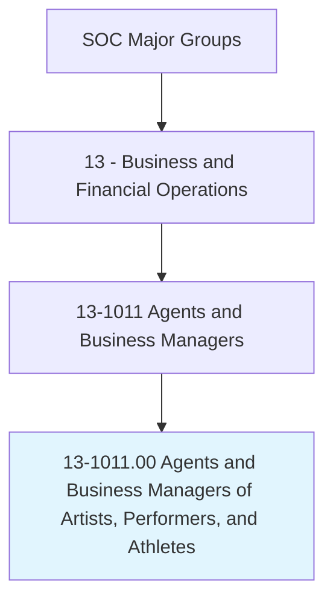
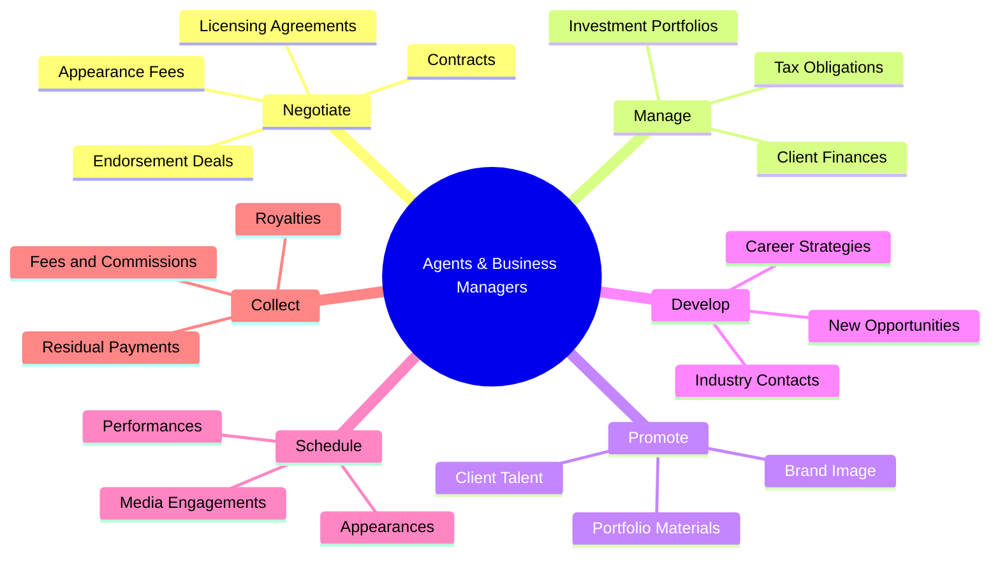
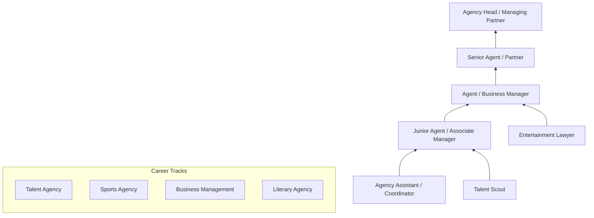
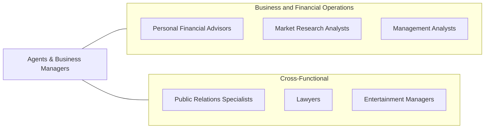

# Agents and Business Managers of Artists, Performers, and Athletes

> Represent and promote artists, performers, and athletes in dealings with current or prospective employers. May handle contract negotiation and other business matters for clients.

## Overview

Agents and Business Managers of Artists, Performers, and Athletes serve as the critical intermediary between creative talent and the commercial marketplace. They negotiate contracts, secure engagements, manage finances, and build career strategies for their clients in entertainment, sports, and the arts. This role combines business acumen with deep industry knowledge, requiring professionals to understand both the creative aspirations of their clients and the economic realities of the entertainment and sports industries.

These professionals operate in a relationship-driven environment where reputation and network strength are paramount. They must stay attuned to shifting market dynamics, emerging platforms, and evolving revenue models -- from traditional media deals to digital content licensing and brand endorsement opportunities. Agents typically work on commission, aligning their financial incentives directly with their clients' success, while business managers handle the broader financial planning, tax strategy, and investment oversight that high-earning talent requires.

The profession demands exceptional negotiation skills, an understanding of entertainment law and intellectual property, and the ability to identify and capitalize on opportunities that advance a client's career trajectory. Whether representing a recording artist, professional athlete, actor, or visual artist, these professionals must balance short-term deal-making with long-term career management and brand building.

## Classification Hierarchy

## Key Statistics

| Metric | Value |
|--------|-------|
| SOC Code | 13-1011.00 |
| Job Zone | 4 (Considerable Preparation) |
| Category | [Business and Financial Operations](/occupations/Business/index) |
| Median Salary | $78,420 |
| Employment | ~31,000 |
| Projected Growth | 7% (Faster than average) |
| Task Count | 50 |
| Source | O*NET |

## Core Tasks

### negotiate.Contracts

Negotiate the terms of contracts and agreements for clients across entertainment, sports, and arts engagements.

**Actions:**
- `negotiate.Contracts.with.Employers.for.ClientEngagements` - Secure performance and appearance deals
- `negotiate.EndorsementDeals.with.Brands.for.ClientRepresentation` - Arrange sponsorship agreements
- `negotiate.LicensingAgreements.for.IntellectualProperty` - Manage rights and royalties
- `negotiate.CompensationTerms.with.Studios.for.Productions` - Structure deal terms

### manage.ClientFinances

Oversee the financial affairs of clients, including budgets, investments, and tax planning.

**Actions:**
- `manage.ClientFinances.to.ensure.LongTermFinancialHealth` - Oversee financial planning
- `manage.InvestmentPortfolios.for.ClientWealth` - Direct investment strategy
- `manage.TaxObligations.to.optimize.ClientReturns` - Coordinate tax planning
- `manage.RoyaltyPayments.from.IntellectualProperty` - Track revenue streams

### promote.ClientTalent

Promote clients to potential employers, media outlets, and brands to secure new opportunities.

**Actions:**
- `promote.ClientTalent.to.PotentialEmployers` - Market client capabilities
- `send.PortfolioMaterials.to.CastingDirectors` - Distribute promotional content
- `develop.BrandImage.for.ClientPositioning` - Build public profile
- `keep.Informed.of.IndustryTrends` - Monitor market opportunities

## Skills & Competencies

### Technical Skills
- **Contract Negotiation** - Expert
- **Financial Management & Planning** - Advanced
- **Entertainment/Sports Law** - Advanced
- **Intellectual Property Rights** - Advanced
- **Marketing & Brand Strategy** - Advanced
- **Revenue & Royalty Accounting** - Proficient
- **Social Media & Digital Platforms** - Proficient

### Soft Skills
- **Negotiation & Persuasion** - Critical
- **Relationship Building** - Critical
- **Communication (Written/Verbal)** - Essential
- **Strategic Thinking** - Essential
- **Networking** - Essential
- **Emotional Intelligence** - Important
- **Conflict Resolution** - Important

## Education & Certifications

| Requirement | Details |
|-------------|---------|
| Typical Education | Bachelor's degree in Business, Communications, Entertainment Management, or related field |
| Advanced Degree | MBA or JD advantageous for business management and legal negotiation |
| Certifications | Certified Sports Agent (state-specific), AAAA membership |
| Licensing | State-specific agent licensing required in many jurisdictions |
| Work Experience | 3-5 years in entertainment, sports management, or talent agency |
| On-the-Job Training | Extensive - agency mailroom/assistant track is traditional entry path |

## Career Progression

## Industry Variations

| Industry | Focus | Typical Tasks |
|----------|-------|---------------|
| **Film & Television** | Casting, production deals | Script review, audition scheduling, studio negotiations |
| **Music** | Recording contracts, touring | Label deals, concert booking, merchandise licensing |
| **Professional Sports** | Athlete contracts, endorsements | Draft preparation, salary negotiation, brand partnerships |
| **Literary & Publishing** | Book deals, rights management | Publisher negotiations, foreign rights, adaptation deals |
| **Digital & Social Media** | Influencer deals, content licensing | Platform partnerships, brand collaborations, content strategy |
| **Fine Arts** | Gallery representation, commissions | Exhibition placement, collector relations, authentication |

## Technology & Tools

| Category | Tools |
|----------|-------|
| **CRM & Client Management** | Salesforce, HubSpot, Agency Pro |
| **Financial Management** | QuickBooks, AgilLink, Concur |
| **Contract Management** | DocuSign, Clio, ContractWorks |
| **Communication** | Slack, Zoom, Microsoft Teams |
| **Scheduling** | Calendly, MasterTour, Eventbrite |
| **Market Research** | Billboard, Pollstar, Nielsen, ESPN Analytics |
| **Social Media** | Hootsuite, Sprout Social, CreatorIQ |

## Related Occupations

## Departments

This occupation typically works in:
- [Talent Management](/departments/TalentManagement)
- [Business Affairs](/departments/BusinessAffairs)
- [Client Services](/departments/ClientServices)
- [Legal Affairs](/departments/LegalAffairs)
- [Marketing & Promotions](/departments/MarketingPromotions)

---

*Source: O*NET 13-1011.00 - ONETOccupation*
