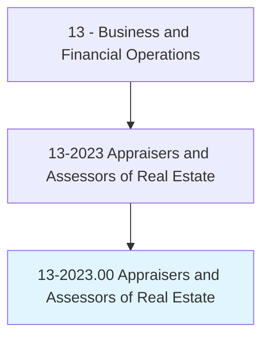
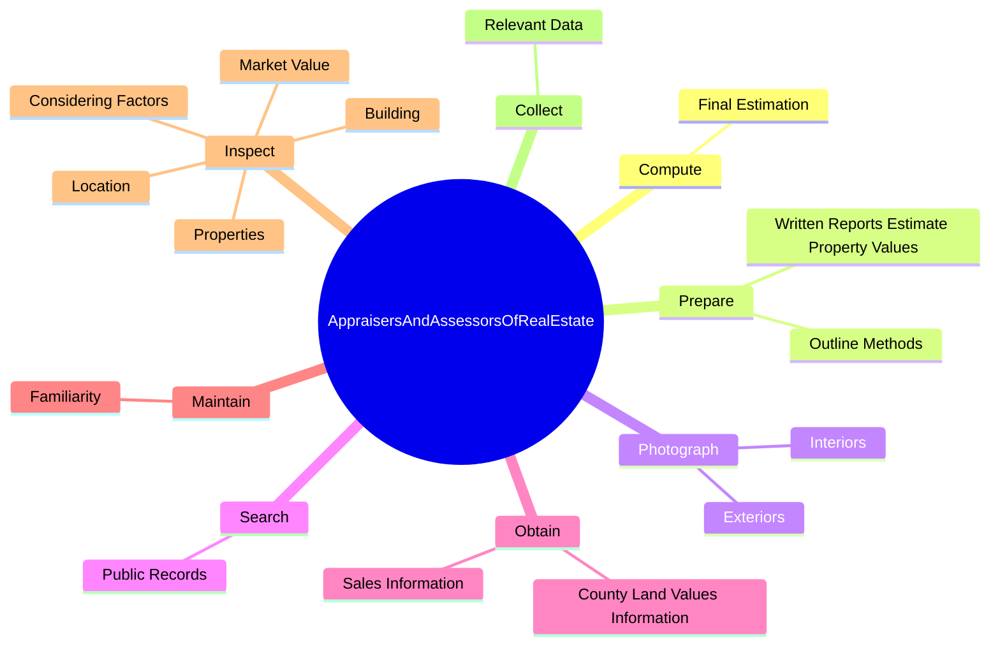
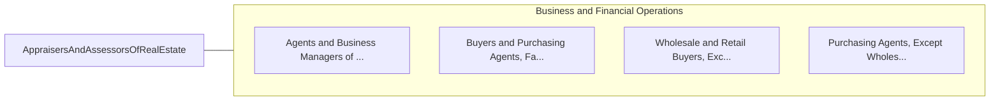

# Appraisers and Assessors of Real Estate

> Appraise real estate, exclusively, and estimate its fair value. May assess taxes in accordance with prescribed schedules.

## Overview

Appraisers and Assessors of Real Estate is an occupation within the Business and Financial Operations category. Appraise real estate, exclusively, and estimate its fair value. 

## Classification Hierarchy

## Key Statistics

| Metric | Value |
|--------|-------|
| SOC Code | 13-2023.00 |
| Category | [Business and Financial Operations](/occupations/Business/index) |
| Task Count | 107 |
| Source | O*NET |

## Core Tasks

### compute.FinalEstimation

Appraisers and Assessors of Real Estate compute final estimation as part of their core responsibilities.

**Actions:**
- `compute.FinalEstimation.of.PropertyValues`
- `compute.FinalEstimation.of.TakingIntoAccountSuchFactorsAsDepreciation`
- `compute.FinalEstimation.of.ReplacementCosts`
- `compute.FinalEstimation.of.ValueComparisons.of.SimilarProperties`

### prepare.WrittenReportsEstimatePropertyValues

Appraisers and Assessors of Real Estate prepare written reports estimate property values as part of their core responsibilities.

**Actions:**
- `prepare.WrittenReportsEstimatePropertyValues.by.WhichEstimationsWereMade`
- `prepare.WrittenReportsEstimatePropertyValues.by.MeetAppraisalStandards`
- `prepare.OutlineMethods.by.WhichEstimationsWereMade`
- `prepare.OutlineMethods.by.MeetAppraisalStandards`

### photograph.Interiors

Appraisers and Assessors of Real Estate photograph interiors as part of their core responsibilities.

**Actions:**
- `photograph.Interiors.of.Properties.to.assist.InEstimatingPropertyValue`
- `photograph.Interiors.of.SubstantiateFindings`
- `photograph.Interiors.of.CompleteAppraisalReports`
- `photograph.Exteriors.of.Properties.to.assist.InEstimatingPropertyValue`

## Skills & Competencies

### Technical Skills
- **Financial Analysis** - Advanced
- **Data Analysis** - Advanced
- **Regulatory Compliance** - Advanced

### Soft Skills
- **Communication** - Essential
- **Problem Solving** - Essential
- **Critical Thinking** - Important
- **Teamwork** - Important
- **Adaptability** - Important

## Related Occupations

## Industries

This occupation is found across multiple industries. See [Industries](/industries) for sector-specific employment data.

## Career Progression

---

*Source: O*NET 13-2023.00 - ONETOccupation*
