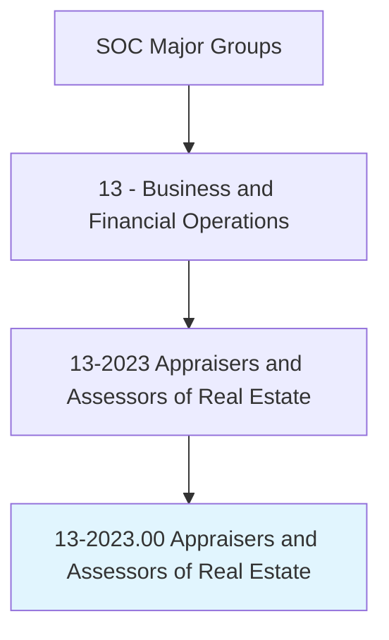
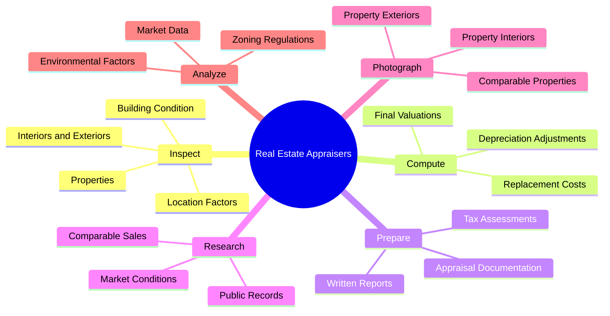
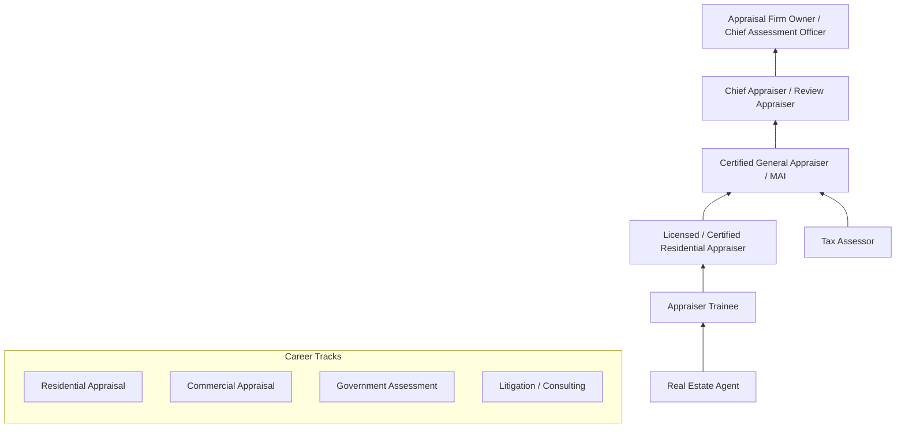
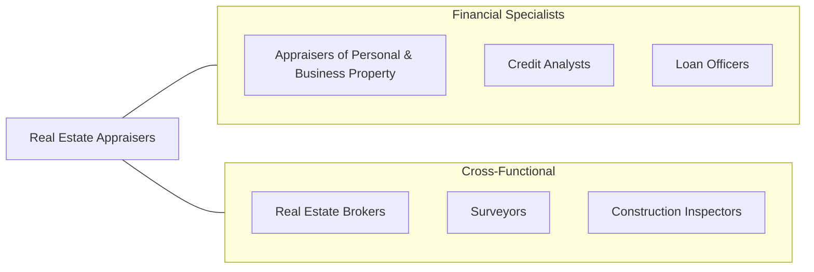

# Appraisers and Assessors of Real Estate

> Appraise real estate, exclusively, and estimate its fair value. May assess taxes in accordance with prescribed schedules.

## Overview

Appraisers and Assessors of Real Estate provide independent, objective valuations of residential and commercial properties for a wide range of purposes including mortgage lending, property taxation, estate planning, and litigation support. These professionals apply systematic methodologies -- the sales comparison, cost, and income capitalization approaches -- to determine the market value of real property. Their work is fundamental to the functioning of real estate markets, ensuring that buyers, sellers, lenders, and government entities have reliable information on which to base financial decisions.

The profession requires a deep understanding of local real estate markets, construction methods, zoning regulations, and economic trends that influence property values. Appraisers must maintain strict independence and objectivity, adhering to the Uniform Standards of Professional Appraisal Practice (USPAP) and state licensing requirements. The role has evolved significantly with the adoption of geographic information systems, automated valuation models, and digital inspection tools, though professional judgment remains central to the appraisal process.

Real estate assessors, a closely related specialization, focus specifically on determining property values for tax assessment purposes. They work primarily for local government agencies and must balance accuracy with the need to assess large volumes of properties efficiently. Both roles demand strong analytical skills, attention to detail, and the ability to communicate complex valuation conclusions clearly in written reports.

## Classification Hierarchy

## Key Statistics

| Metric | Value |
|--------|-------|
| SOC Code | 13-2023.00 |
| Job Zone | 4 (Considerable Preparation) |
| Category | [Business and Financial Operations](/occupations/Business/index) |
| Median Salary | $61,560 |
| Employment | ~77,000 |
| Projected Growth | 5% (As fast as average) |
| Task Count | 107 |
| Source | O*NET |

## Core Tasks

### inspect.Properties

Conduct thorough physical inspections of real estate properties to assess condition, features, and value factors.

**Actions:**
- `inspect.Properties.to.assess.Condition` - Evaluate physical state of improvements
- `inspect.Properties.to.evaluate.LocationFactors` - Assess neighborhood and site characteristics
- `inspect.BuildingCondition.to.determine.FunctionalObsolescence` - Identify depreciation factors
- `photograph.InteriorsAndExteriors.to.document.PropertyCondition` - Create visual record

### compute.FinalValuation

Calculate final property value estimates using multiple appraisal methodologies.

**Actions:**
- `compute.FinalEstimation.of.PropertyValues` - Determine market value
- `compute.Depreciation.to.adjust.ReplacementCosts` - Apply depreciation schedules
- `compute.ValueComparisons.of.SimilarProperties` - Apply sales comparison approach
- `compute.IncomeCapitalization.for.InvestmentProperties` - Apply income approach

### prepare.AppraisalReports

Prepare comprehensive written appraisal reports documenting methods, data, and conclusions.

**Actions:**
- `prepare.WrittenReports.to.document.PropertyValues` - Write formal appraisals
- `prepare.OutlineMethods.by.WhichEstimationsWereMade` - Document methodology
- `prepare.TaxAssessments.in.accordance.with.PrescribedSchedules` - Complete tax valuations
- `search.PublicRecords.for.ComparableSalesData` - Research market evidence

## Skills & Competencies

### Technical Skills
- **Real Estate Valuation Methodologies** - Expert
- **USPAP Standards Compliance** - Expert
- **Market Analysis & Research** - Advanced
- **Construction Methods & Costs** - Advanced
- **GIS & Mapping Software** - Advanced
- **Statistical Analysis** - Proficient
- **Zoning & Land Use Regulations** - Advanced
- **Financial Mathematics** - Proficient

### Soft Skills
- **Analytical Thinking** - Critical
- **Attention to Detail** - Critical
- **Written Communication** - Essential
- **Objectivity & Independence** - Essential
- **Time Management** - Important
- **Client Relations** - Important

## Education & Certifications

| Requirement | Details |
|-------------|---------|
| Typical Education | Bachelor's degree in Real Estate, Finance, or related field |
| State Licensing | Required in all states (Trainee, Licensed, Certified Residential, Certified General) |
| Key Certifications | MAI (Appraisal Institute), SRA (Residential), AI-RRS, ASA |
| USPAP | Continuing education in USPAP required every 2 years |
| Work Experience | 1,000-3,000 hours supervised experience depending on license level |
| Continuing Education | 14-28 hours per renewal cycle depending on state |

## Career Progression

## Industry Variations

| Industry | Focus | Typical Tasks |
|----------|-------|---------------|
| **Mortgage Lending** | Residential valuations | FHA/VA/conventional appraisals, AMC compliance |
| **Commercial Real Estate** | Income properties | DCF analysis, lease abstraction, highest-and-best-use |
| **Government Assessment** | Tax valuation | Mass appraisal, CAMA systems, appeals review |
| **Litigation Support** | Expert witness | Condemnation, divorce, estate valuations |
| **Insurance** | Replacement cost | Catastrophe assessment, damage estimation |
| **Corporate Real Estate** | Portfolio valuation | Portfolio analysis, lease vs. buy, site selection |

## Technology & Tools

| Category | Tools |
|----------|-------|
| **Appraisal Software** | ACI Sky, TOTAL, ClickFORMS, WinTOTAL |
| **MLS & Data** | MLS systems, CoreLogic, CoStar, REIS |
| **GIS & Mapping** | ArcGIS, Google Earth, ParcelQuest |
| **CAMA Systems** | Tyler Technologies, Patriot Properties, Vision |
| **Sketching** | Apex Sketch, ANSI-compliant tools |
| **Document Management** | Adobe Acrobat, Mercury Network |
| **Market Analytics** | HouseCanary, Zillow Pro, Redfin Data |

## Related Occupations

## Departments

This occupation typically works in:
- [Appraisal Services](/departments/AppraisalServices)
- [Property Assessment](/departments/PropertyAssessment)
- [Loan Underwriting](/departments/LoanUnderwriting)
- [Risk Management](/departments/RiskManagement)
- [Tax Assessment](/departments/TaxAssessment)

---

*Source: O*NET 13-2023.00 - ONETOccupation*
