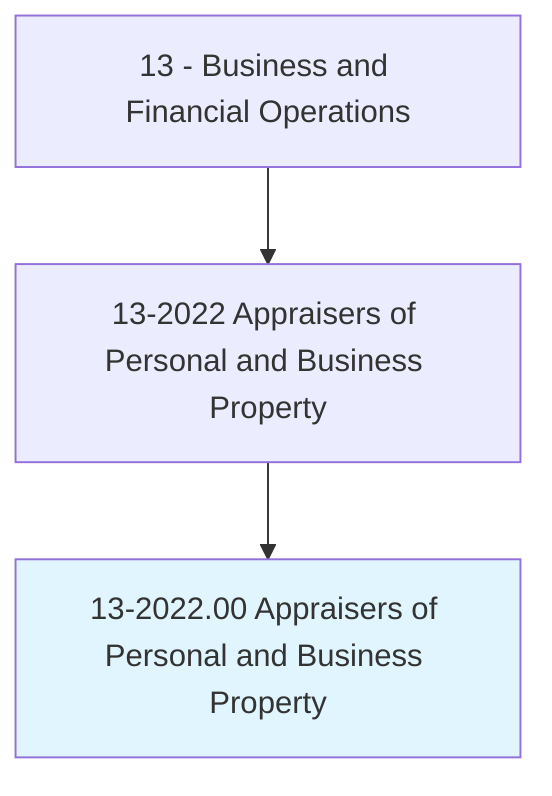
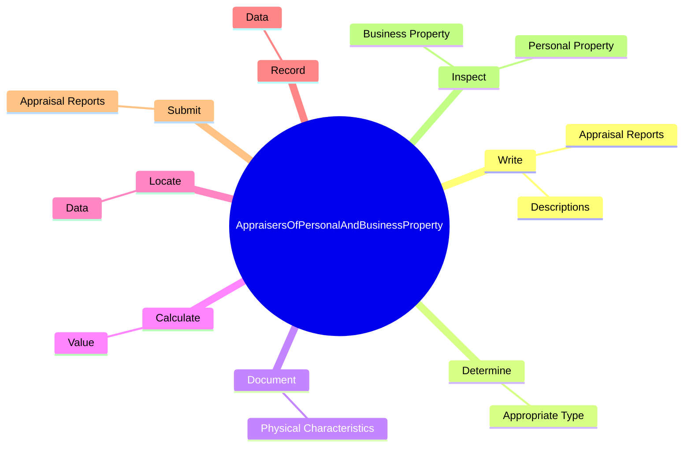

# Appraisers of Personal and Business Property

> Appraise and estimate the fair value of tangible personal or business property, such as jewelry, art, antiques, collectibles, and equipment. May also appraise land.

## Overview

Appraisers of Personal and Business Property is an occupation within the Business and Financial Operations category. Appraise and estimate the fair value of tangible personal or business property, such as jewelry, art, antiques, collectibles, and equipment. 

## Classification Hierarchy

## Key Statistics

| Metric | Value |
|--------|-------|
| SOC Code | 13-2022.00 |
| Category | [Business and Financial Operations](/occupations/Business/index) |
| Task Count | 43 |
| Source | O*NET |

## Core Tasks

### write.Descriptions

Appraisers of Personal and Business Property write descriptions as part of their core responsibilities.

**Actions:**
- `write.Descriptions.of.PropertyBeingAppraised`
- `write.AppraisalReports.for.Property`
- `write.AppraisalReports.for.Jewelry`
- `write.AppraisalReports.for.Art`

### determine.AppropriateType

Appraisers of Personal and Business Property determine appropriate type as part of their core responsibilities.

**Actions:**
- `determine.AppropriateType.of.Valuation.to.Make`
- `determine.AppropriateType.of.FairMarket`
- `determine.AppropriateType.of.Replacement`
- `determine.AppropriateType.of.Liquidation`

### document.PhysicalCharacteristics

Appraisers of Personal and Business Property document physical characteristics as part of their core responsibilities.

**Actions:**
- `document.PhysicalCharacteristics.of.Property`
- `document.PhysicalCharacteristics.of.Measurements`
- `document.PhysicalCharacteristics.of.Quality`
- `document.PhysicalCharacteristics.of.Design`

## Skills & Competencies

### Technical Skills
- **Financial Analysis** - Advanced
- **Data Analysis** - Advanced
- **Regulatory Compliance** - Advanced

### Soft Skills
- **Communication** - Essential
- **Problem Solving** - Essential
- **Critical Thinking** - Important
- **Teamwork** - Important
- **Adaptability** - Important

## Related Occupations

## Industries

This occupation is found across multiple industries. See [Industries](/industries) for sector-specific employment data.

## Career Progression

---

*Source: O*NET 13-2022.00 - ONETOccupation*
