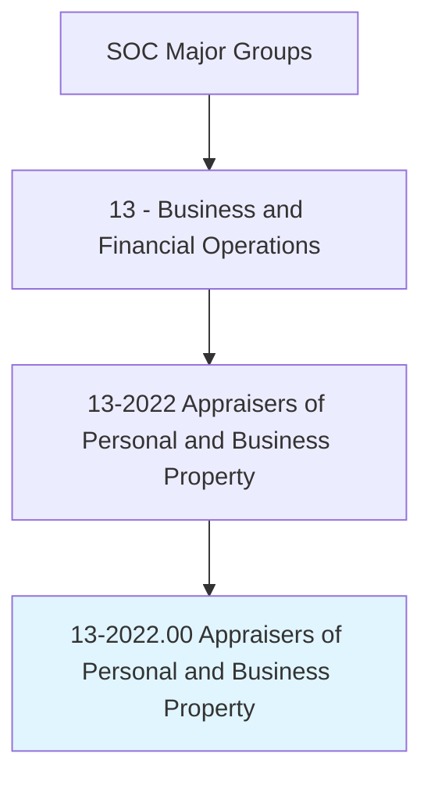
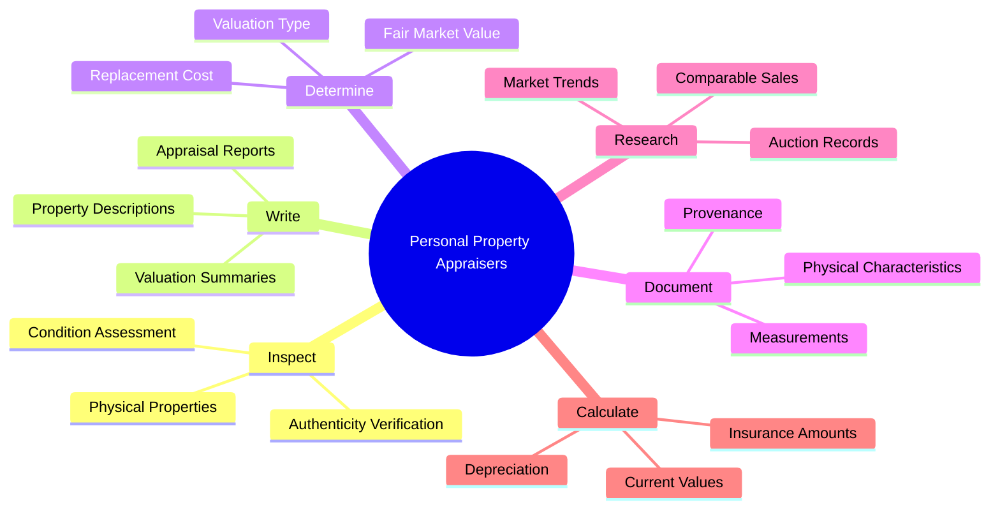
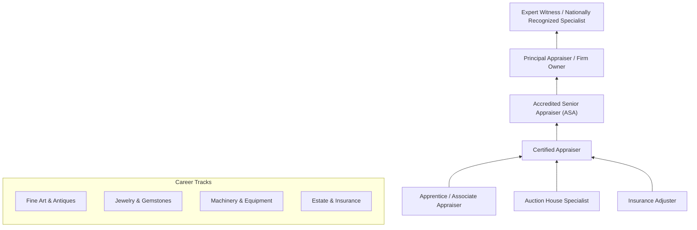
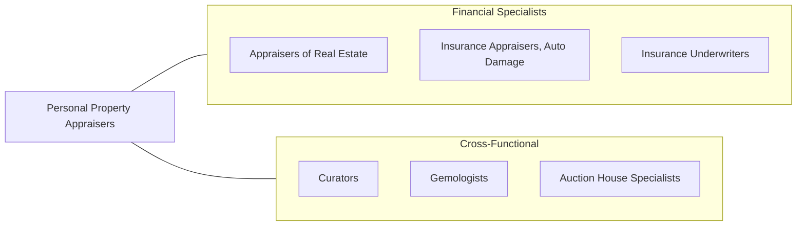

# Appraisers of Personal and Business Property

> Appraise and estimate the fair value of tangible personal or business property, such as jewelry, art, antiques, collectibles, and equipment. May also appraise land.

## Overview

Appraisers of Personal and Business Property determine the fair market, replacement, or liquidation value of tangible assets ranging from fine art and antiques to industrial machinery and business equipment. They serve clients in insurance, estate planning, bankruptcy, divorce proceedings, charitable donations, and corporate asset management. Unlike real estate appraisers who focus on immovable property, these professionals must possess specialized knowledge across diverse categories of personal property, often developing deep expertise in specific niches such as gemology, fine art, or industrial equipment.

The work requires a combination of market research, physical inspection, provenance verification, and condition assessment. Appraisers must stay current with auction results, dealer prices, and market trends within their areas of specialty. They prepare detailed written reports that meet professional standards and may serve as expert witnesses in legal proceedings. The profession demands intellectual curiosity, meticulous documentation skills, and the ability to communicate complex valuation conclusions to non-specialist audiences.

As the market for collectibles, art, and specialized equipment has grown more global and digital, personal property appraisers have adapted by incorporating online auction data, digital photography, and specialized databases into their practice. The rise of estate planning, insurance coverage verification, and corporate asset management continues to drive demand for qualified appraisers across all property categories.

## Classification Hierarchy

## Key Statistics

| Metric | Value |
|--------|-------|
| SOC Code | 13-2022.00 |
| Job Zone | 4 (Considerable Preparation) |
| Category | [Business and Financial Operations](/occupations/Business/index) |
| Median Salary | $58,560 |
| Employment | ~16,000 |
| Projected Growth | 4% (As fast as average) |
| Task Count | 43 |
| Source | O*NET |

## Core Tasks

### inspect.PersonalProperty

Physically inspect items to assess condition, authenticity, and characteristics that affect value.

**Actions:**
- `inspect.PersonalProperty.to.assess.Condition` - Evaluate physical state
- `inspect.BusinessProperty.to.determine.FunctionalUtility` - Assess operational status
- `verify.Authenticity.of.ArtAndAntiques` - Confirm provenance and genuineness
- `document.PhysicalCharacteristics.of.Property` - Record measurements, quality, design

### write.AppraisalReports

Prepare detailed written appraisal reports documenting property, methodology, and value conclusions.

**Actions:**
- `write.AppraisalReports.for.InsuranceCoverage` - Document replacement values
- `write.Descriptions.of.PropertyBeingAppraised` - Detail item characteristics
- `write.AppraisalReports.for.EstatePlanning` - Support tax and distribution decisions
- `submit.AppraisalReports.to.Clients` - Deliver completed valuations

### determine.ValuationType

Determine the appropriate standard of value based on the purpose of the appraisal.

**Actions:**
- `determine.AppropriateType.of.Valuation.to.Make` - Select valuation standard
- `determine.FairMarketValue.for.TaxPurposes` - Calculate IRS-compliant values
- `determine.ReplacementCost.for.InsuranceClaims` - Establish coverage amounts
- `determine.LiquidationValue.for.BankruptcyProceedings` - Assess forced-sale value

## Skills & Competencies

### Technical Skills
- **Personal Property Valuation** - Expert
- **Market Research & Analysis** - Advanced
- **Gemology / Art History / Equipment Knowledge** - Specialty-dependent Expert
- **Photography & Documentation** - Advanced
- **Provenance Research** - Advanced
- **Legal Standards (IRS, USPAP)** - Advanced
- **Insurance Terminology** - Proficient

### Soft Skills
- **Attention to Detail** - Critical
- **Research & Investigation** - Critical
- **Written Communication** - Essential
- **Client Relations** - Essential
- **Objectivity & Ethics** - Essential
- **Continuous Learning** - Important

## Education & Certifications

| Requirement | Details |
|-------------|---------|
| Typical Education | Bachelor's degree; specialized education varies by property type |
| Key Certifications | ASA (Accredited Senior Appraiser), AAA (Certified Appraiser), ISA (International Society of Appraisers) |
| Gemology | GG (Graduate Gemologist - GIA) for jewelry appraisal |
| USPAP | Compliance with Uniform Standards of Professional Appraisal Practice |
| Work Experience | 2-5 years depending on certification level |
| Continuing Education | Required annually by most professional organizations |

## Career Progression

## Industry Variations

| Industry | Focus | Typical Tasks |
|----------|-------|---------------|
| **Insurance** | Replacement cost valuations | Scheduled property, claims support, damage assessment |
| **Estate Planning** | Fair market value | Estate tax appraisals, equitable distribution |
| **Auction Houses** | Pre-sale estimates | Cataloging, reserve pricing, authentication |
| **Corporate Assets** | Equipment valuation | Depreciation schedules, asset disposition, M&A support |
| **Legal / Litigation** | Expert testimony | Divorce, bankruptcy, damage claims, fraud investigation |
| **Museums & Galleries** | Collection management | Acquisition valuation, insurance scheduling, donation appraisal |

## Technology & Tools

| Category | Tools |
|----------|-------|
| **Appraisal Software** | CollectorSystems, PrecisionAppraisals, Liberty Appraisals |
| **Market Data** | LiveAuctioneers, Invaluable, Artnet, 1stDibs |
| **Gemology** | GIA reports, Rapaport Diamond Report, Gemval |
| **Photography** | DSLR equipment, macro lenses, light boxes |
| **Research** | WorldCat, provenance databases, patent records |
| **Document Management** | Adobe Acrobat, cloud storage, digital signatures |
| **Equipment Data** | Rouse Analytics, IronPlanet, Ritchie Bros |

## Related Occupations

## Departments

This occupation typically works in:
- [Appraisal Services](/departments/AppraisalServices)
- [Insurance Claims](/departments/InsuranceClaims)
- [Estate Administration](/departments/EstateAdministration)
- [Collections Management](/departments/CollectionsManagement)
- [Asset Management](/departments/AssetManagement)

---

*Source: O*NET 13-2022.00 - ONETOccupation*
