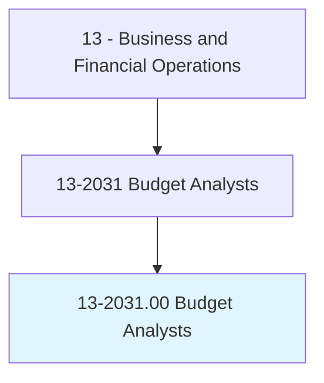
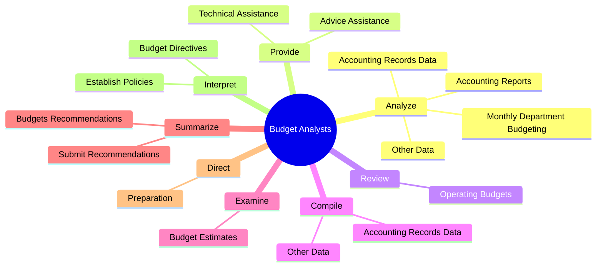
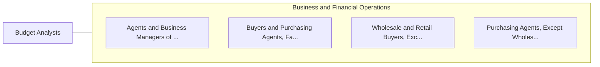

# Budget Analysts

> Examine budget estimates for completeness, accuracy, and conformance with procedures and regulations. Analyze budgeting and accounting reports.

## Overview

Budget Analysts is an occupation within the Business and Financial Operations category. Examine budget estimates for completeness, accuracy, and conformance with procedures and regulations. 

## Classification Hierarchy

## Key Statistics

| Metric | Value |
|--------|-------|
| SOC Code | 13-2031.00 |
| Category | [Business and Financial Operations](/occupations/Business) |
| Task Count | 36 |
| Source | O*NET |

## Core Tasks

### analyze.MonthlyDepartmentBudgeting

Budget Analysts analyze monthly department budgeting as part of their core responsibilities.

**Actions:**
- `analyze.MonthlyDepartmentBudgeting.to.maintain.ExpenditureControls`
- `analyze.AccountingReports.to.maintain.ExpenditureControls`
- `analyze.AccountingRecordsData.to.determine.FinancialResourcesRequiredToImplementProgram`
- `analyze.OtherData.to.determine.FinancialResourcesRequiredToImplementProgram`

### provide.AdviceAssistance

Budget Analysts provide advice assistance as part of their core responsibilities.

**Actions:**
- `provide.AdviceAssistance.with.CostAnalysis`
- `provide.AdviceAssistance.with.FiscalAllocation`
- `provide.AdviceAssistance.with.BudgetPreparation`
- `provide.TechnicalAssistance.with.CostAnalysis`

### review.OperatingBudgets

Budget Analysts review operating budgets as part of their core responsibilities.

**Actions:**
- `review.OperatingBudgets.to.analyze.TrendsAffectingBudgetNeeds`

## Skills & Competencies

### Technical Skills
- **Financial Analysis** - Advanced
- **Data Analysis** - Advanced
- **Regulatory Compliance** - Advanced

### Soft Skills
- **Communication** - Essential
- **Problem Solving** - Essential
- **Critical Thinking** - Important
- **Teamwork** - Important
- **Adaptability** - Important

## Related Occupations

## Industries

This occupation is found across multiple industries. See [Industries](/industries) for sector-specific employment data.

## Career Progression

---

*Source: O*NET 13-2031.00 - ONETOccupation*
