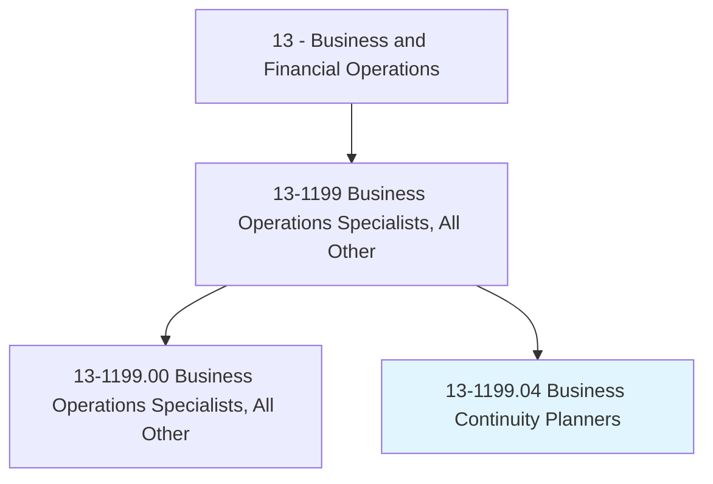
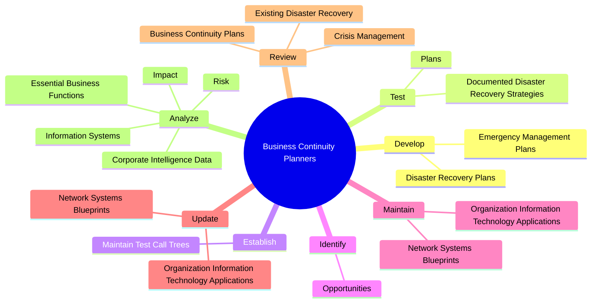

# Business Continuity Planners

> Develop, maintain, or implement business continuity and disaster recovery strategies and solutions, including risk assessments, business impact analyses, strategy selection, and documentation of business continuity and disaster recovery procedures. Plan, conduct, and debrief regular mock-disaster exercises to test the adequacy of existing plans and strategies, updating procedures and plans regularly. Act as a coordinator for continuity efforts after a disruption event.

## Overview

Business Continuity Planners is a specialized variant within the Business and Financial Operations category. Develop, maintain, or implement business continuity and disaster recovery strategies and solutions, including risk assessments, business impact analyses, strategy selection, and documentation of business continuity and disaster recovery procedures. Plan, conduct, and debrief regular mock-disaster exercises to test the adequacy of existing plans and strategies, updating procedures and plans regularly.

## Classification Hierarchy

## Key Statistics

| Metric | Value |
|--------|-------|
| SOC Code | 13-1199.04 |
| Category | [Business and Financial Operations](/occupations/Business/index) |
| Task Count | 114 |
| Source | O*NET |

## Core Tasks

### develop.EmergencyManagementPlans

Business Continuity Planners develop emergency management plans as part of their core responsibilities.

**Actions:**
- `develop.EmergencyManagementPlans.for.RecoveryDecisionMaking`
- `develop.EmergencyManagementPlans.for.Communications`
- `develop.EmergencyManagementPlans.for.Continuity.of.CriticalDepartmentalProcesses`
- `develop.EmergencyManagementPlans.for.TemporaryShutDownOfNonCriticalDepartments.to.ensure.ContinuityOfOperation`

### test.DocumentedDisasterRecoveryStrategies

Business Continuity Planners test documented disaster recovery strategies as part of their core responsibilities.

**Actions:**
- `test.DocumentedDisasterRecoveryStrategies`
- `test.Plans`

### establish.MaintainTestCallTrees

Business Continuity Planners establish maintain test call trees as part of their core responsibilities.

**Actions:**
- `establish.MaintainTestCallTrees.to.ensure.AppropriateCommunicationDuringDisaster`

## Skills & Competencies

### Technical Skills
- **Financial Analysis** - Advanced
- **Data Analysis** - Advanced
- **Regulatory Compliance** - Advanced

### Soft Skills
- **Communication** - Essential
- **Problem Solving** - Essential
- **Critical Thinking** - Important
- **Teamwork** - Important
- **Adaptability** - Important

## Related Occupations

## Industries

This occupation is found across multiple industries. See [Industries](/industries) for sector-specific employment data.

## Career Progression

---

*Source: O*NET 13-1199.04 - ONETOccupation*
