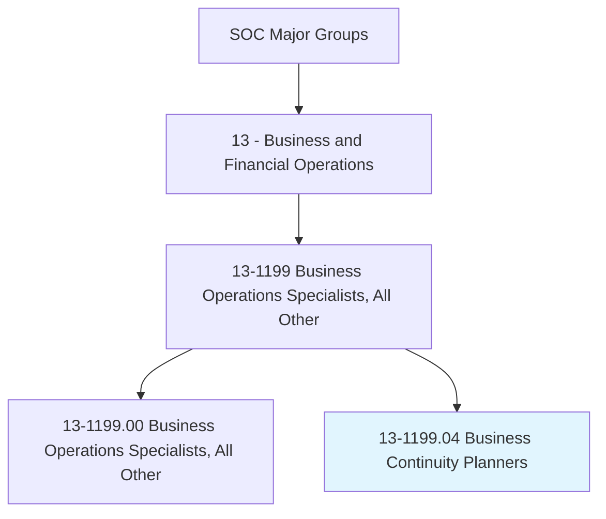
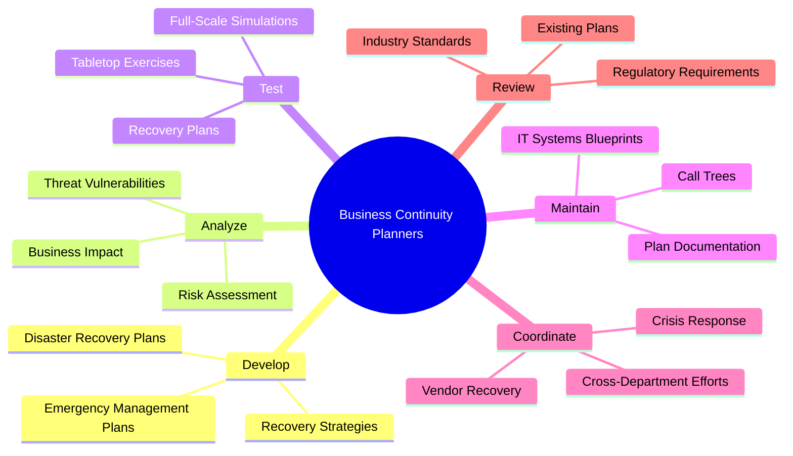
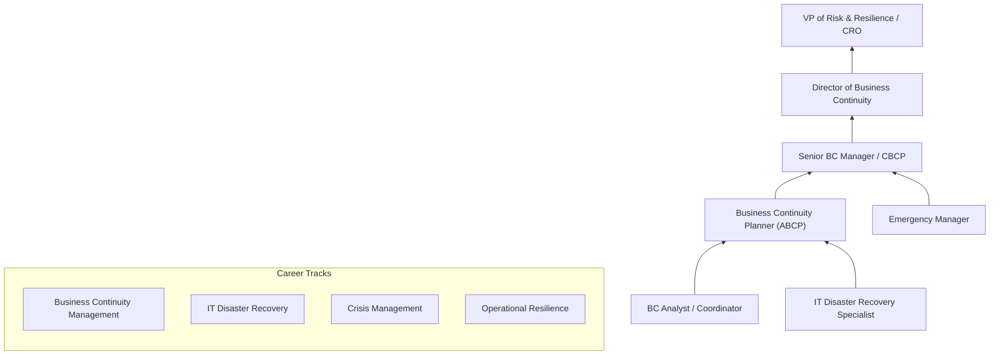
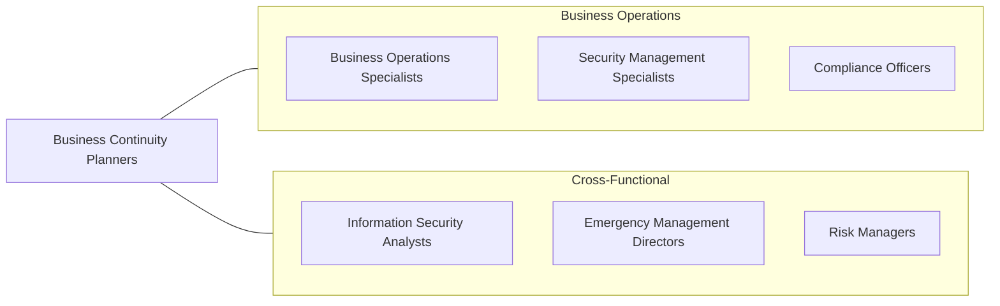

# Business Continuity Planners

> Develop, maintain, or implement business continuity and disaster recovery strategies and solutions, including risk assessments, business impact analyses, strategy selection, and documentation of business continuity and disaster recovery procedures.

## Overview

Business Continuity Planners are responsible for ensuring that organizations can maintain essential functions during and after crises, whether natural disasters, cyberattacks, pandemics, or other disruptive events. They develop comprehensive plans that identify critical business processes, assess vulnerabilities, and establish recovery strategies that minimize downtime and financial loss. This role has grown dramatically in importance as organizations face increasingly complex threat landscapes and regulatory requirements around operational resilience.

These professionals conduct business impact analyses (BIA) to quantify the potential consequences of disruptions, identifying recovery time objectives (RTO) and recovery point objectives (RPO) for each critical function. They design and document detailed recovery procedures, coordinate with IT disaster recovery teams, and lead regular exercises and simulations to validate plan effectiveness. The role requires close collaboration with senior leadership, IT, facilities, human resources, and external partners including emergency services and third-party vendors.

The profession has evolved beyond traditional disaster recovery to encompass operational resilience, crisis management, and organizational adaptability. Modern business continuity planners must understand cloud infrastructure, supply chain interdependencies, cyber threats, and regulatory frameworks such as ISO 22301, NFPA 1600, and sector-specific requirements in banking, healthcare, and critical infrastructure.

## Classification Hierarchy

## Key Statistics

| Metric | Value |
|--------|-------|
| SOC Code | 13-1199.04 |
| Job Zone | 4 (Considerable Preparation) |
| Category | [Business and Financial Operations](/occupations/Business/index) |
| Median Salary | $79,500 |
| Employment | ~28,000 |
| Projected Growth | 8% (Faster than average) |
| Task Count | 114 |
| Source | O*NET |

## Core Tasks

### develop.EmergencyManagementPlans

Develop comprehensive emergency management and business continuity plans for organizational resilience.

**Actions:**
- `develop.EmergencyManagementPlans.for.RecoveryDecisionMaking` - Create response frameworks
- `develop.DisasterRecoveryPlans.for.ITSystemsRecovery` - Plan technology restoration
- `develop.RecoveryStrategies.for.CriticalBusinessProcesses` - Identify continuity approaches
- `develop.CrisisCommunicationPlans.for.StakeholderNotification` - Establish communication protocols

### analyze.BusinessImpact

Conduct business impact analyses and risk assessments to identify vulnerabilities and recovery priorities.

**Actions:**
- `analyze.BusinessImpact.to.determine.RecoveryTimelines` - Quantify disruption consequences
- `analyze.RiskAssessment.to.identify.Threats` - Evaluate threat landscape
- `analyze.EssentialBusinessFunctions.to.prioritize.RecoveryEfforts` - Rank critical processes
- `analyze.SupplyChainDependencies.to.identify.SinglePointsOfFailure` - Map interdependencies

### test.RecoveryPlans

Plan, conduct, and debrief exercises to validate plan effectiveness and identify improvements.

**Actions:**
- `test.DocumentedDisasterRecoveryStrategies` - Validate recovery procedures
- `conduct.TabletopExercises.to.evaluate.PlanEffectiveness` - Simulate scenarios
- `debrief.ExerciseParticipants.to.identify.Improvements` - Capture lessons learned
- `update.Plans.based.on.TestResults` - Incorporate findings

## Skills & Competencies

### Technical Skills
- **Business Impact Analysis (BIA)** - Expert
- **Risk Assessment & Management** - Expert
- **Disaster Recovery Planning** - Expert
- **Crisis Management** - Advanced
- **ISO 22301 / NFPA 1600 Standards** - Advanced
- **IT Infrastructure & Cloud Computing** - Proficient
- **Project Management** - Advanced
- **Regulatory Compliance** - Advanced

### Soft Skills
- **Strategic Thinking** - Critical
- **Cross-Functional Collaboration** - Critical
- **Communication (Written/Verbal)** - Essential
- **Leadership Under Pressure** - Essential
- **Problem Solving** - Essential
- **Attention to Detail** - Important

## Education & Certifications

| Requirement | Details |
|-------------|---------|
| Typical Education | Bachelor's degree in Business, Emergency Management, or IT |
| Advanced Degree | Master's in Business Continuity, Emergency Management, or MBA |
| Key Certifications | CBCP (Certified Business Continuity Professional), MBCI (Member of BCI) |
| Additional Certs | ABCP (Associate), CBCI, CISM (Certified Information Security Manager) |
| Standards Knowledge | ISO 22301, NFPA 1600, FFIEC, ASIS SPC.1 |
| Work Experience | 3-5 years in business continuity, IT disaster recovery, or risk management |

## Career Progression

## Industry Variations

| Industry | Focus | Typical Tasks |
|----------|-------|---------------|
| **Financial Services** | Regulatory compliance (FFIEC, OCC) | Regulatory examinations, trading floor recovery, payment system continuity |
| **Healthcare** | Patient safety, HIPAA | Clinical systems recovery, emergency operations, supply chain continuity |
| **Technology** | Service availability (SLA) | Cloud failover, data center recovery, customer communication |
| **Manufacturing** | Supply chain resilience | Production line recovery, supplier diversification, inventory management |
| **Government** | COOP/COG planning | Continuity of operations, essential services, public safety |
| **Energy & Utilities** | Critical infrastructure | Grid restoration, NERC compliance, community resilience |

## Technology & Tools

| Category | Tools |
|----------|-------|
| **BC Planning** | Fusion Risk Management, Archer, Castellan |
| **Risk Management** | RSA Archer, ServiceNow GRC, LogicManager |
| **Communication** | Everbridge, OnSolve, AlertMedia, PagerDuty |
| **Project Management** | Microsoft Project, Jira, Smartsheet |
| **Documentation** | SharePoint, Confluence, Microsoft 365 |
| **IT Recovery** | Zerto, Veeam, AWS Disaster Recovery, Azure Site Recovery |
| **GIS & Mapping** | ArcGIS, Google Maps Platform |

## Related Occupations

## Departments

This occupation typically works in:
- Business Continuity
- Risk Management
- Information Technology
- [Operations](/departments/Operations)
- Compliance

---

*Source: O*NET 13-1199.04 - ONETOccupation*
