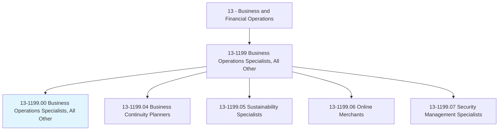
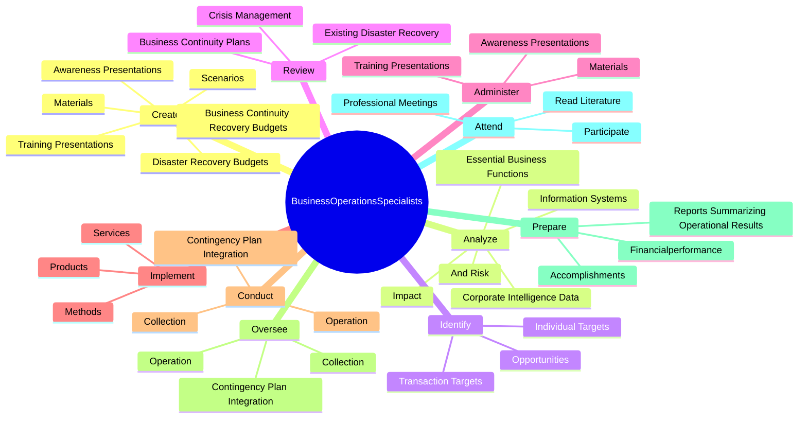

# Business Operations Specialists, All Other

> All business operations specialists not listed separately.

## Overview

Business Operations Specialists, All Other is classified under Business and Financial Operations (SOC 13). All business operations specialists not listed separately.

## Classification Hierarchy

## Key Statistics

| Metric | Value |
|--------|-------|
| SOC Code | 13-1199.00 |
| Category | [Business and Financial Operations](/occupations/Business) |
| Task Count | 114 |
| Source | O*NET |

## Core Tasks

### create.TrainingPresentations

Business Operations Specialists, All Other create training presentations as part of their core responsibilities.

**Actions:**
- `create.TrainingPresentations`
- `create.Materials`
- `create.AwarenessPresentations`
- `create.BusinessContinuityRecoveryBudgets`

### analyze.Impact

Business Operations Specialists, All Other analyze impact as part of their core responsibilities.

**Actions:**
- `analyze.Impact.on.AcceptableRecoveryTimePeriods`
- `analyze.Impact.on.ResourceRequirements`
- `analyze.AndRisk.to.AcceptableRecoveryTimePeriods`
- `analyze.AndRisk.to.ResourceRequirements`

### identify.Opportunities

Business Operations Specialists, All Other identify opportunities as part of their core responsibilities.

**Actions:**
- `identify.Opportunities.for.StrategicImprovement`
- `identify.Opportunities.for.Mitigation`
- `identify.Opportunities.for.Regulatory`
- `identify.Opportunities.for.IndustrySpecificChangeInitiatives`

## Skills & Competencies

### Technical Skills
- **Financial Analysis** - Advanced
- **Data Analysis** - Advanced
- **Regulatory Compliance** - Advanced

### Soft Skills
- **Communication** - Essential
- **Problem Solving** - Essential
- **Critical Thinking** - Important
- **Teamwork** - Important
- **Adaptability** - Important

## Related Occupations

## Industries

This occupation is found across multiple industries. See [Industries](/industries) for sector-specific employment data.

## Career Progression

---

*Source: O*NET 13-1199.00 - ONETOccupation*
