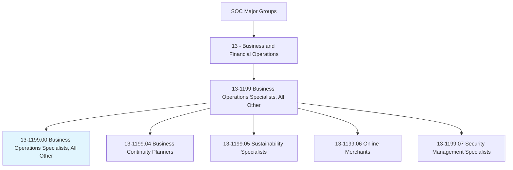
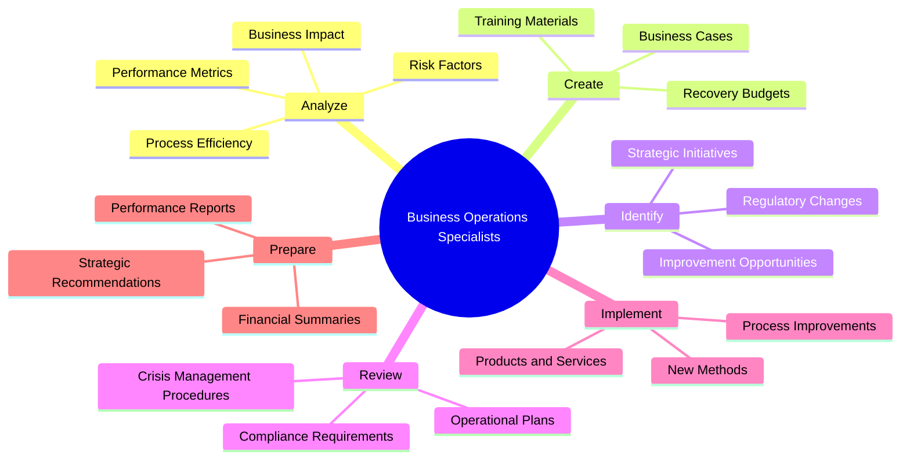
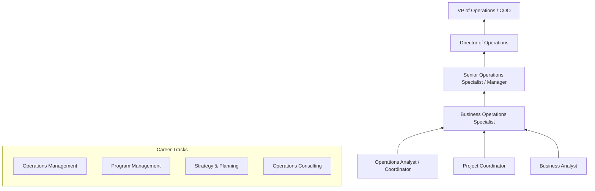
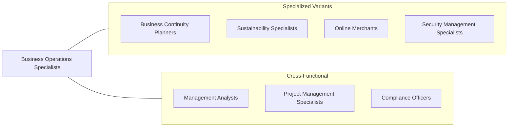

# Business Operations Specialists, All Other

> All business operations specialists not listed separately.

## Overview

Business Operations Specialists encompass a broad category of professionals who analyze and improve organizational processes, manage special projects, and ensure operational efficiency across business functions. This catch-all classification includes roles such as business continuity planners, sustainability specialists, online merchants, and security management specialists, as well as numerous other specialized operational roles that do not fit neatly into other SOC categories.

These professionals serve as organizational generalists with specialized expertise, often bridging the gap between strategic objectives and day-to-day execution. They conduct process analyses, develop training materials, manage cross-functional initiatives, and prepare performance reports that inform executive decision-making. The breadth of this category reflects the increasingly diverse nature of modern business operations, where organizations require professionals with hybrid skill sets spanning technology, analytics, project management, and domain-specific knowledge.

The role has expanded significantly as organizations adopt digital transformation initiatives, requiring specialists who can translate business requirements into operational improvements. Whether optimizing supply chains, implementing new software systems, managing compliance programs, or developing sustainability initiatives, business operations specialists are the connective tissue that keeps organizations running effectively.

## Classification Hierarchy

## Key Statistics

| Metric | Value |
|--------|-------|
| SOC Code | 13-1199.00 |
| Job Zone | 4 (Considerable Preparation) |
| Category | [Business and Financial Operations](/occupations/Business/index) |
| Median Salary | $79,590 |
| Employment | ~373,000 |
| Projected Growth | 6% (As fast as average) |
| Task Count | 114 |
| Source | O*NET |

## Core Tasks

### analyze.BusinessImpact

Analyze business processes, risks, and performance metrics to identify opportunities for improvement.

**Actions:**
- `analyze.Impact.on.AcceptableRecoveryTimePeriods` - Assess operational continuity
- `analyze.ProcessEfficiency.to.identify.Bottlenecks` - Streamline workflows
- `analyze.RiskFactors.to.develop.MitigationStrategies` - Manage operational risk
- `analyze.PerformanceMetrics.to.inform.StrategicDecisions` - Drive data-based decisions

### create.TrainingMaterials

Develop training programs, presentations, and awareness materials for organizational initiatives.

**Actions:**
- `create.TrainingPresentations.for.OperationalReadiness` - Build workforce capability
- `create.BusinessCases.for.StrategicInvestments` - Justify resource allocation
- `create.AwarenessPresentations.for.CompliancePrograms` - Ensure regulatory awareness
- `create.RecoveryBudgets.for.BusinessContinuity` - Plan recovery funding

### identify.ImprovementOpportunities

Identify and evaluate strategic improvement initiatives across business functions.

**Actions:**
- `identify.Opportunities.for.StrategicImprovement` - Spot optimization potential
- `identify.Opportunities.for.Mitigation` - Reduce operational risk
- `identify.RegulatoryChangeInitiatives.for.Compliance` - Track regulatory evolution
- `implement.ProcessImprovements.across.Functions` - Execute change programs

## Skills & Competencies

### Technical Skills
- **Business Process Analysis** - Expert
- **Project Management** - Advanced
- **Data Analysis & Reporting** - Advanced
- **Strategic Planning** - Advanced
- **Change Management** - Advanced
- **Financial Analysis** - Proficient
- **Risk Management** - Proficient
- **Regulatory Compliance** - Proficient

### Soft Skills
- **Analytical Thinking** - Critical
- **Communication (Written/Verbal)** - Essential
- **Problem Solving** - Essential
- **Cross-Functional Collaboration** - Essential
- **Adaptability** - Important
- **Leadership** - Important

## Education & Certifications

| Requirement | Details |
|-------------|---------|
| Typical Education | Bachelor's degree in Business Administration, Management, or related field |
| Advanced Degree | MBA or Master's in Operations Management preferred for advancement |
| Key Certifications | PMP (Project Management Professional), Six Sigma Green/Black Belt |
| Additional Certs | CBAP (Certified Business Analysis Professional), CISA |
| Work Experience | 2-5 years in business operations or related field |
| On-the-Job Training | Moderate - organization-specific processes and systems |

## Career Progression

## Industry Variations

| Industry | Focus | Typical Tasks |
|----------|-------|---------------|
| **Financial Services** | Regulatory operations | Compliance monitoring, process automation, audit support |
| **Technology** | Scaling operations | Product operations, platform management, vendor relations |
| **Healthcare** | Clinical operations | Workflow optimization, regulatory compliance, quality improvement |
| **Manufacturing** | Lean operations | Process efficiency, supply chain optimization, quality control |
| **Consulting** | Client delivery | Engagement management, methodology development, knowledge management |
| **Government** | Public service delivery | Program management, policy implementation, constituent services |

## Technology & Tools

| Category | Tools |
|----------|-------|
| **Project Management** | Microsoft Project, Jira, Asana, Monday.com |
| **Process Mapping** | Visio, Lucidchart, ARIS, Bizagi |
| **Analytics** | Excel, Tableau, Power BI, SQL |
| **ERP Systems** | SAP, Oracle, NetSuite, Workday |
| **Collaboration** | Microsoft 365, Google Workspace, Slack, Confluence |
| **CRM** | Salesforce, HubSpot, Dynamics 365 |
| **Automation** | UiPath, Power Automate, Zapier |

## Related Occupations

## Departments

This occupation typically works in:
- [Operations](/departments/Operations)
- Strategy & Planning
- Program Management
- Business Development
- Corporate Services

---

*Source: O*NET 13-1199.00 - ONETOccupation*
