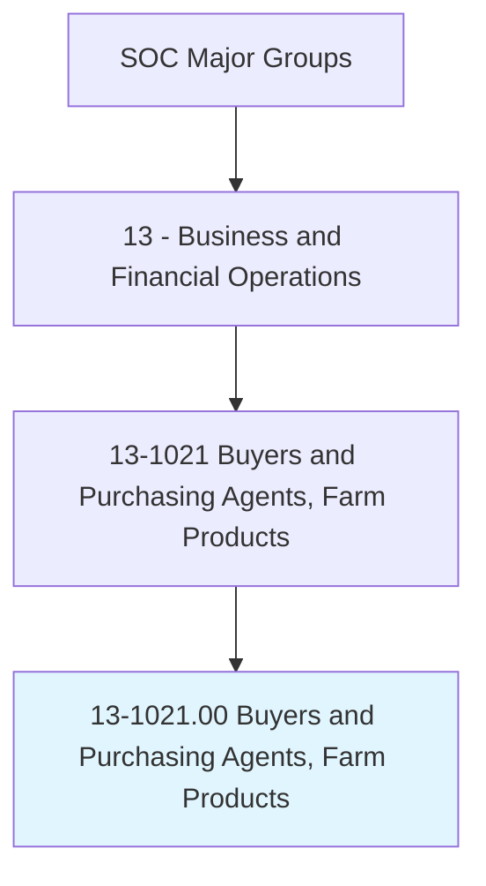
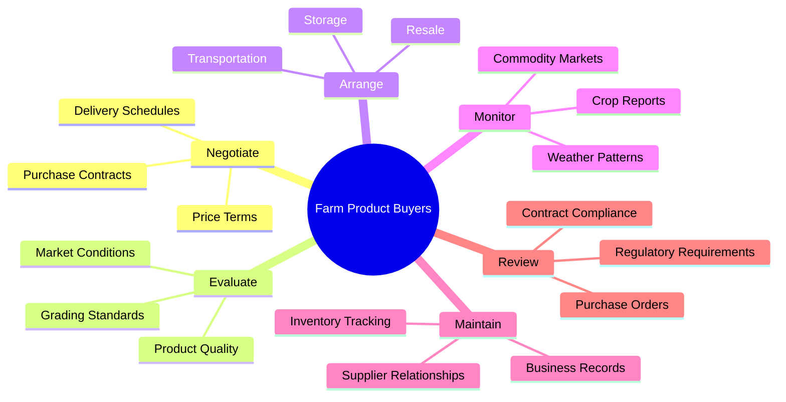
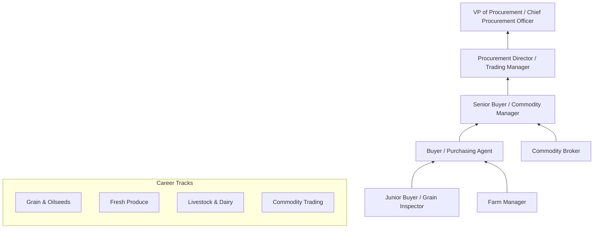
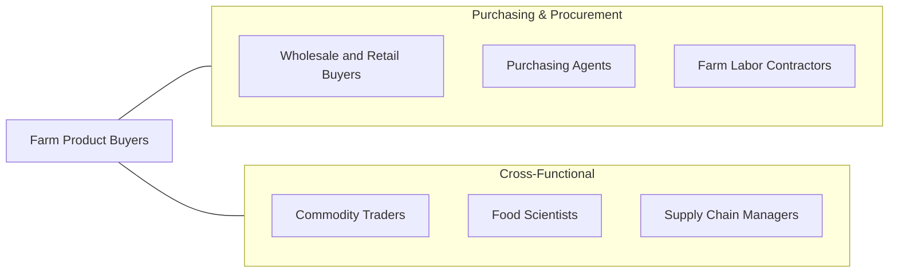

# Buyers and Purchasing Agents, Farm Products

> Purchase farm products either for further processing or resale. Includes tree farm contractors, grain brokers and market operators, grain buyers, and tobacco buyers. May negotiate contracts.

## Overview

Buyers and Purchasing Agents for Farm Products are specialized procurement professionals who source agricultural commodities including grains, livestock, dairy, produce, tobacco, and timber for food processors, distributors, exporters, and retailers. They must understand agricultural markets, commodity pricing, seasonal production cycles, and quality grading standards to negotiate favorable purchase terms while ensuring reliable supply chains for their organizations.

These professionals operate at the intersection of agriculture and commerce, evaluating crop quality, monitoring commodity futures markets, and building relationships with farmers, cooperatives, and agricultural brokers. They must account for factors including weather patterns, government subsidies, trade policies, transportation logistics, and storage requirements when making purchasing decisions. The role requires both market savvy and agricultural knowledge, as product quality and timing are critical to profitability.

The profession has been transformed by commodity trading technology, precision agriculture data, and global supply chain integration. Modern farm product buyers use satellite imagery, crop yield forecasting models, and digital trading platforms alongside traditional field inspection and relationship-based sourcing. Increasing focus on sustainable sourcing, organic certification, and supply chain traceability has added new dimensions to the role.

## Classification Hierarchy

## Key Statistics

| Metric | Value |
|--------|-------|
| SOC Code | 13-1021.00 |
| Job Zone | 4 (Considerable Preparation) |
| Category | [Business and Financial Operations](/occupations/Business/index) |
| Median Salary | $70,720 |
| Employment | ~12,000 |
| Projected Growth | -1% (Declining) |
| Task Count | 59 |
| Source | O*NET |

## Core Tasks

### negotiate.PurchaseContracts

Negotiate contracts with farmers, cooperatives, and brokers for the purchase of agricultural products.

**Actions:**
- `negotiate.Contracts.with.Farmers.for.Production` - Secure forward contracts
- `negotiate.PriceTerms.with.Cooperatives.for.BulkPurchases` - Arrange volume pricing
- `negotiate.DeliverySchedules.with.Suppliers.for.JustInTimeReceiving` - Coordinate logistics
- `negotiate.QualityStandards.with.Producers.for.GradeCompliance` - Set quality thresholds

### evaluate.ProductQuality

Assess agricultural product quality, grade classifications, and market value.

**Actions:**
- `evaluate.ProductQuality.to.determine.GradeClassification` - Grade commodities
- `evaluate.MarketConditions.to.optimize.PurchaseTiming` - Time market entry
- `evaluate.CropReports.to.forecast.SupplyAvailability` - Predict supply levels
- `evaluate.StorageConditions.to.ensure.ProductIntegrity` - Verify handling standards

### arrange.StorageAndDistribution

Coordinate storage, transportation, and resale of purchased agricultural products.

**Actions:**
- `arrange.Storage.of.PurchasedProducts` - Secure warehouse capacity
- `arrange.Resale.of.PurchasedProducts` - Facilitate distribution
- `arrange.Transportation.for.ProductDelivery` - Coordinate logistics
- `maintain.Records.of.BusinessTransactionsInventories` - Track procurement data

## Skills & Competencies

### Technical Skills
- **Commodity Market Analysis** - Expert
- **Agricultural Product Grading** - Expert
- **Contract Negotiation** - Advanced
- **Supply Chain Management** - Advanced
- **Commodity Futures & Hedging** - Advanced
- **USDA Regulations & Grading Standards** - Advanced
- **Inventory Management** - Proficient

### Soft Skills
- **Negotiation** - Critical
- **Relationship Building** - Critical
- **Decision Making** - Essential
- **Market Awareness** - Essential
- **Communication** - Essential
- **Adaptability** - Important

## Education & Certifications

| Requirement | Details |
|-------------|---------|
| Typical Education | Bachelor's degree in Agriculture, Agribusiness, or Business |
| Key Certifications | CPSM (Certified Professional in Supply Management), CPM (Certified Purchasing Manager) |
| Supply Chain | CSCP (Certified Supply Chain Professional) |
| Agricultural Knowledge | USDA grading certification, commodity-specific certifications |
| Work Experience | 2-5 years in agricultural purchasing or commodity trading |
| On-the-Job Training | Extensive - commodity-specific and market knowledge |

## Career Progression

## Industry Variations

| Industry | Focus | Typical Tasks |
|----------|-------|---------------|
| **Food Processing** | Raw material sourcing | Quality control, contract farming, specification compliance |
| **Grain Elevators** | Commodity aggregation | Grading, storage management, basis trading |
| **Export Trading** | International markets | Trade compliance, foreign exchange, logistics coordination |
| **Retail / Grocery** | Consumer products | Supplier management, freshness standards, organic sourcing |
| **Tobacco** | Leaf buying | Auction participation, curing evaluation, blend sourcing |
| **Timber / Forestry** | Wood products | Timber cruising, mill supply, sustainable forestry |

## Technology & Tools

| Category | Tools |
|----------|-------|
| **Trading Platforms** | CME Group, ICE, DTN ProphetX |
| **Market Data** | USDA NASS, Reuters Eikon, Bloomberg Agriculture |
| **ERP & Procurement** | SAP, Oracle, Agris, Bushel |
| **Quality Testing** | FGIS systems, NIR analyzers, moisture meters |
| **Logistics** | TransCore, McLeod, FreightView |
| **Weather & Crop** | DTN, Maxar Weather, NOAA, satellite imagery |
| **Communication** | Microsoft 365, mobile field apps |

## Related Occupations

## Departments

This occupation typically works in:
- [Procurement](/departments/Procurement)
- [Supply Chain Management](/departments/SupplyChain)
- Commodity Trading
- Quality Assurance
- Agricultural Operations

---

*Source: O*NET 13-1021.00 - ONETOccupation*
