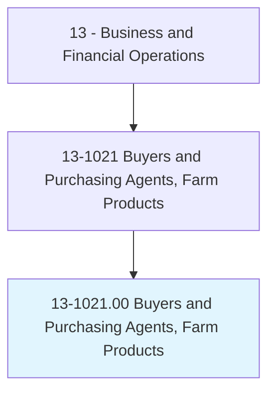
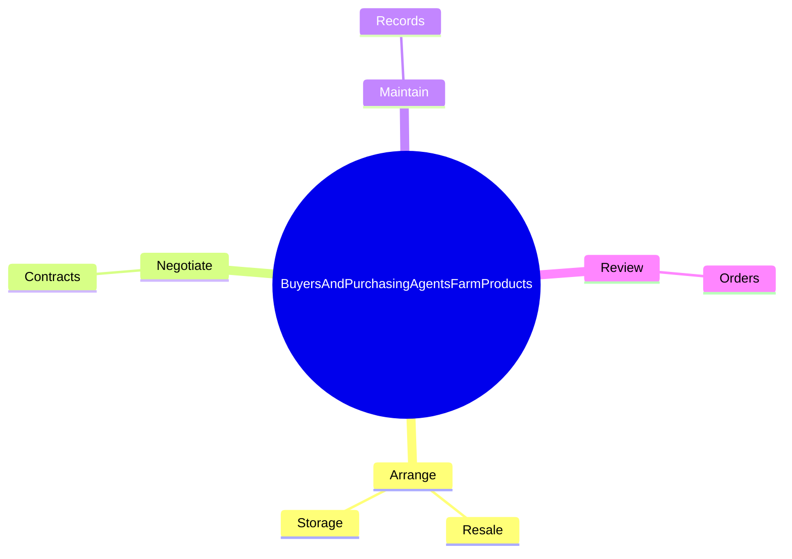
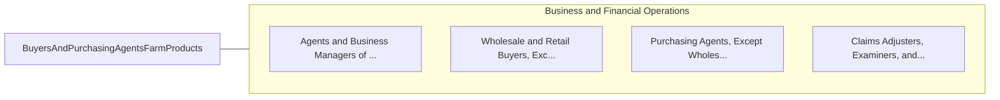

# Buyers and Purchasing Agents, Farm Products

> Purchase farm products either for further processing or resale. Includes tree farm contractors, grain brokers and market operators, grain buyers, and tobacco buyers. May negotiate contracts.

## Overview

Buyers and Purchasing Agents, Farm Products is an occupation within the Business and Financial Operations category. Purchase farm products either for further processing or resale. Includes tree farm contractors, grain brokers and market operators, grain buyers, and tobacco buyers.

## Classification Hierarchy

## Key Statistics

| Metric | Value |
|--------|-------|
| SOC Code | 13-1021.00 |
| Category | [Business and Financial Operations](/occupations/Business/index) |
| Task Count | 59 |
| Source | O*NET |

## Core Tasks

### arrange.Resale

Buyers and Purchasing Agents, Farm Products arrange resale as part of their core responsibilities.

**Actions:**
- `arrange.Resale.of.PurchasedProducts`
- `arrange.Storage.of.PurchasedProducts`

### negotiate.Contracts

Buyers and Purchasing Agents, Farm Products negotiate contracts as part of their core responsibilities.

**Actions:**
- `negotiate.Contracts.with.Farmers.for.Production`
- `negotiate.Contracts.with.Purchase.of.FarmProducts`

### maintain.Records

Buyers and Purchasing Agents, Farm Products maintain records as part of their core responsibilities.

**Actions:**
- `maintain.Records.of.BusinessTransactionsInventories`
- `maintain.Records.of.ProductInventories`
- `maintain.Records.of.ReportingData.to.Companies`
- `maintain.Records.of.GovernmentAgenciesAsNecessary`

## Skills & Competencies

### Technical Skills
- **Financial Analysis** - Advanced
- **Data Analysis** - Advanced
- **Regulatory Compliance** - Advanced

### Soft Skills
- **Communication** - Essential
- **Problem Solving** - Essential
- **Critical Thinking** - Important
- **Teamwork** - Important
- **Adaptability** - Important

## Related Occupations

## Industries

This occupation is found across multiple industries. See [Industries](/industries) for sector-specific employment data.

## Career Progression

---

*Source: O*NET 13-1021.00 - ONETOccupation*
