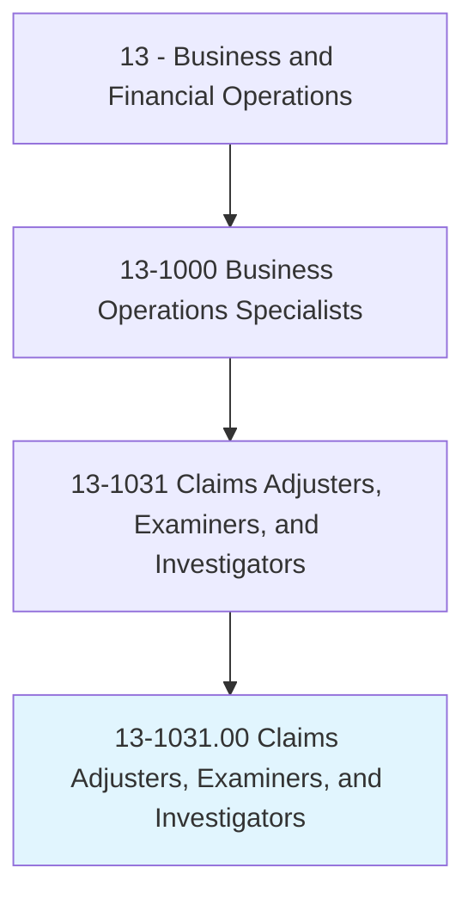
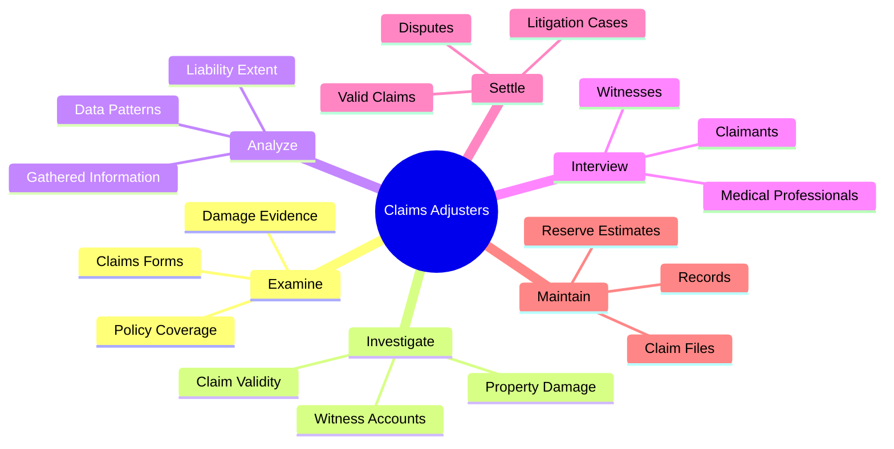
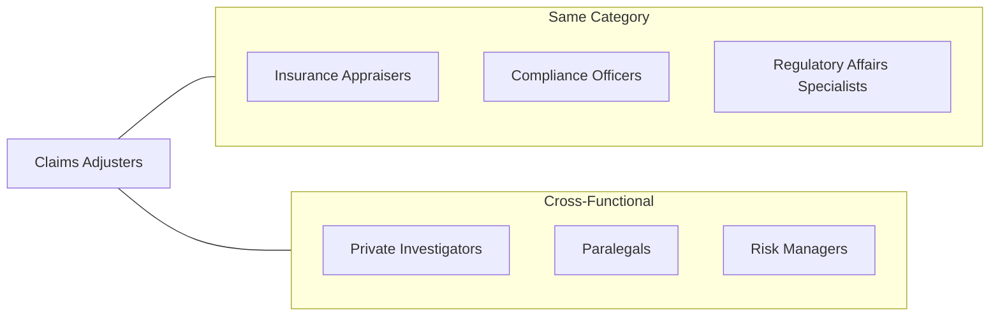
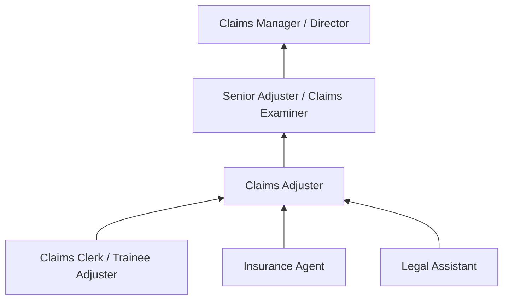

# Claims Adjusters, Examiners, and Investigators

> Review settled claims to determine that payments and settlements are made in accordance with company practices and procedures. Confer with legal counsel on claims requiring litigation. May also settle insurance claims.

## Overview

Claims Adjusters, Examiners, and Investigators serve as the frontline of insurance claim resolution, determining claim validity, investigating circumstances, and negotiating fair settlements. They balance the interests of policyholders seeking compensation with the insurer's need to prevent fraud and manage risk. This role requires investigative skills, technical knowledge of insurance policies, and strong interpersonal abilities to handle sensitive situations professionally.

## Classification Hierarchy

## Key Statistics

| Metric | Value |
|--------|-------|
| SOC Code | 13-1031.00 |
| Job Zone | 4 (Considerable Preparation) |
| Category | [Business and Financial Operations](/occupations/Business/index) |
| Core Tasks | 25+ |
| Source | O*NET |

## Core Tasks

### examine.Claims

Claims Adjusters review documentation to determine coverage and validity.

**Actions:**
- `examine.ClaimsFormsRecords.to.determine.InsuranceCoverage` - Verify policy coverage
- `examine.OtherRecords.to.determine.InsuranceCoverage` - Review supporting documentation
- `review.PoliceReports.to.determine.ExtentOfLiability` - Analyze incident reports
- `review.MedicalTreatmentRecords.to.determine.ExtentOfLiability` - Evaluate medical documentation

### investigate.Claims

Claims Adjusters conduct thorough investigations to validate claims.

**Actions:**
- `investigate.Claims.to.effect.FairDisposalOfCasesToContributeToReducedLossRatio` - Ensure fair resolution
- `investigate.Damage.to.Property` - Assess physical damage
- `investigate.Damage.to.create.PropertyDamageEstimates` - Develop cost estimates
- `assess.Damage.to.Property` - Evaluate loss extent

### analyze.Information

Claims Adjusters evaluate gathered data to make informed decisions.

**Actions:**
- `analyze.InformationGathered.by.Investigation` - Process investigation findings
- `analyze.InformationGathered.by.ReportFindings` - Document conclusions
- `analyze.DataUsed.in.SettlingClaims.to.ensure.ClaimsAreValid` - Validate claim data
- `verify.DataUsed.in.SettlementsAreMadeAccordingToCompanyPractices` - Ensure compliance

### interview.Parties

Claims Adjusters gather information through direct communication with involved parties.

**Actions:**
- `interview.Claimants.to.correct.ErrorsToInvestigateQuestionableClaims` - Clarify claim details
- `interview.Witnesses.to.determine.ClaimSettlement` - Gather witness accounts
- `interview.Physicians.to.determine.ClaimSettlement` - Obtain medical opinions
- `correspond.Claimants.to.correct.ErrorsToInvestigateQuestionableClaims` - Written communication

### settle.Claims

Claims Adjusters resolve claims through negotiation and settlement.

**Actions:**
- `settle.Claims.to.effect.FairDisposalOfCasesToContributeToReducedLossRatio` - Achieve fair settlements
- `pay.Claims.within.DesignatedAuthorityLevel` - Process approved payments
- `process.Claims.within.DesignatedAuthorityLevel` - Handle claim processing
- `negotiate.ClaimSettlements` - Negotiate resolution terms

### maintain.Records

Claims Adjusters document all claim activities and maintain files.

**Actions:**
- `maintain.ClaimFiles.of.SettledClaims` - Archive completed cases
- `maintain.Records.of.Inventory.of.ClaimsRequiringDetailedAnalysis` - Track pending claims
- `enter.ClaimPayments.on.ComputerSystem` - Record financial transactions
- `enter.Reserves.on.ComputerSystem` - Update reserve estimates

## Skills & Competencies

### Technical Skills
- **Insurance Policy Analysis** - Expert
- **Investigation Techniques** - Advanced
- **Damage Assessment** - Advanced
- **Legal Knowledge** - Proficient
- **Claims Software Systems** - Proficient

### Soft Skills
- **Critical Thinking** - Critical
- **Communication** - Critical
- **Negotiation** - Essential
- **Attention to Detail** - Essential
- **Empathy** - Important

## Related Occupations

## Industries

- [Insurance Carriers](/industries/Finance/InsuranceCarriers/index) - High Employment
- [Direct Insurance](/industries/DirectInsurance) - High Employment
- [Insurance Agencies and Brokerages](/industries/Finance/InsuranceCarriers/InsuranceRelatedActivities/InsuranceAgencies) - Moderate Employment
- [Government](/industries/Government) - Moderate Employment

## Career Progression

## Education & Training

| Requirement | Details |
|-------------|---------|
| Typical Education | High school diploma required; Bachelor's degree preferred |
| Work Experience | 1-3 years in insurance or related field |
| On-the-Job Training | Extensive - policy interpretation and investigation techniques |
| Common Certifications | Associate in Claims (AIC), CPCU |

## Departments

This occupation typically works in:
- [Claims Department](/departments/Claims)
- [Special Investigations Unit](/departments/SIU)
- [Litigation Support](/departments/LitigationSupport)

---

*Source: O*NET 13-1031.00 - ONETOccupation*
