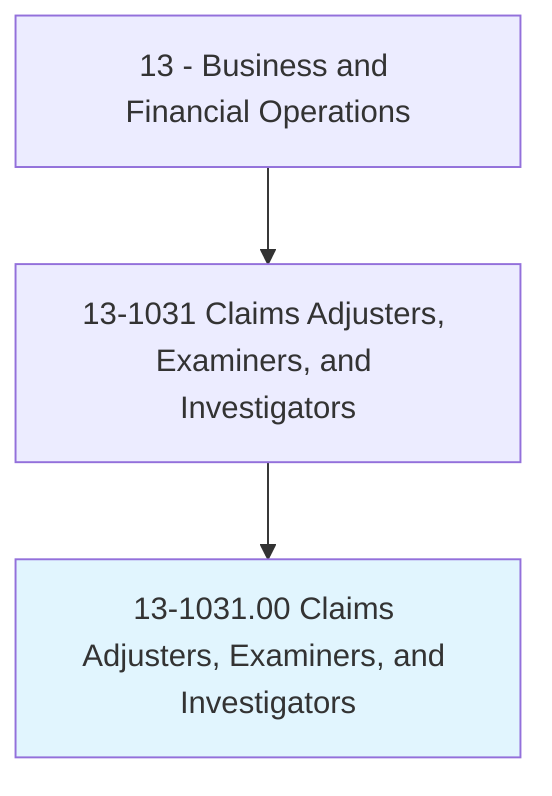
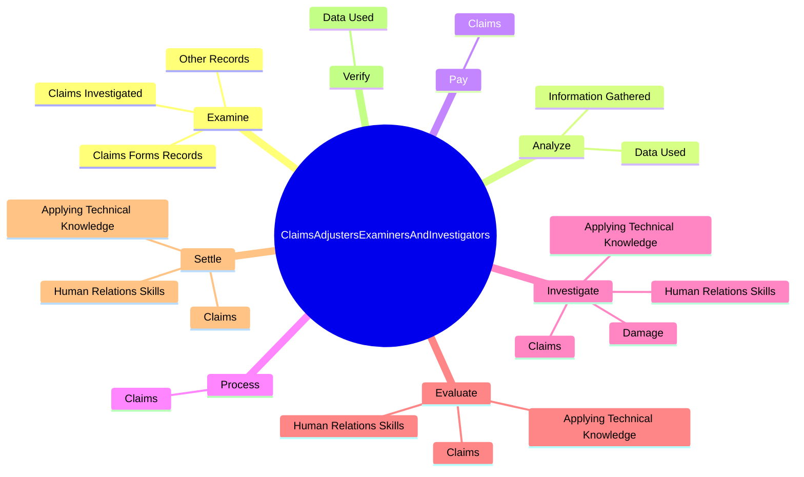
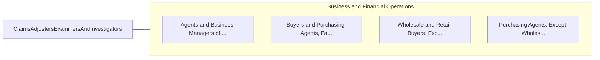

# Claims Adjusters, Examiners, and Investigators

> Review settled claims to determine that payments and settlements are made in accordance with company practices and procedures. Confer with legal counsel on claims requiring litigation. May also settle insurance claims.

## Overview

Claims Adjusters, Examiners, and Investigators is an occupation within the Business and Financial Operations category. Review settled claims to determine that payments and settlements are made in accordance with company practices and procedures. Confer with legal counsel on claims requiring litigation.

## Classification Hierarchy

## Key Statistics

| Metric | Value |
|--------|-------|
| SOC Code | 13-1031.00 |
| Category | [Business and Financial Operations](/occupations/Business) |
| Task Count | 115 |
| Source | O*NET |

## Core Tasks

### examine.ClaimsFormsRecords

Claims Adjusters, Examiners, and Investigators examine claims forms records as part of their core responsibilities.

**Actions:**
- `examine.ClaimsFormsRecords.to.determine.InsuranceCoverage`
- `examine.OtherRecords.to.determine.InsuranceCoverage`
- `examine.ClaimsInvestigated.by.InsuranceAdjusters`
- `examine.ClaimsInvestigated.by.FurtherInvestigatingQuestionableClaims.to.determine.WhetherToAuthorizePayments`

### analyze.InformationGathered

Claims Adjusters, Examiners, and Investigators analyze information gathered as part of their core responsibilities.

**Actions:**
- `analyze.InformationGathered.by.Investigation`
- `analyze.InformationGathered.by.ReportFindings`
- `analyze.InformationGathered.by.Recommendations`
- `analyze.DataUsed.in.SettlingClaims.to.ensure.ClaimsAreValid`

### pay.Claims

Claims Adjusters, Examiners, and Investigators pay claims as part of their core responsibilities.

**Actions:**
- `pay.Claims.within.DesignatedAuthorityLevel`

## Skills & Competencies

### Technical Skills
- **Financial Analysis** - Advanced
- **Data Analysis** - Advanced
- **Regulatory Compliance** - Advanced

### Soft Skills
- **Communication** - Essential
- **Problem Solving** - Essential
- **Critical Thinking** - Important
- **Teamwork** - Important
- **Adaptability** - Important

## Related Occupations

## Industries

This occupation is found across multiple industries. See [Industries](/industries) for sector-specific employment data.

## Career Progression

---

*Source: O*NET 13-1031.00 - ONETOccupation*
