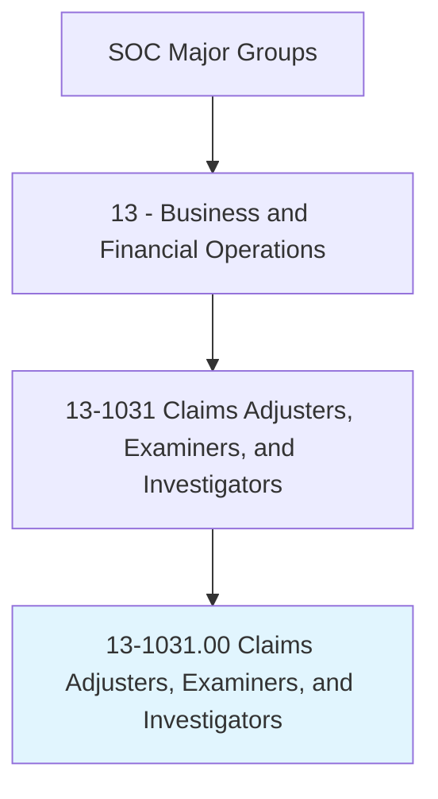
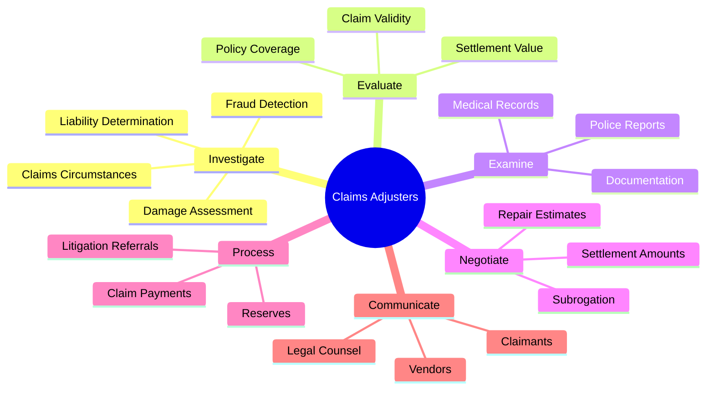
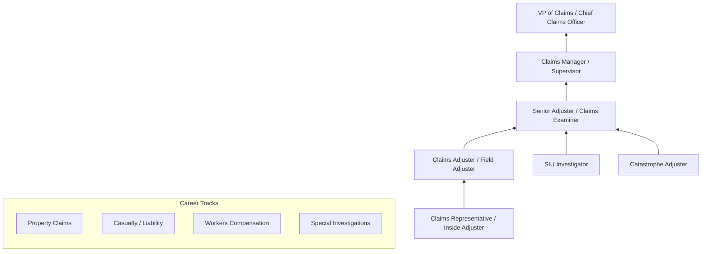
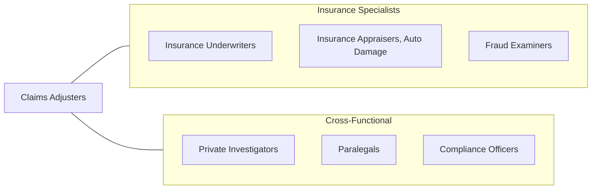

# Claims Adjusters, Examiners, and Investigators

> Review settled claims to determine that payments and settlements are made in accordance with company practices and procedures. Confer with legal counsel on claims requiring litigation. May also settle insurance claims.

## Overview

Claims Adjusters, Examiners, and Investigators form the backbone of the insurance industry's claims handling process, responsible for investigating, evaluating, and settling insurance claims. Adjusters work directly with claimants to inspect damage, gather evidence, and negotiate settlements, while examiners review claims processed by adjusters to ensure compliance with company policies and regulatory requirements. Investigators focus on detecting fraudulent claims through surveillance, interviews, and forensic analysis.

These professionals must balance the interests of policyholders, who expect fair and timely compensation, with the financial responsibilities of insurance companies to manage claims costs and prevent fraud. They apply technical knowledge of policy coverage, legal liability, damage assessment, and medical terminology to determine the validity and value of claims. The role demands both analytical rigor and strong interpersonal skills, as professionals must interact with claimants who may be in distress while maintaining objectivity in their evaluations.

The profession continues to evolve with advances in claims technology, including AI-powered damage estimation, telematics data analysis, drone-based inspections, and predictive analytics for fraud detection. Despite these technological advances, the judgment and negotiation skills of experienced claims professionals remain essential, particularly for complex liability claims, catastrophe response, and litigation management.

## Classification Hierarchy

## Key Statistics

| Metric | Value |
|--------|-------|
| SOC Code | 13-1031.00 |
| Job Zone | 4 (Considerable Preparation) |
| Category | [Business and Financial Operations](/occupations/Business/index) |
| Median Salary | $71,680 |
| Employment | ~298,000 |
| Projected Growth | -3% (Declining) |
| Task Count | 115 |
| Source | O*NET |

## Core Tasks

### investigate.Claims

Investigate insurance claims to determine coverage, liability, and the extent of damages.

**Actions:**
- `investigate.Claims.to.determine.LiabilityAndCoverage` - Assess claim merits
- `investigate.DamageAssessment.to.estimate.LossAmount` - Quantify damages
- `investigate.FraudIndicators.to.detect.SuspiciousClaims` - Identify fraud patterns
- `interview.Claimants.to.gather.FactualInformation` - Collect testimony

### evaluate.ClaimValidity

Review claims documentation and evidence to determine the validity and value of claims.

**Actions:**
- `evaluate.PolicyCoverage.to.determine.ClaimEligibility` - Verify coverage
- `evaluate.ClaimValidity.to.authorize.Payments` - Approve settlements
- `evaluate.MedicalRecords.to.assess.InjurySeverity` - Review medical evidence
- `examine.ClaimsFormsRecords.to.determine.InsuranceCoverage` - Verify policy terms

### negotiate.Settlements

Negotiate settlement amounts with claimants, attorneys, and repair vendors.

**Actions:**
- `negotiate.SettlementAmounts.with.Claimants` - Reach agreement on payments
- `negotiate.RepairEstimates.with.Contractors` - Approve restoration costs
- `confer.with.LegalCounsel.on.LitigatedClaims` - Coordinate legal strategy
- `pay.Claims.within.DesignatedAuthorityLevel` - Process approved payments

## Skills & Competencies

### Technical Skills
- **Insurance Policy Interpretation** - Expert
- **Damage Assessment & Estimation** - Expert
- **Claims Investigation Techniques** - Advanced
- **Legal Liability Analysis** - Advanced
- **Medical Terminology** - Proficient
- **Fraud Detection Methods** - Advanced
- **Negotiation & Settlement** - Advanced
- **Regulatory Compliance** - Proficient

### Soft Skills
- **Analytical Thinking** - Critical
- **Attention to Detail** - Critical
- **Communication (Written/Verbal)** - Essential
- **Negotiation** - Essential
- **Empathy & Objectivity** - Essential
- **Time Management** - Important
- **Decision Making** - Important

## Education & Certifications

| Requirement | Details |
|-------------|---------|
| Typical Education | Bachelor's degree in Business, Insurance, or related field |
| State Licensing | Required in most states for independent adjusters |
| Key Certifications | AIC (Associate in Claims), CPCU (Chartered Property Casualty Underwriter) |
| Additional Certs | SCLA (Senior Claims Law Associate), AIC-M (Management) |
| Professional Development | The Institutes, PLRB, NICB |
| Work Experience | 1-3 years entry-level; 5+ years for senior/complex claims |

## Career Progression

## Industry Variations

| Industry | Focus | Typical Tasks |
|----------|-------|---------------|
| **Property & Casualty** | Home, auto, commercial | Damage inspection, repair coordination, liability analysis |
| **Workers Compensation** | Workplace injury | Medical management, return-to-work programs, disability assessment |
| **Health Insurance** | Medical claims | Utilization review, provider negotiation, coding review |
| **Life Insurance** | Death benefits | Beneficiary verification, contestability review, fraud detection |
| **Catastrophe Response** | Disaster events | Rapid deployment, mass claims processing, emergency assessment |
| **Reinsurance** | Treaty claims | Coverage analysis, loss aggregation, cedent review |

## Technology & Tools

| Category | Tools |
|----------|-------|
| **Claims Management** | Guidewire ClaimCenter, Duck Creek, Majesco |
| **Estimation** | Xactimate, CCC Intelligent Solutions, Mitchell |
| **Fraud Detection** | NICB databases, SIU analytics, social media tools |
| **Inspection** | Drones, satellite imagery, virtual inspection apps |
| **Medical Review** | ISO ClaimSearch, medical databases |
| **Communication** | Microsoft 365, Salesforce, mobile claims apps |
| **Analytics** | Tableau, Power BI, predictive modeling tools |

## Related Occupations

## Departments

This occupation typically works in:
- Claims Operations
- Special Investigations Unit
- Litigation Management
- Subrogation
- Quality Assurance

---

*Source: O*NET 13-1031.00 - ONETOccupation*
