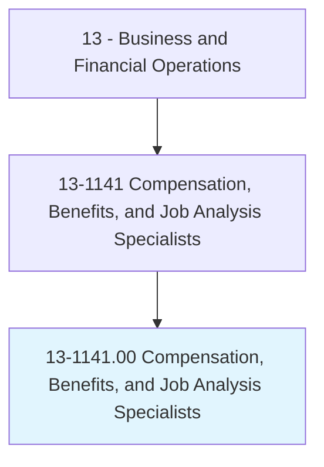
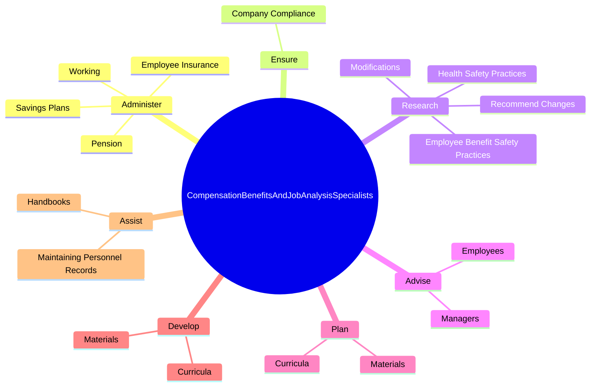
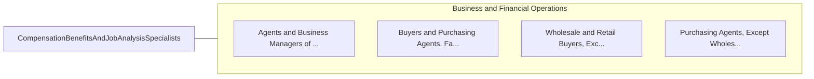

# Compensation, Benefits, and Job Analysis Specialists

> Conduct programs of compensation and benefits and job analysis for employer. May specialize in specific areas, such as position classification and pension programs.

## Overview

Compensation, Benefits, and Job Analysis Specialists is an occupation within the Business and Financial Operations category. Conduct programs of compensation and benefits and job analysis for employer. 

## Classification Hierarchy

## Key Statistics

| Metric | Value |
|--------|-------|
| SOC Code | 13-1141.00 |
| Category | [Business and Financial Operations](/occupations/Business/index) |
| Task Count | 189 |
| Source | O*NET |

## Core Tasks

### administer.EmployeeInsurance

Compensation, Benefits, and Job Analysis Specialists administer employee insurance as part of their core responsibilities.

**Actions:**
- `administer.EmployeeInsurance.with.InsuranceBrokers`
- `administer.EmployeeInsurance.with.PlanCarriers`
- `administer.Pension.with.InsuranceBrokers`
- `administer.Pension.with.PlanCarriers`

### ensure.CompanyCompliance

Compensation, Benefits, and Job Analysis Specialists ensure company compliance as part of their core responsibilities.

**Actions:**
- `ensure.CompanyCompliance.with.FederalLawsIncludingReportingRequirements`
- `ensure.CompanyCompliance.with.StateLawsIncludingReportingRequirements`

### research.EmployeeBenefitSafetyPractices

Compensation, Benefits, and Job Analysis Specialists research employee benefit safety practices as part of their core responsibilities.

**Actions:**
- `research.EmployeeBenefitSafetyPractices.to.ExistingPolicies`
- `research.HealthSafetyPractices.to.ExistingPolicies`
- `research.RecommendChanges.to.ExistingPolicies`
- `research.Modifications.to.ExistingPolicies`

## Skills & Competencies

### Technical Skills
- **Financial Analysis** - Advanced
- **Data Analysis** - Advanced
- **Regulatory Compliance** - Advanced

### Soft Skills
- **Communication** - Essential
- **Problem Solving** - Essential
- **Critical Thinking** - Important
- **Teamwork** - Important
- **Adaptability** - Important

## Related Occupations

## Industries

This occupation is found across multiple industries. See [Industries](/industries) for sector-specific employment data.

## Career Progression

---

*Source: O*NET 13-1141.00 - ONETOccupation*
