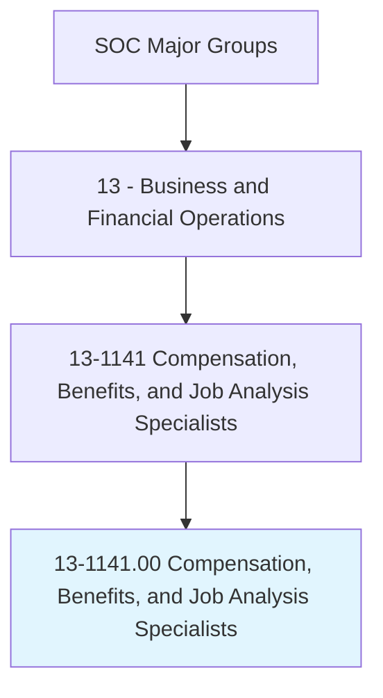
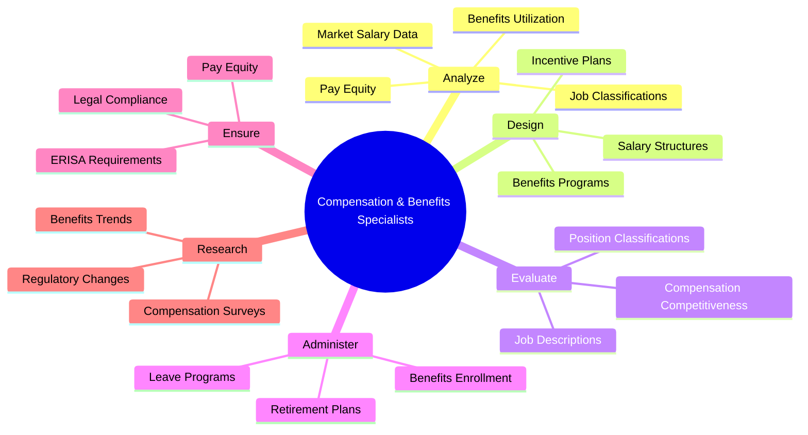
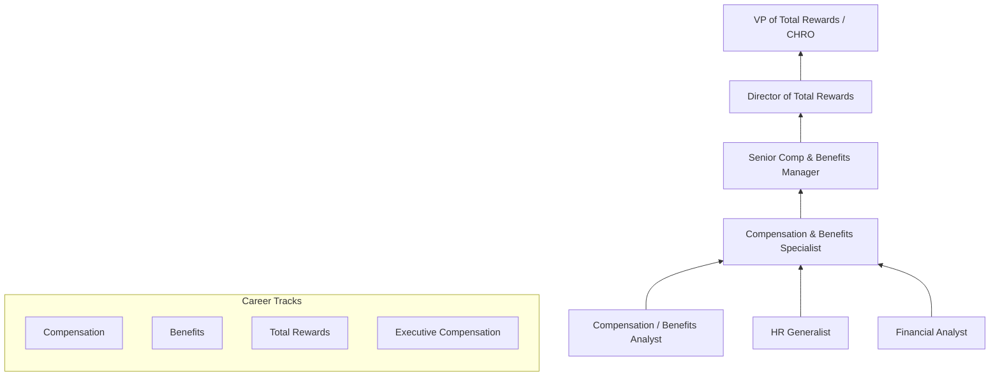
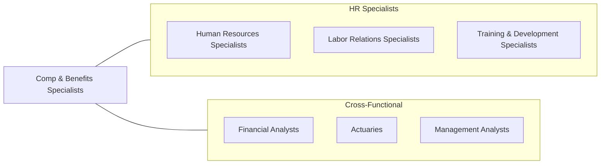

# Compensation, Benefits, and Job Analysis Specialists

> Conduct programs of compensation and benefits and job analysis for employer. May specialize in specific areas, such as position classification and pension programs.

## Overview

Compensation, Benefits, and Job Analysis Specialists design and administer the programs that determine how organizations pay and reward their employees. They conduct job analyses to classify positions, develop salary structures, design benefits packages, and ensure that compensation programs comply with labor laws and remain competitive in the marketplace. Their work directly impacts an organization's ability to attract, retain, and motivate talent while managing labor costs effectively.

These professionals bridge the gap between organizational strategy and human capital management. They analyze market compensation data, conduct salary surveys, evaluate job descriptions against standardized frameworks, and model the financial impact of proposed compensation changes. Benefits specialists focus on designing and administering health insurance, retirement plans, paid time off, and emerging benefits such as wellness programs, student loan assistance, and flexible work arrangements.

The field has been reshaped by pay transparency legislation, remote work compensation challenges, and the growing complexity of total rewards strategies. Modern compensation professionals must navigate multi-state and international compliance requirements, address gender and racial pay gaps, and design creative benefits packages that differentiate their organizations in competitive talent markets.

## Classification Hierarchy

## Key Statistics

| Metric | Value |
|--------|-------|
| SOC Code | 13-1141.00 |
| Job Zone | 4 (Considerable Preparation) |
| Category | [Business and Financial Operations](/occupations/Business/index) |
| Median Salary | $67,780 |
| Employment | ~89,000 |
| Projected Growth | 6% (As fast as average) |
| Task Count | 48 |
| Source | O*NET |

## Core Tasks

### analyze.CompensationData

Analyze market compensation data and internal pay structures to maintain competitive and equitable programs.

**Actions:**
- `analyze.MarketSalaryData.to.benchmark.CompensationLevels` - Compare to market rates
- `analyze.PayEquity.to.identify.CompensationDisparities` - Audit for pay gaps
- `analyze.JobClassifications.to.ensure.InternalEquity` - Maintain fair structures
- `analyze.BenefitsUtilization.to.optimize.ProgramDesign` - Improve benefit offerings

### design.CompensationPrograms

Design and implement salary structures, incentive plans, and total rewards strategies.

**Actions:**
- `design.SalaryStructures.for.OrganizationalCompetitiveness` - Build pay frameworks
- `design.IncentivePlans.to.drive.PerformanceOutcomes` - Create variable pay programs
- `design.BenefitsPrograms.to.attract.TopTalent` - Develop total rewards
- `design.EquityCompensation.for.RetentionObjectives` - Structure stock/option plans

### evaluate.JobPositions

Conduct job analyses and evaluate positions using standardized classification systems.

**Actions:**
- `evaluate.JobDescriptions.to.classify.Positions` - Categorize roles
- `evaluate.PositionRequirements.to.determine.PayGrades` - Set compensation levels
- `evaluate.MarketCompetitiveness.of.CurrentPrograms` - Assess program effectiveness
- `ensure.Compliance.with.FLSA.and.PayEquityLaws` - Verify legal adherence

## Skills & Competencies

### Technical Skills
- **Compensation Analysis & Design** - Expert
- **Benefits Administration** - Expert
- **Job Evaluation Methodologies** - Advanced
- **HRIS & Compensation Software** - Advanced
- **Statistical Analysis** - Advanced
- **Labor Law Compliance (FLSA, ERISA, ACA)** - Advanced
- **Financial Modeling** - Proficient
- **Pay Equity Analysis** - Advanced

### Soft Skills
- **Analytical Thinking** - Critical
- **Attention to Detail** - Critical
- **Communication** - Essential
- **Discretion & Confidentiality** - Essential
- **Problem Solving** - Essential
- **Stakeholder Management** - Important

## Education & Certifications

| Requirement | Details |
|-------------|---------|
| Typical Education | Bachelor's degree in Human Resources, Business, Finance, or related field |
| Advanced Degree | Master's in HR Management or MBA with HR concentration |
| Key Certifications | CCP (Certified Compensation Professional), CBP (Certified Benefits Professional) |
| HR Certifications | PHR/SPHR (HRCI), SHRM-CP/SHRM-SCP |
| Benefits Specific | CEBS (Certified Employee Benefit Specialist) |
| Work Experience | 2-5 years in compensation, benefits, or HR analytics |

## Career Progression

## Industry Variations

| Industry | Focus | Typical Tasks |
|----------|-------|---------------|
| **Technology** | Equity compensation, total rewards | Stock option design, RSU programs, sign-on bonuses |
| **Financial Services** | Incentive compensation | Bonus structures, deferred comp, regulatory compliance |
| **Healthcare** | Benefits complexity | Provider network management, shift differentials |
| **Manufacturing** | Union negotiations | Collective bargaining support, skilled trades pay |
| **Government** | Classification systems | GS/SES scales, locality pay, FERS administration |
| **Consulting** | Multi-client advisory | Compensation surveys, benchmarking studies, M&A due diligence |

## Technology & Tools

| Category | Tools |
|----------|-------|
| **HRIS** | Workday, SAP SuccessFactors, ADP, UKG |
| **Compensation** | PayScale, Salary.com CompAnalyst, Mercer WIN, Radford |
| **Benefits Administration** | Benefitfocus, bswift, Employee Navigator |
| **Survey Data** | Mercer, Willis Towers Watson, Aon Radford, Culpepper |
| **Analytics** | Excel (advanced), Tableau, Power BI, R |
| **Job Evaluation** | Hay Group, Mercer IPE, Willis Towers Watson GGS |
| **Equity Compensation** | E*TRADE Corporate Services, Shareworks, Carta |

## Related Occupations

## Departments

This occupation typically works in:
- [Total Rewards](/departments/TotalRewards)
- [Human Resources](/departments/HumanResources)
- [Benefits Administration](/departments/BenefitsAdministration)
- [People Analytics](/departments/PeopleAnalytics)
- [Finance](/departments/Finance)

---

*Source: O*NET 13-1141.00 - ONETOccupation*
