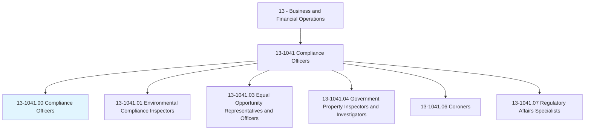
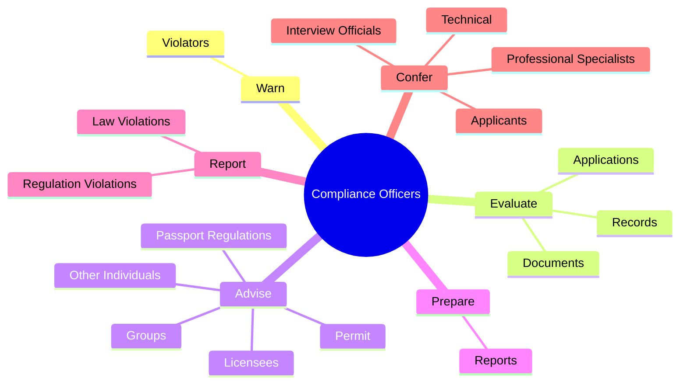
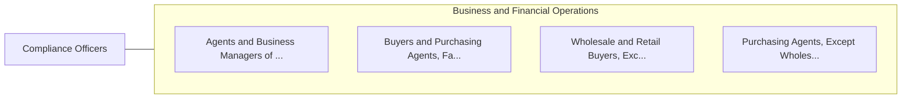

# Compliance Officers

> Examine, evaluate, and investigate eligibility for or conformity with laws and regulations governing contract compliance of licenses and permits, and perform other compliance and enforcement inspection and analysis activities not classified elsewhere.

## Overview

Compliance Officers is classified under Business and Financial Operations (SOC 13). Examine, evaluate, and investigate eligibility for or conformity with laws and regulations governing contract compliance of licenses and permits, and perform other compliance and enforcement inspection and analysis activities not classified elsewhere.

## Classification Hierarchy

## Key Statistics

| Metric | Value |
|--------|-------|
| SOC Code | 13-1041.00 |
| Category | [Business and Financial Operations](/occupations/Business) |
| Task Count | 43 |
| Source | O*NET |

## Core Tasks

### warn.Violators

Compliance Officers warn violators as part of their core responsibilities.

**Actions:**
- `warn.Violators.of.Infractions`
- `warn.Violators.of.Penalties`

### evaluate.Applications

Compliance Officers evaluate applications as part of their core responsibilities.

**Actions:**
- `evaluate.Applications.to.gather.InformationAboutEligibilityIssues`
- `evaluate.Applications.to.LiabilityIssues`
- `evaluate.Records.to.gather.InformationAboutEligibilityIssues`
- `evaluate.Records.to.LiabilityIssues`

### advise.Licensees

Compliance Officers advise licensees as part of their core responsibilities.

**Actions:**
- `advise.Licensees`
- `advise.OtherIndividuals`
- `advise.Groups.concerning.Licensing`
- `advise.Permit`

## Skills & Competencies

### Technical Skills
- **Financial Analysis** - Advanced
- **Data Analysis** - Advanced
- **Regulatory Compliance** - Advanced

### Soft Skills
- **Communication** - Essential
- **Problem Solving** - Essential
- **Critical Thinking** - Important
- **Teamwork** - Important
- **Adaptability** - Important

## Related Occupations

## Industries

This occupation is found across multiple industries. See [Industries](/industries) for sector-specific employment data.

## Career Progression

---

*Source: O*NET 13-1041.00 - ONETOccupation*
