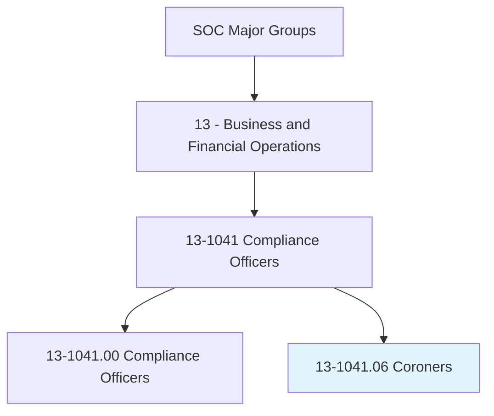
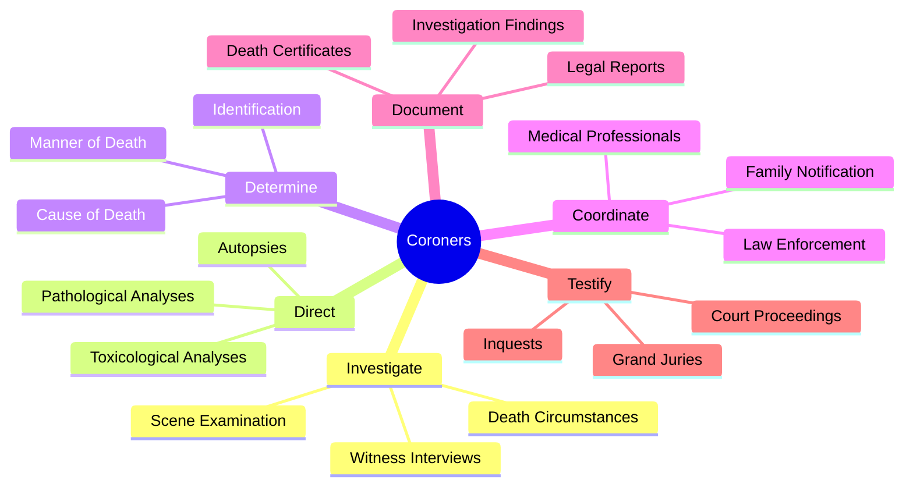
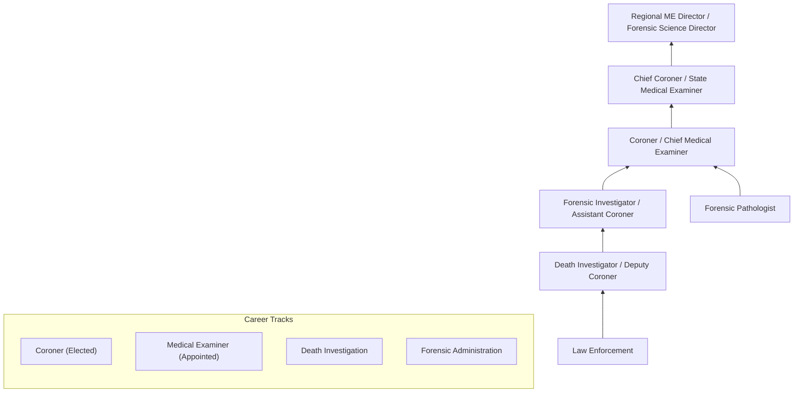
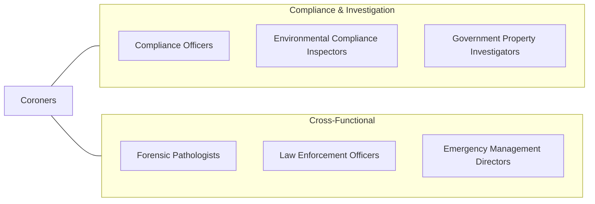

# Coroners

> Direct activities such as autopsies, pathological and toxicological analyses, and inquests relating to the investigation of deaths occurring within a legal jurisdiction.

## Overview

Coroners are public officials responsible for investigating deaths that occur under unusual, suspicious, or unexplained circumstances within their jurisdictions. They direct autopsies, coordinate with law enforcement, review medical records, and make official determinations about the cause and manner of death. Unlike medical examiners who are typically appointed physicians, coroners are often elected officials whose qualifications vary by jurisdiction, though the role increasingly demands specialized training in death investigation and medicolegal practices.

The coroner's office serves as a critical intersection of public health, law enforcement, and the legal system. Coroners issue death certificates, authorize the release of bodies to families, testify in court proceedings, and may convene coroner's inquests in cases of public interest. Their determinations have profound legal, insurance, and public health implications, influencing criminal prosecutions, civil litigation, and epidemiological data.

Modern coroner and medical examiner systems face growing challenges including opioid epidemic caseloads, advances in forensic technology, mass casualty incident preparedness, and increasing public scrutiny. The profession is evolving toward higher educational standards, accreditation requirements, and integration of digital tools for case management, forensic imaging, and data analysis.

## Classification Hierarchy

## Key Statistics

| Metric | Value |
|--------|-------|
| SOC Code | 13-1041.06 |
| Job Zone | 5 (Extensive Preparation) |
| Category | [Business and Financial Operations](/occupations/Business/index) |
| Median Salary | $69,400 |
| Employment | ~8,500 |
| Projected Growth | 4% (As fast as average) |
| Task Count | 35 |
| Source | O*NET |

## Core Tasks

### investigate.DeathCircumstances

Investigate the circumstances surrounding deaths to determine cause and manner.

**Actions:**
- `investigate.DeathCircumstances.to.determine.CauseOfDeath` - Establish death cause
- `investigate.SceneEvidence.to.reconstruct.Events` - Analyze death scene
- `interview.Witnesses.to.gather.Information` - Collect testimony
- `review.MedicalRecords.to.establish.MedicalHistory` - Assess health background

### direct.ForensicAnalyses

Direct and oversee autopsies, pathological, and toxicological analyses.

**Actions:**
- `direct.Autopsies.to.determine.CauseOfDeath` - Oversee post-mortem examinations
- `direct.PathologicalAnalyses.to.identify.DiseasesOrInjuries` - Coordinate tissue analysis
- `direct.ToxicologicalAnalyses.to.detect.Substances` - Order substance testing
- `coordinate.ForensicTeams.for.ComplexInvestigations` - Manage specialist resources

### determine.MannerOfDeath

Make official determinations regarding the manner and cause of death.

**Actions:**
- `determine.CauseOfDeath.for.DeathCertification` - Certify cause
- `determine.MannerOfDeath.as.NaturalOrUnnatural` - Classify death manner
- `issue.DeathCertificates.for.LegalPurposes` - Complete documentation
- `testify.InCourtProceedings.as.ExpertWitness` - Provide legal testimony

## Skills & Competencies

### Technical Skills
- **Death Investigation Procedures** - Expert
- **Forensic Science Principles** - Expert
- **Medicolegal Standards** - Advanced
- **Anatomy & Pathology Knowledge** - Advanced
- **Toxicology** - Proficient
- **Legal Procedures & Court Testimony** - Advanced
- **Public Health Reporting** - Proficient

### Soft Skills
- **Analytical Thinking** - Critical
- **Attention to Detail** - Critical
- **Communication (Written/Verbal)** - Essential
- **Emotional Resilience** - Essential
- **Ethical Judgment** - Essential
- **Leadership & Management** - Important

## Education & Certifications

| Requirement | Details |
|-------------|---------|
| Typical Education | Varies by jurisdiction; increasingly requires bachelor's or higher |
| Medical Examiner Track | MD/DO with forensic pathology fellowship |
| Key Certifications | ABMDI (American Board of Medicolegal Death Investigators) |
| Forensic Certification | D-ABFE (Diplomate, American Board of Forensic Examiners) |
| Professional Development | NAME (National Association of Medical Examiners) |
| Elected vs Appointed | Coroners often elected; Medical Examiners appointed |

## Career Progression

## Industry Variations

| Industry | Focus | Typical Tasks |
|----------|-------|---------------|
| **County/Municipal Government** | Local jurisdiction | Routine death investigations, death certification |
| **State Government** | State-level oversight | Standards development, complex cases |
| **Federal (AFMES)** | Military/federal deaths | Armed forces casualties, federal jurisdiction |
| **Mass Casualty / Disaster** | DVI operations | Victim identification, multi-agency coordination |
| **Academia / Research** | Forensic science | Teaching, research, expert consultation |
| **Private Consulting** | Expert witness | Case review, independent analysis, litigation support |

## Technology & Tools

| Category | Tools |
|----------|-------|
| **Case Management** | CME (Case Management Enterprise), MEDEX |
| **Forensic Imaging** | Autopsy imaging systems, CT/MRI virtual autopsy |
| **Toxicology** | GC-MS, LC-MS/MS, immunoassay systems |
| **Digital Forensics** | Digital photography, 3D scanning |
| **Records & Reporting** | EDRS (Electronic Death Registration Systems) |
| **Communication** | MDI notification systems |
| **GIS & Mapping** | Crime scene mapping, death mapping analytics |

## Related Occupations

## Departments

This occupation typically works in:
- [Coroner's Office](/departments/CoronersOffice)
- [Medical Examiner's Office](/departments/MedicalExaminersOffice)
- [Forensic Science Services](/departments/ForensicScience)
- [Public Health](/departments/PublicHealth)
- [Law Enforcement](/departments/LawEnforcement)

---

*Source: O*NET 13-1041.06 - ONETOccupation*
