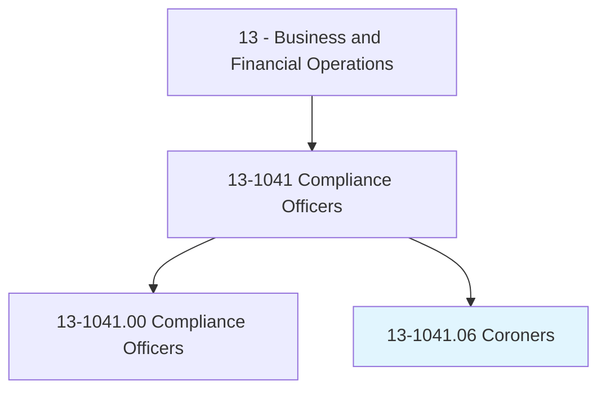
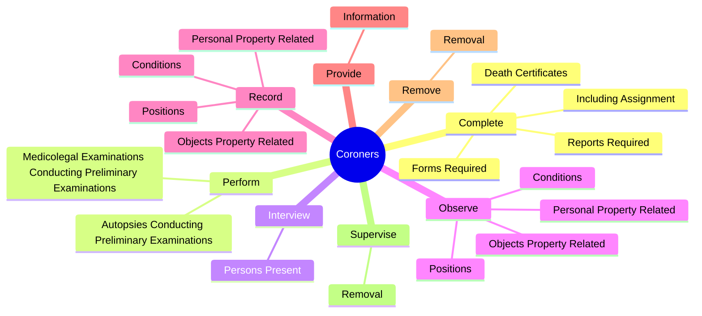
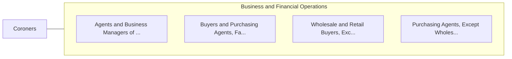

# Coroners

> Direct activities such as autopsies, pathological and toxicological analyses, and inquests relating to the investigation of deaths occurring within a legal jurisdiction to determine cause of death or to fix responsibility for accidental, violent, or unexplained deaths.

## Overview

Coroners is classified under Business and Financial Operations (SOC 13). Direct activities such as autopsies, pathological and toxicological analyses, and inquests relating to the investigation of deaths occurring within a legal jurisdiction to determine cause of death or to fix responsibility for accidental, violent, or unexplained deaths.

## Classification Hierarchy

## Key Statistics

| Metric | Value |
|--------|-------|
| SOC Code | 13-1041.06 |
| Category | [Business and Financial Operations](/occupations/Business) |
| Task Count | 92 |
| Source | O*NET |

## Core Tasks

### complete.DeathCertificates

Coroners complete death certificates as part of their core responsibilities.

**Actions:**
- `complete.DeathCertificates.of.Cause.of.Death`
- `complete.DeathCertificates.of.Manner.of.Death`
- `complete.IncludingAssignment.of.Cause.of.Death`
- `complete.IncludingAssignment.of.Manner.of.Death`

### perform.MedicolegalExaminationsConductingPreliminaryExaminations

Coroners perform medicolegal examinations conducting preliminary examinations as part of their core responsibilities.

**Actions:**
- `perform.MedicolegalExaminationsConductingPreliminaryExaminations.of.Body.to.identify.Victims`
- `perform.MedicolegalExaminationsConductingPreliminaryExaminations.of.LocateSigns.of.Trauma`
- `perform.MedicolegalExaminationsConductingPreliminaryExaminations.of.IdentifyFactorsWouldIndicateTime.of.Death`
- `perform.AutopsiesConductingPreliminaryExaminations.of.Body.to.identify.Victims`

### interview.PersonsPresent

Coroners interview persons present as part of their core responsibilities.

**Actions:**
- `interview.PersonsPresent.at.DeathScenes.to.obtain.InformationUsefulInDeterminingMannerOfDeath`

## Skills & Competencies

### Technical Skills
- **Financial Analysis** - Advanced
- **Data Analysis** - Advanced
- **Regulatory Compliance** - Advanced

### Soft Skills
- **Communication** - Essential
- **Problem Solving** - Essential
- **Critical Thinking** - Important
- **Teamwork** - Important
- **Adaptability** - Important

## Related Occupations

## Industries

This occupation is found across multiple industries. See [Industries](/industries) for sector-specific employment data.

## Career Progression

---

*Source: O*NET 13-1041.06 - ONETOccupation*
