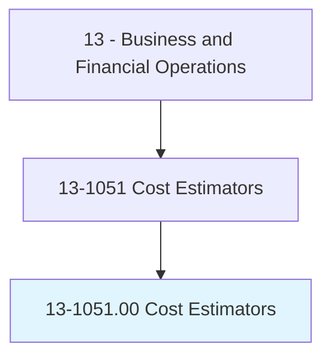
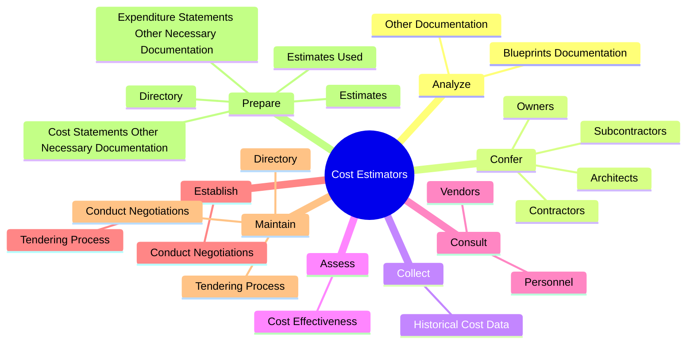
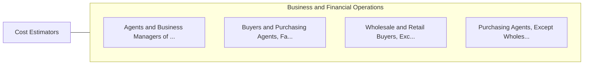

# Cost Estimators

> Prepare cost estimates for product manufacturing, construction projects, or services to aid management in bidding on or determining price of product or service. May specialize according to particular service performed or type of product manufactured.

## Overview

Cost Estimators is an occupation within the Business and Financial Operations category. Prepare cost estimates for product manufacturing, construction projects, or services to aid management in bidding on or determining price of product or service. 

## Classification Hierarchy

## Key Statistics

| Metric | Value |
|--------|-------|
| SOC Code | 13-1051.00 |
| Category | [Business and Financial Operations](/occupations/Business) |
| Task Count | 61 |
| Source | O*NET |

## Core Tasks

### analyze.BlueprintsDocumentation

Cost Estimators analyze blueprints documentation as part of their core responsibilities.

**Actions:**
- `analyze.BlueprintsDocumentation.to.prepare.Time`
- `analyze.BlueprintsDocumentation.to.Cost`
- `analyze.BlueprintsDocumentation.to.Materials`
- `analyze.BlueprintsDocumentation.to.LaborEstimates`

### confer.Architects

Cost Estimators confer architects as part of their core responsibilities.

**Actions:**
- `confer.Architects.on.ChangesToCostEstimates`
- `confer.Architects.on.AdjustmentsToCostEstimates`
- `confer.Owners.on.ChangesToCostEstimates`
- `confer.Owners.on.AdjustmentsToCostEstimates`

### collect.HistoricalCostData

Cost Estimators collect historical cost data as part of their core responsibilities.

**Actions:**
- `collect.HistoricalCostData.to.estimate.CostsForCurrentProducts`
- `collect.HistoricalCostData.to.FutureProducts`

## Skills & Competencies

### Technical Skills
- **Financial Analysis** - Advanced
- **Data Analysis** - Advanced
- **Regulatory Compliance** - Advanced

### Soft Skills
- **Communication** - Essential
- **Problem Solving** - Essential
- **Critical Thinking** - Important
- **Teamwork** - Important
- **Adaptability** - Important

## Related Occupations

## Industries

This occupation is found across multiple industries. See [Industries](/industries) for sector-specific employment data.

## Career Progression

---

*Source: O*NET 13-1051.00 - ONETOccupation*
