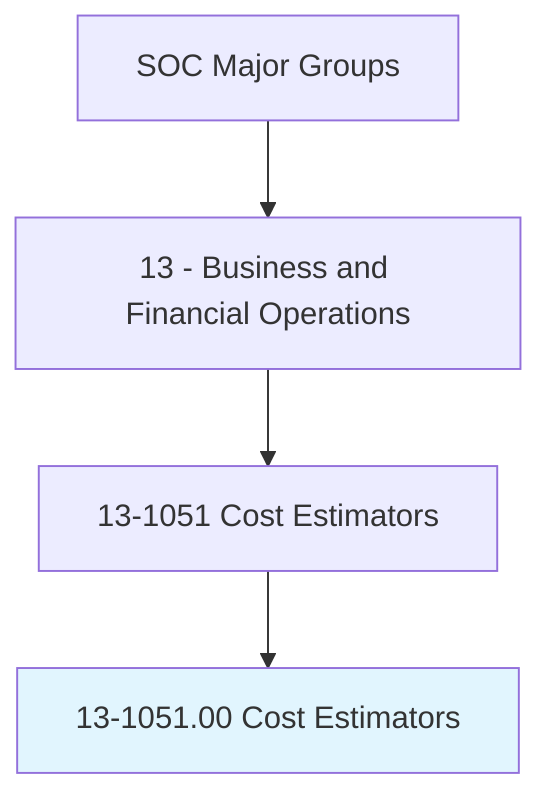
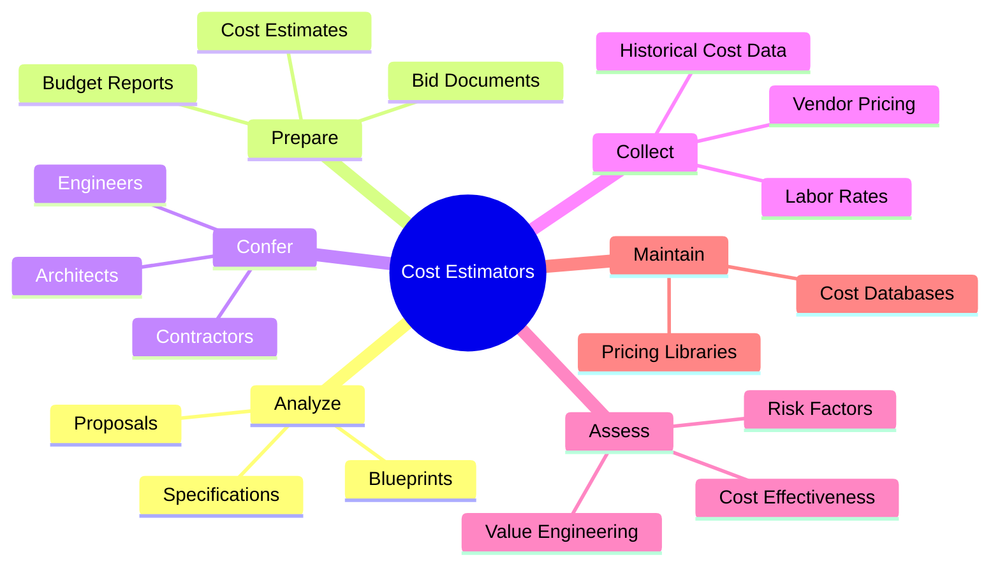
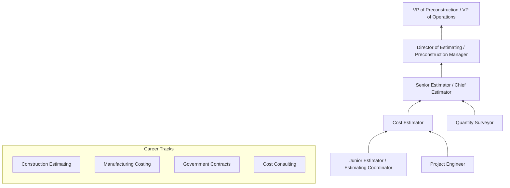
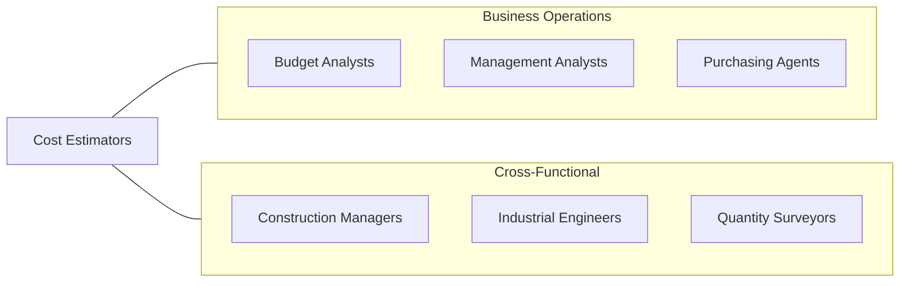

# Cost Estimators

> Prepare cost estimates for product manufacturing, construction projects, or services to aid management in bidding on or determining price of product or service.

## Overview

Cost Estimators are analytical professionals who develop accurate projections of the time, money, materials, and labor required to complete projects or manufacture products. They are essential to the profitability and competitiveness of construction firms, manufacturers, engineering companies, and government agencies, as their estimates directly influence bidding strategies, project budgets, and pricing decisions.

These professionals analyze blueprints, specifications, proposals, and other documentation to prepare comprehensive cost breakdowns. They consult with engineers, architects, subcontractors, and suppliers to gather pricing data and understand project requirements. The work requires strong mathematical skills, knowledge of construction methods or manufacturing processes, and the ability to anticipate potential cost variables including material price fluctuations, labor availability, and regulatory requirements.

The profession has evolved with the adoption of building information modeling (BIM), cloud-based estimating software, and data analytics that enable more accurate and efficient cost projections. Despite technological advances, experienced estimators remain essential for their judgment in assessing risk, interpreting ambiguous specifications, and applying lessons learned from past projects.

## Classification Hierarchy

## Key Statistics

| Metric | Value |
|--------|-------|
| SOC Code | 13-1051.00 |
| Job Zone | 4 (Considerable Preparation) |
| Category | [Business and Financial Operations](/occupations/Business/index) |
| Median Salary | $71,200 |
| Employment | ~210,000 |
| Projected Growth | 3% (Slower than average) |
| Task Count | 61 |
| Source | O*NET |

## Core Tasks

### analyze.ProjectDocumentation

Analyze blueprints, specifications, and proposals to identify all cost elements.

**Actions:**
- `analyze.BlueprintsDocumentation.to.prepare.CostEstimates` - Extract quantity takeoffs
- `analyze.Specifications.to.determine.MaterialRequirements` - Identify material needs
- `analyze.RiskFactors.to.apply.ContingencyAllowances` - Account for uncertainty
- `analyze.Proposals.to.evaluate.ProjectScope` - Define work boundaries

### prepare.CostEstimates

Develop comprehensive cost estimates including materials, labor, equipment, and overhead.

**Actions:**
- `prepare.CostEstimates.for.BidSubmission` - Support competitive bidding
- `prepare.BudgetReports.for.ProjectPlanning` - Guide financial planning
- `prepare.ValueEngineeringAnalyses.to.reduce.ProjectCosts` - Identify savings
- `prepare.ChangeOrderEstimates.for.ScopeModifications` - Price scope changes

### confer.WithStakeholders

Consult with architects, engineers, contractors, and clients on cost-related matters.

**Actions:**
- `confer.Architects.on.ChangesToCostEstimates` - Discuss design impacts
- `confer.Contractors.on.SubcontractorPricing` - Validate trade costs
- `collect.HistoricalCostData.to.estimate.CostsForCurrentProducts` - Leverage past data
- `confer.Clients.on.BudgetConstraints` - Align expectations

## Skills & Competencies

### Technical Skills
- **Cost Estimation Methodologies** - Expert
- **Quantity Takeoff** - Expert
- **Blueprint & Specification Reading** - Expert
- **BIM (Building Information Modeling)** - Advanced
- **Construction Methods / Manufacturing Processes** - Advanced
- **Statistical Analysis & Forecasting** - Advanced
- **Financial Analysis** - Proficient

### Soft Skills
- **Analytical Thinking** - Critical
- **Attention to Detail** - Critical
- **Mathematical Aptitude** - Essential
- **Communication** - Essential
- **Time Management** - Important
- **Negotiation** - Important

## Education & Certifications

| Requirement | Details |
|-------------|---------|
| Typical Education | Bachelor's degree in Construction Management, Engineering, or related field |
| Key Certifications | CCC (Certified Cost Consultant - AACE), CPE (Certified Professional Estimator - ASPE) |
| Additional Certs | CCE (Certified Cost Engineer), EVP (Earned Value Professional) |
| Professional Orgs | AACE International, ASPE, RSMeans |
| Work Experience | 2-5 years in construction, engineering, or manufacturing |
| Continuing Education | Required for certification maintenance |

## Career Progression

## Industry Variations

| Industry | Focus | Typical Tasks |
|----------|-------|---------------|
| **Construction** | Building projects | Quantity takeoff, subcontractor bidding, change order pricing |
| **Manufacturing** | Product costing | Bill of materials, labor standards, overhead allocation |
| **Defense / Aerospace** | Government contracts | EVMS, CAS compliance, parametric estimating |
| **Oil & Gas** | Capital projects | Factored estimating, modular construction |
| **Software / IT** | Project estimation | Function point analysis, agile estimation |
| **Infrastructure** | Civil works | Earthwork calculations, unit pricing, equipment rates |

## Technology & Tools

| Category | Tools |
|----------|-------|
| **Estimating Software** | RSMeans, ProEst, HCSS HeavyBid, WinEst |
| **BIM Tools** | Revit, Navisworks, Bluebeam Revu |
| **Takeoff** | PlanSwift, On-Screen Takeoff, Bluebeam |
| **Spreadsheets** | Excel (advanced), Google Sheets |
| **Project Management** | Primavera P6, Microsoft Project, Procore |
| **Cost Databases** | RSMeans, Richardson, Compass International |
| **ERP Systems** | SAP, Oracle, Viewpoint Vista |

## Related Occupations

## Departments

This occupation typically works in:
- Preconstruction
- Estimating
- Project Controls
- [Finance & Budgeting](/departments/Finance)
- [Procurement](/departments/Procurement)

---

*Source: O*NET 13-1051.00 - ONETOccupation*
