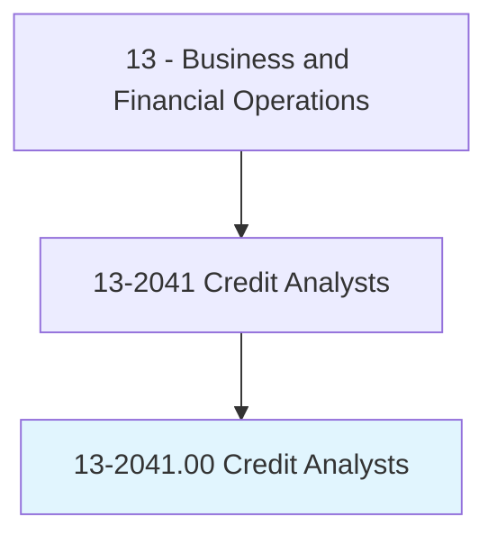
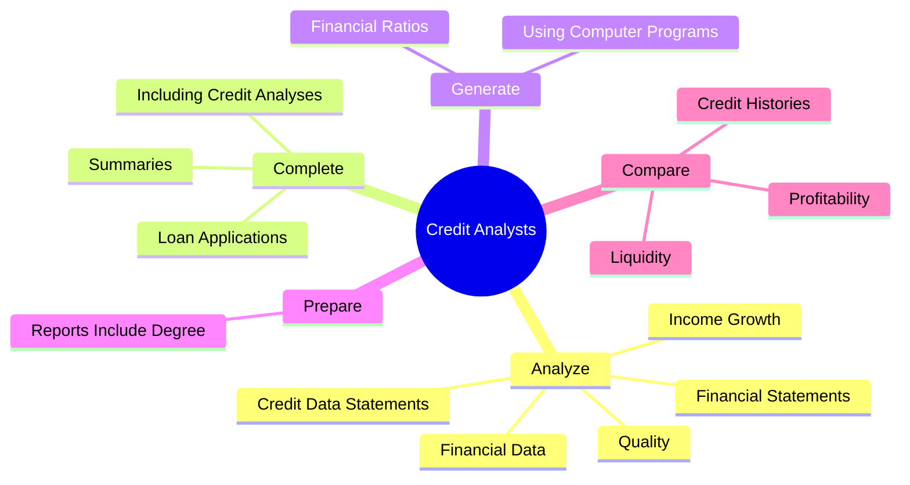

# Credit Analysts

> Analyze credit data and financial statements of individuals or firms to determine the degree of risk involved in extending credit or lending money. Prepare reports with credit information for use in decisionmaking.

## Overview

Credit Analysts is an occupation within the Business and Financial Operations category. Analyze credit data and financial statements of individuals or firms to determine the degree of risk involved in extending credit or lending money. 

## Classification Hierarchy

## Key Statistics

| Metric | Value |
|--------|-------|
| SOC Code | 13-2041.00 |
| Category | [Business and Financial Operations](/occupations/Business) |
| Task Count | 47 |
| Source | O*NET |

## Core Tasks

### analyze.CreditDataStatements

Credit Analysts analyze credit data statements as part of their core responsibilities.

**Actions:**
- `analyze.CreditDataStatements.to.determine.DegreeOfRiskInvolvedInExtendingCredit`
- `analyze.CreditDataStatements.to.LendingMoney`
- `analyze.FinancialStatements.to.determine.DegreeOfRiskInvolvedInExtendingCredit`
- `analyze.FinancialStatements.to.LendingMoney`

### complete.LoanApplications

Credit Analysts complete loan applications as part of their core responsibilities.

**Actions:**
- `complete.LoanApplications.of.LoanRequests`
- `complete.LoanApplications.of.SubmitToLoanCommitteesF`
- `complete.LoanApplications.of.Approval`
- `complete.IncludingCreditAnalyses.of.LoanRequests`

### generate.FinancialRatios

Credit Analysts generate financial ratios as part of their core responsibilities.

**Actions:**
- `generate.FinancialRatios.to.evaluate.CustomersFinancialStatus`
- `generate.UsingComputerPrograms.to.evaluate.CustomersFinancialStatus`

## Skills & Competencies

### Technical Skills
- **Financial Analysis** - Advanced
- **Data Analysis** - Advanced
- **Regulatory Compliance** - Advanced

### Soft Skills
- **Communication** - Essential
- **Problem Solving** - Essential
- **Critical Thinking** - Important
- **Teamwork** - Important
- **Adaptability** - Important

## Related Occupations

## Industries

This occupation is found across multiple industries. See [Industries](/industries) for sector-specific employment data.

## Career Progression

---

*Source: O*NET 13-2041.00 - ONETOccupation*
