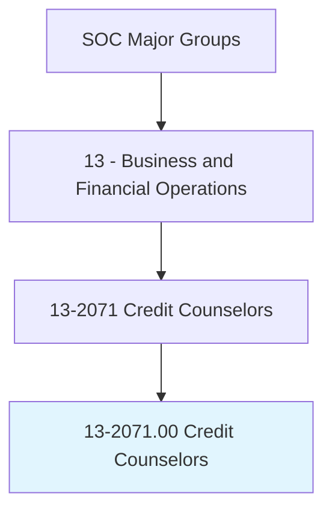
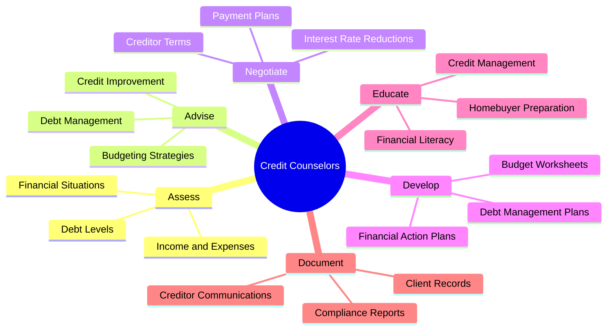
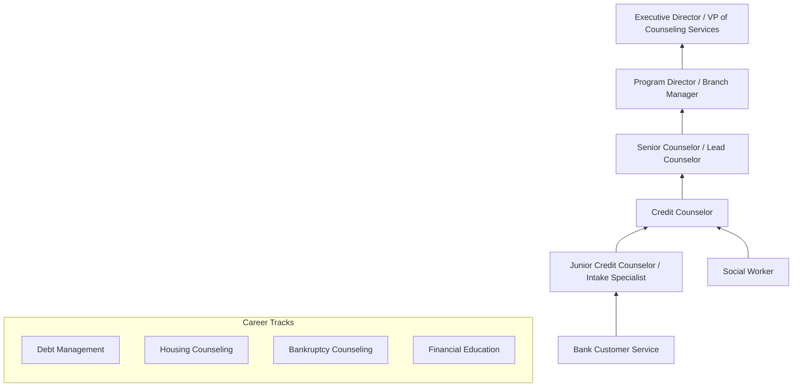
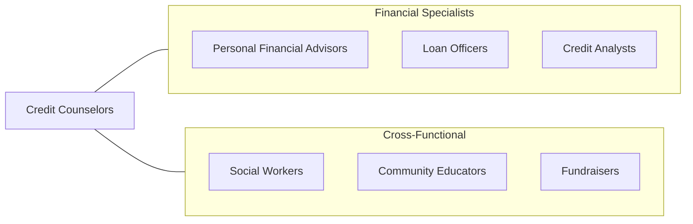

# Credit Counselors

> Advise and educate individuals or organizations on acquiring and managing debt. May provide guidance on budgeting, managing money, and using credit. May also negotiate with creditors on behalf of clients.

## Overview

Credit Counselors help individuals and families manage their debt, improve their financial literacy, and develop sustainable budgeting practices. They work for nonprofit credit counseling agencies, financial institutions, and government programs, providing one-on-one counseling sessions that assess clients' financial situations, create debt management plans, and negotiate with creditors for reduced interest rates or modified payment terms. The role combines financial expertise with counseling skills, as many clients are experiencing significant financial stress.

These professionals evaluate clients' income, expenses, assets, and debts to develop personalized action plans. They may administer debt management programs (DMPs) where the agency consolidates client payments and distributes funds to creditors. Credit counselors also provide pre-bankruptcy counseling and post-bankruptcy debtor education as required by federal law, housing counseling for prospective homebuyers, and financial education workshops for community organizations.

The profession has grown in importance as consumer debt levels have risen and financial products have become more complex. Credit counselors must stay current with consumer protection regulations, bankruptcy law, student loan programs, mortgage modification options, and emerging financial technologies. The shift to digital financial services has expanded the reach of credit counseling while also introducing new challenges around online lending, cryptocurrency, and digital payment platforms.

## Classification Hierarchy

## Key Statistics

| Metric | Value |
|--------|-------|
| SOC Code | 13-2071.00 |
| Job Zone | 4 (Considerable Preparation) |
| Category | [Business and Financial Operations](/occupations/Business/index) |
| Median Salary | $48,170 |
| Employment | ~34,000 |
| Projected Growth | 4% (As fast as average) |
| Task Count | 32 |
| Source | O*NET |

## Core Tasks

### assess.FinancialSituations

Evaluate clients' financial circumstances to identify problems and develop solutions.

**Actions:**
- `assess.FinancialSituations.to.identify.DebtProblems` - Diagnose financial issues
- `assess.IncomeAndExpenses.to.create.BudgetBaseline` - Establish spending picture
- `assess.CreditReports.to.evaluate.CreditHealth` - Review credit standing
- `assess.DebtLevels.to.determine.AppropriateInterventions` - Select counseling approach

### negotiate.CreditorTerms

Negotiate with creditors on behalf of clients to obtain more favorable repayment terms.

**Actions:**
- `negotiate.InterestRateReductions.with.Creditors` - Lower borrowing costs
- `negotiate.PaymentPlans.with.CollectionAgencies` - Structure affordable payments
- `negotiate.FeeWaivers.with.CreditCardCompanies` - Eliminate penalty charges
- `administer.DebtManagementPrograms.for.ClientRepayment` - Manage consolidated payments

### educate.FinancialLiteracy

Provide financial education to individuals and groups on budgeting, credit, and money management.

**Actions:**
- `educate.Clients.on.BudgetingStrategies` - Teach money management
- `educate.Homebuyers.on.MortgageReadiness` - Prepare for homeownership
- `provide.PreBankruptcyCounseling.as.required.ByLaw` - Fulfill legal requirements
- `conduct.FinancialLiteracyWorkshops.for.Communities` - Deliver group education

## Skills & Competencies

### Technical Skills
- **Consumer Credit & Debt Analysis** - Expert
- **Budgeting & Financial Planning** - Expert
- **Debt Management Program Administration** - Advanced
- **Consumer Protection Regulations** - Advanced
- **Bankruptcy Law Basics** - Proficient
- **Mortgage & Housing Counseling** - Proficient
- **Student Loan Programs** - Proficient

### Soft Skills
- **Empathy & Active Listening** - Critical
- **Communication** - Critical
- **Problem Solving** - Essential
- **Patience** - Essential
- **Cultural Sensitivity** - Important
- **Ethical Judgment** - Important

## Education & Certifications

| Requirement | Details |
|-------------|---------|
| Typical Education | Bachelor's degree in Finance, Social Work, or related field |
| Key Certifications | CCCS (Certified Consumer Credit Specialist), AFC (Accredited Financial Counselor) |
| HUD Counseling | HUD-approved housing counselor certification |
| Bankruptcy | DOJ-approved pre-bankruptcy counseling provider certification |
| Professional Orgs | NFCC (National Foundation for Credit Counseling) |
| Work Experience | 1-3 years in financial counseling or related field |

## Career Progression

## Industry Variations

| Industry | Focus | Typical Tasks |
|----------|-------|---------------|
| **Nonprofit Credit Counseling** | Consumer debt | DMP administration, budget counseling, creditor negotiation |
| **Housing Counseling** | Homeownership | Pre-purchase education, foreclosure prevention, reverse mortgage counseling |
| **Military Financial Counseling** | Service member finances | PCS budgeting, deployment planning, TSP guidance |
| **Student Loan Counseling** | Education debt | Repayment plan selection, forgiveness program guidance |
| **Banking / Credit Unions** | Customer education | Financial wellness programs, product guidance |
| **Government Programs** | Public assistance | Benefits coordination, financial capability programs |

## Technology & Tools

| Category | Tools |
|----------|-------|
| **Counseling Platforms** | CredHQ, CounselorMax, NFCC tools |
| **CRM** | Salesforce, custom agency systems |
| **Credit Reports** | Equifax, Experian, TransUnion platforms |
| **Budgeting** | Excel, YNAB, Mint, agency-specific tools |
| **Document Management** | DocuSign, SharePoint, secure portals |
| **Communication** | Phone systems, Zoom, secure messaging |
| **Compliance** | HUD reporting systems, DOJ compliance tools |

## Related Occupations

## Departments

This occupation typically works in:
- [Consumer Counseling Services](/departments/ConsumerCounseling)
- [Housing Counseling](/departments/HousingCounseling)
- [Financial Education](/departments/FinancialEducation)
- [Community Outreach](/departments/CommunityOutreach)
- [Client Services](/departments/ClientServices)

---

*Source: O*NET 13-2071.00 - ONETOccupation*
