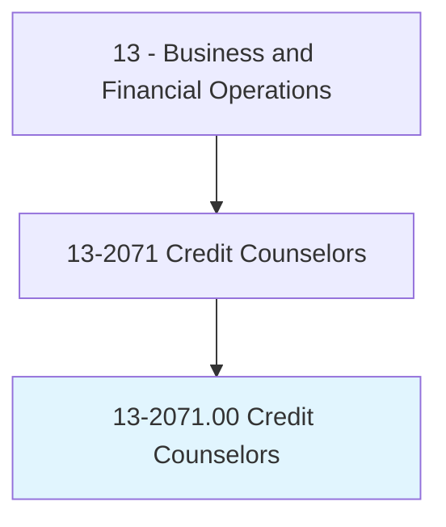
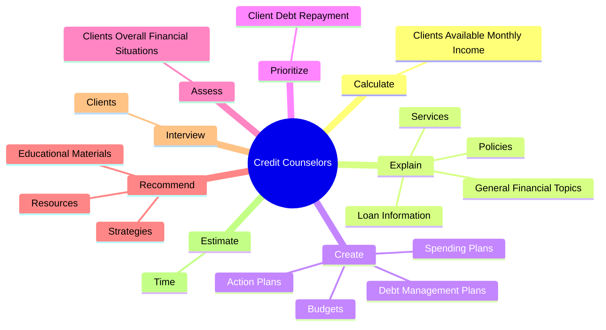

# Credit Counselors

> Advise and educate individuals or organizations on acquiring and managing debt. May provide guidance in determining the best type of loan and explain loan requirements or restrictions. May help develop debt management plans or student financial aid packages. May advise on credit issues, or provide budget, mortgage, bankruptcy, or student financial aid counseling.

## Overview

Credit Counselors is an occupation within the Business and Financial Operations category. Advise and educate individuals or organizations on acquiring and managing debt. May provide guidance in determining the best type of loan and explain loan requirements or restrictions.

## Classification Hierarchy

## Key Statistics

| Metric | Value |
|--------|-------|
| SOC Code | 13-2071.00 |
| Category | [Business and Financial Operations](/occupations/Business/index) |
| Task Count | 115 |
| Source | O*NET |

## Core Tasks

### calculate.ClientsAvailableMonthlyIncome

Credit Counselors calculate clients available monthly income as part of their core responsibilities.

**Actions:**
- `calculate.ClientsAvailableMonthlyIncome.to.meet.DebtObligations`

### explain.Services

Credit Counselors explain services as part of their core responsibilities.

**Actions:**
- `explain.Services.to.Clients`
- `explain.Services.to.DebtManagementProgramRules`
- `explain.Services.to.Advantages`
- `explain.Services.to.DisadvantagesOfUsingServices`

### create.DebtManagementPlans

Credit Counselors create debt management plans as part of their core responsibilities.

**Actions:**
- `create.DebtManagementPlans.to.assist.ClientsToMeetFinancialGoals`
- `create.SpendingPlans.to.assist.ClientsToMeetFinancialGoals`
- `create.Budgets.to.assist.ClientsToMeetFinancialGoals`
- `create.ActionPlans.to.assist.ClientsInObtainingPermanentHousingViaRentPrograms`

## Skills & Competencies

### Technical Skills
- **Financial Analysis** - Advanced
- **Data Analysis** - Advanced
- **Regulatory Compliance** - Advanced

### Soft Skills
- **Communication** - Essential
- **Problem Solving** - Essential
- **Critical Thinking** - Important
- **Teamwork** - Important
- **Adaptability** - Important

## Related Occupations

## Industries

This occupation is found across multiple industries. See [Industries](/industries) for sector-specific employment data.

## Career Progression

---

*Source: O*NET 13-2071.00 - ONETOccupation*
