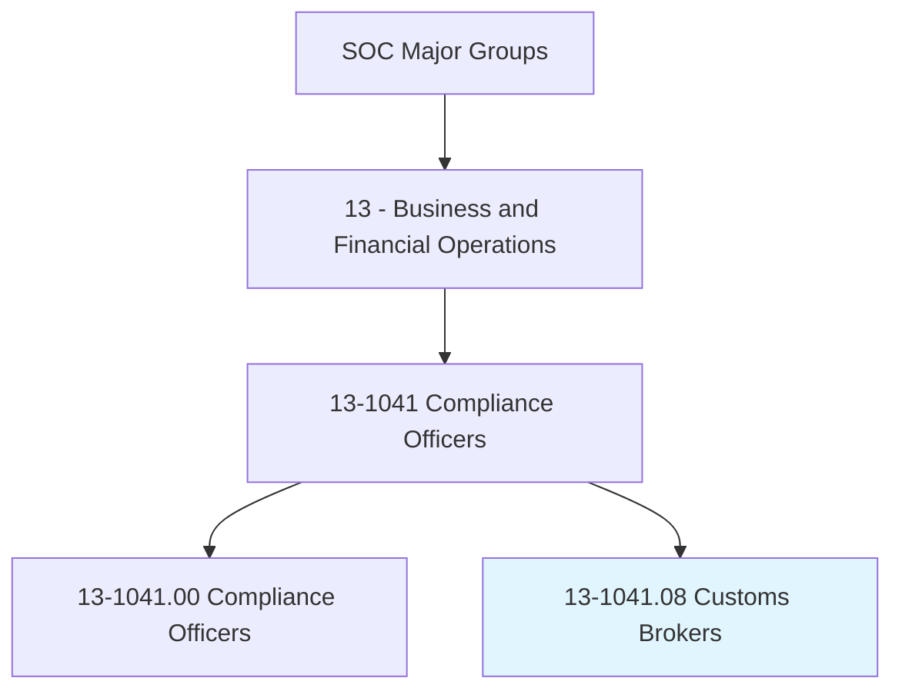
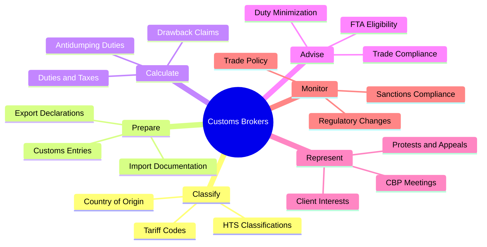
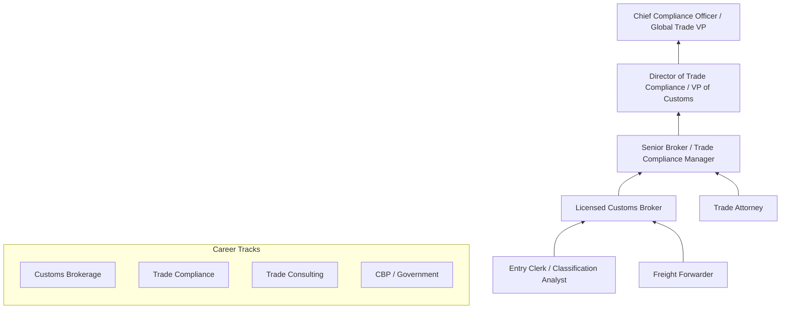
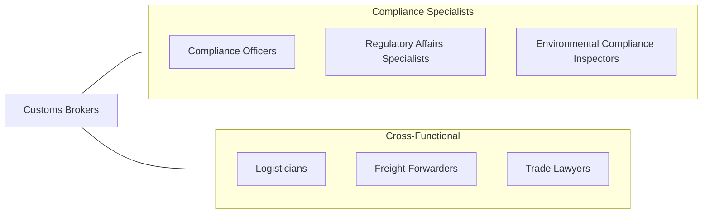

# Customs Brokers

> Prepare customs documentation and ensure that shipments meet all applicable laws to facilitate the import and export of goods. Determine and track import duties and taxes. Represent clients in meetings with customs officials and apply for duty refunds and tariff reclassifications.

## Overview

Customs Brokers are licensed professionals who serve as intermediaries between importers/exporters and government customs authorities, ensuring that international shipments comply with all applicable laws, regulations, and tariff classifications. They prepare and submit customs documentation, calculate duties and taxes, and resolve classification disputes on behalf of their clients. The role requires deep expertise in trade law, the Harmonized Tariff Schedule, customs valuation, and the regulatory requirements of agencies including CBP, FDA, USDA, and EPA.

These professionals play an essential role in global commerce by facilitating the efficient flow of goods across international borders while ensuring compliance with trade agreements, sanctions, anti-dumping duties, and security requirements. They advise clients on duty minimization strategies, free trade agreement eligibility, foreign trade zone benefits, and drawback programs. Errors in customs documentation can result in shipment delays, costly penalties, seizure of goods, or loss of import privileges, making accuracy and attention to detail paramount.

The profession has been transformed by electronic filing systems, automated broker interfaces, and increasing trade complexity driven by tariff disputes, sanctions regimes, and supply chain security requirements. Modern customs brokers must navigate rapidly changing trade policies while leveraging technology to manage high volumes of entries efficiently.

## Classification Hierarchy

## Key Statistics

| Metric | Value |
|--------|-------|
| SOC Code | 13-1041.08 |
| Job Zone | 4 (Considerable Preparation) |
| Category | [Business and Financial Operations](/occupations/Business/index) |
| Median Salary | $72,500 |
| Employment | ~22,000 |
| Projected Growth | 5% (As fast as average) |
| Task Count | 38 |
| Source | O*NET |

## Core Tasks

### classify.TariffCodes

Determine the correct Harmonized Tariff Schedule classification for imported goods.

**Actions:**
- `classify.Goods.under.HarmonizedTariffSchedule` - Assign HTS codes
- `determine.CountryOfOrigin.for.DutyCalculation` - Establish origin
- `evaluate.FreeTradeAgreementEligibility.for.DutyReduction` - Assess FTA benefits
- `apply.for.TariffReclassifications.on.behalf.of.Clients` - Contest classifications

### prepare.CustomsDocumentation

Prepare and submit customs entries and supporting documentation for import/export shipments.

**Actions:**
- `prepare.CustomsEntries.for.CBPFiling` - File import declarations
- `prepare.ExportDeclarations.for.ComplianceVerification` - Submit export filings
- `prepare.BondApplications.for.ImportPrivileges` - Secure customs bonds
- `submit.Documentation.through.AutomatedBrokerInterface` - File electronically

### calculate.DutiesAndTaxes

Calculate and track import duties, taxes, and applicable trade remedy fees.

**Actions:**
- `calculate.ImportDuties.based.on.TariffClassification` - Compute duty amounts
- `calculate.AntidumpingDuties.for.SubjectMerchandise` - Apply AD/CVD rates
- `track.DutyPayments.for.ClientAccounting` - Monitor payment obligations
- `apply.for.DutyDrawback.on.ReexportedGoods` - Recover paid duties

## Skills & Competencies

### Technical Skills
- **Customs Law & Regulations (19 CFR)** - Expert
- **Harmonized Tariff Schedule Classification** - Expert
- **Customs Valuation** - Expert
- **Trade Compliance** - Advanced
- **Free Trade Agreement Administration** - Advanced
- **Import/Export Documentation** - Advanced
- **Sanctions & Denied Party Screening** - Proficient
- **Supply Chain Security (C-TPAT)** - Proficient

### Soft Skills
- **Attention to Detail** - Critical
- **Analytical Thinking** - Critical
- **Communication** - Essential
- **Client Relationship Management** - Essential
- **Problem Solving** - Essential
- **Adaptability to Regulatory Change** - Important

## Education & Certifications

| Requirement | Details |
|-------------|---------|
| Typical Education | Bachelor's degree in International Business, Supply Chain, or related field |
| Federal License | Licensed Customs Broker (LCB) - CBP exam required |
| Key Certifications | CCS (Certified Customs Specialist), CES (Certified Export Specialist) |
| Additional Certs | MCA (Master Customs Advisor), C-TPAT certification |
| Professional Orgs | NCBFAA (National Customs Brokers & Forwarders Association) |
| Work Experience | 2-5 years in customs brokerage or trade compliance |

## Career Progression

## Industry Variations

| Industry | Focus | Typical Tasks |
|----------|-------|---------------|
| **Freight Forwarding** | Full logistics | End-to-end import/export, multimodal documentation |
| **Manufacturing** | Raw material imports | Duty engineering, FTZ management, parts classification |
| **Retail / E-commerce** | Consumer goods | Section 321, de minimis entries, rapid clearance |
| **Pharmaceutical** | FDA-regulated goods | Prior notice, drug listing, controlled substance import |
| **Automotive** | Parts sourcing | USMCA compliance, automotive rules of origin |
| **Agriculture** | Perishable goods | USDA permits, phytosanitary certificates, rapid release |

## Technology & Tools

| Category | Tools |
|----------|-------|
| **Customs Filing** | ACE (Automated Commercial Environment), ABI |
| **Brokerage Software** | Descartes, CargoWise, QAD Trade Management |
| **Classification** | HTS Online, Ruling database, CrossBorder solutions |
| **Compliance Screening** | Descartes Visual Compliance, Amber Road, SAP GTS |
| **Trade Data** | ImportGenius, Panjiva, USITC DataWeb |
| **Communication** | Microsoft 365, secure client portals |
| **Accounting** | Duty tracking systems, drawback management tools |

## Related Occupations

## Departments

This occupation typically works in:
- [Trade Compliance](/departments/TradeCompliance)
- [Customs Brokerage](/departments/CustomsBrokerage)
- [Import/Export Operations](/departments/ImportExport)
- [Supply Chain Management](/departments/SupplyChain)
- [Legal & Regulatory](/departments/Legal)

---

*Source: O*NET 13-1041.08 - ONETOccupation*
