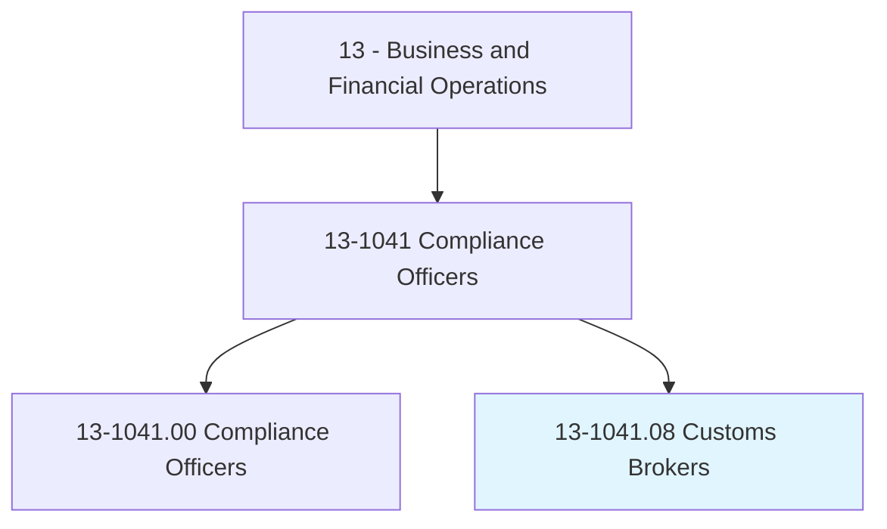
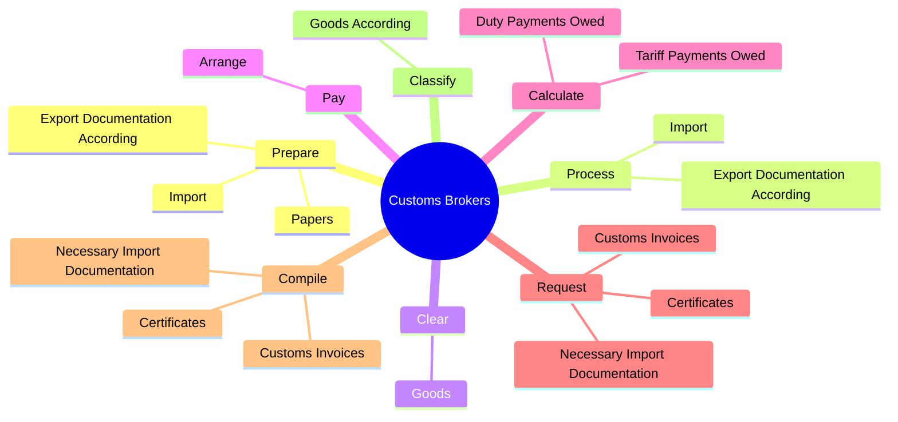
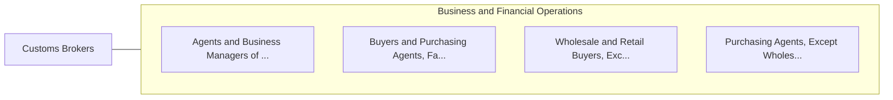

# Customs Brokers

> Prepare customs documentation and ensure that shipments meet all applicable laws to facilitate the import and export of goods. Determine and track duties and taxes payable and process payments on behalf of client. Sign documents under a power of attorney. Represent clients in meetings with customs officials and apply for duty refunds and tariff reclassifications. Coordinate transportation and storage of imported goods.

## Overview

Customs Brokers is a specialized variant within the Business and Financial Operations category. Prepare customs documentation and ensure that shipments meet all applicable laws to facilitate the import and export of goods. Determine and track duties and taxes payable and process payments on behalf of client.

## Classification Hierarchy

## Key Statistics

| Metric | Value |
|--------|-------|
| SOC Code | 13-1041.08 |
| Category | [Business and Financial Operations](/occupations/Business) |
| Task Count | 74 |
| Source | O*NET |

## Core Tasks

### prepare.Import

Customs Brokers prepare import as part of their core responsibilities.

**Actions:**
- `prepare.Import.to.CustomsRegulations`
- `prepare.Import.to.Laws`
- `prepare.Import.to.Procedures`
- `prepare.ExportDocumentationAccording.to.CustomsRegulations`

### process.Import

Customs Brokers process import as part of their core responsibilities.

**Actions:**
- `process.Import.to.CustomsRegulations`
- `process.Import.to.Laws`
- `process.Import.to.Procedures`
- `process.ExportDocumentationAccording.to.CustomsRegulations`

### clear.Goods

Customs Brokers clear goods as part of their core responsibilities.

**Actions:**
- `clear.Goods.through.CustomsToDestinationsForClients`

## Skills & Competencies

### Technical Skills
- **Financial Analysis** - Advanced
- **Data Analysis** - Advanced
- **Regulatory Compliance** - Advanced

### Soft Skills
- **Communication** - Essential
- **Problem Solving** - Essential
- **Critical Thinking** - Important
- **Teamwork** - Important
- **Adaptability** - Important

## Related Occupations

## Industries

This occupation is found across multiple industries. See [Industries](/industries) for sector-specific employment data.

## Career Progression

---

*Source: O*NET 13-1041.08 - ONETOccupation*
