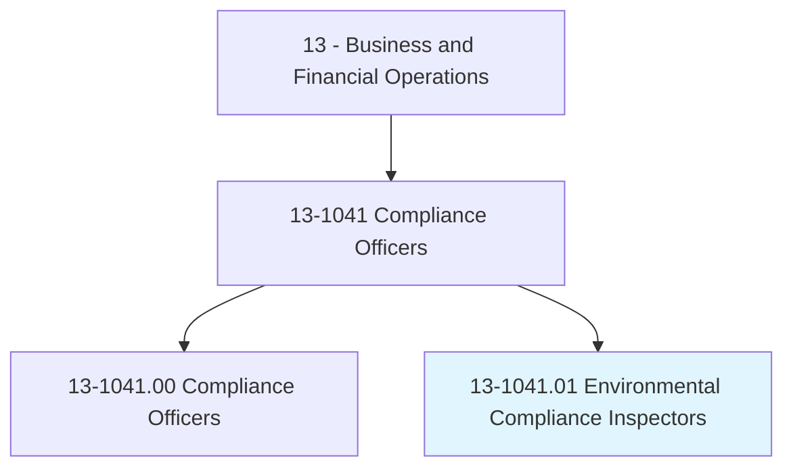
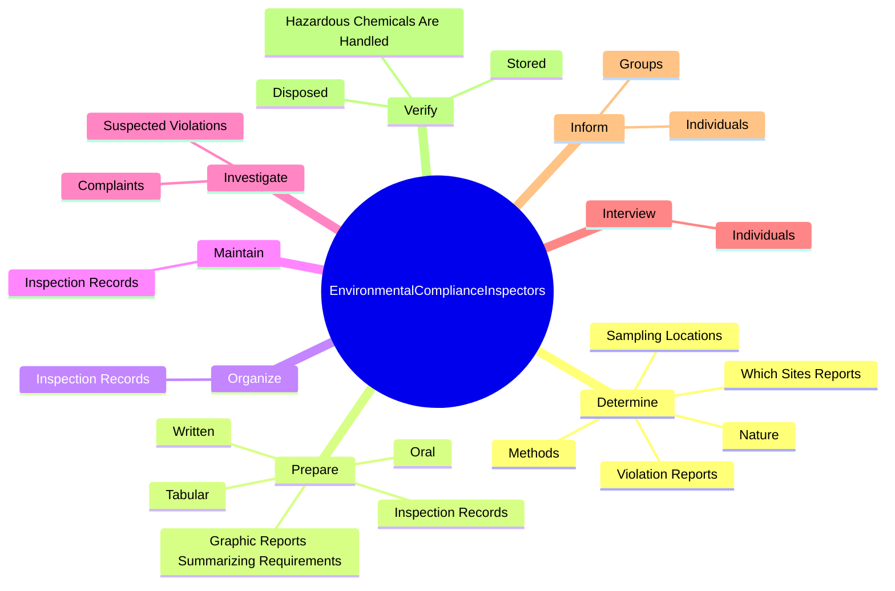
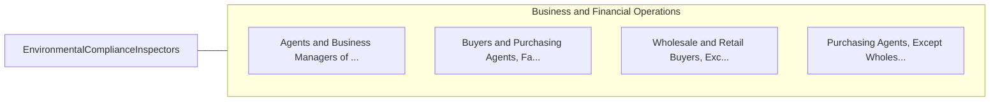

# Environmental Compliance Inspectors

> Inspect and investigate sources of pollution to protect the public and environment and ensure conformance with Federal, State, and local regulations and ordinances.

## Overview

Environmental Compliance Inspectors is classified under Business and Financial Operations (SOC 13). Inspect and investigate sources of pollution to protect the public and environment and ensure conformance with Federal, State, and local regulations and ordinances.

## Classification Hierarchy

## Key Statistics

| Metric | Value |
|--------|-------|
| SOC Code | 13-1041.01 |
| Category | [Business and Financial Operations](/occupations/Business/index) |
| Task Count | 163 |
| Source | O*NET |

## Core Tasks

### determine.Nature

Environmental Compliance Inspectors determine nature as part of their core responsibilities.

**Actions:**
- `determine.Nature.of.CodeViolationsToBeTaken`
- `determine.Nature.of.ActionsToBeTaken`
- `determine.Nature.of.IssueWrittenNotices.of.Violation`
- `determine.Nature.of.Participating.in.EnforcementHearings`

### prepare.InspectionRecords

Environmental Compliance Inspectors prepare inspection records as part of their core responsibilities.

**Actions:**
- `prepare.InspectionRecords`
- `prepare.Written.of.CustodyDocumentation`
- `prepare.Oral.of.CustodyDocumentation`
- `prepare.Tabular.of.CustodyDocumentation`

### organize.InspectionRecords

Environmental Compliance Inspectors organize inspection records as part of their core responsibilities.

**Actions:**
- `organize.InspectionRecords`

## Skills & Competencies

### Technical Skills
- **Financial Analysis** - Advanced
- **Data Analysis** - Advanced
- **Regulatory Compliance** - Advanced

### Soft Skills
- **Communication** - Essential
- **Problem Solving** - Essential
- **Critical Thinking** - Important
- **Teamwork** - Important
- **Adaptability** - Important

## Related Occupations

## Industries

This occupation is found across multiple industries. See [Industries](/industries) for sector-specific employment data.

## Career Progression

---

*Source: O*NET 13-1041.01 - ONETOccupation*
