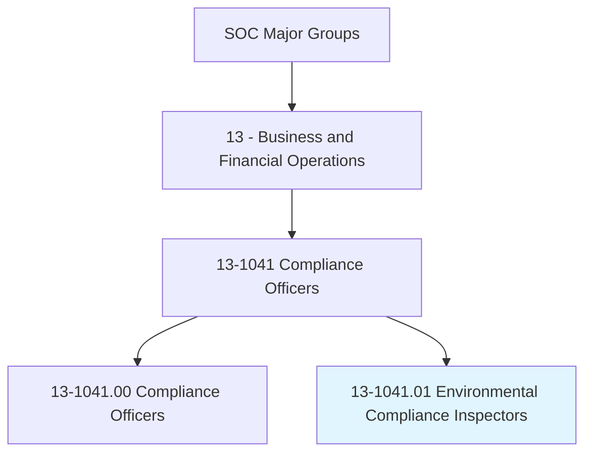
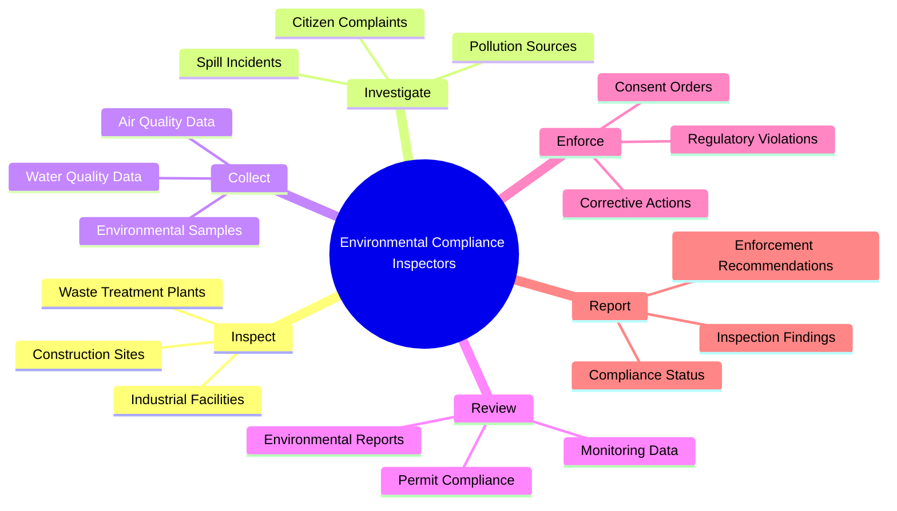
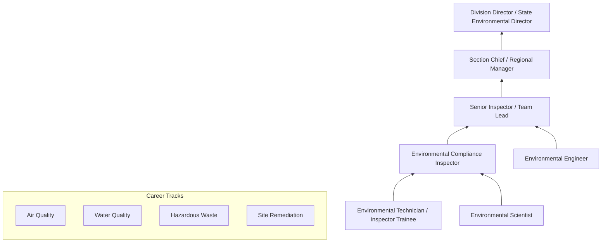
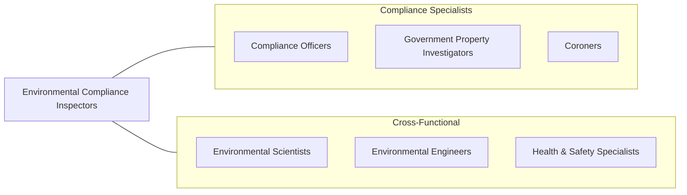

# Environmental Compliance Inspectors

> Inspect and investigate sources of pollution to protect the public and environment and ensure conformance with Federal, State, and local regulations and ordinances.

## Overview

Environmental Compliance Inspectors are regulatory enforcement professionals who inspect facilities, investigate pollution sources, and ensure that businesses and government entities comply with environmental laws and regulations. They work for federal agencies (EPA), state environmental departments, and local health departments, conducting on-site inspections of industrial facilities, waste treatment plants, construction sites, and other operations that may impact air quality, water quality, soil integrity, or public health.

These professionals collect environmental samples, review permit compliance documentation, investigate citizen complaints, and prepare enforcement actions when violations are identified. They must understand complex environmental regulations including the Clean Air Act, Clean Water Act, RCRA (Resource Conservation and Recovery Act), CERCLA (Superfund), and TSCA (Toxic Substances Control Act). The role requires both technical knowledge of environmental science and the legal acumen to build enforceable cases against violators.

The profession continues to evolve as emerging contaminants (PFAS, microplastics), climate change regulations, environmental justice considerations, and new monitoring technologies reshape the regulatory landscape. Environmental compliance inspectors must balance enforcement responsibilities with collaborative approaches that help regulated entities achieve and maintain compliance.

## Classification Hierarchy

## Key Statistics

| Metric | Value |
|--------|-------|
| SOC Code | 13-1041.01 |
| Job Zone | 4 (Considerable Preparation) |
| Category | [Business and Financial Operations](/occupations/Business/index) |
| Median Salary | $73,860 |
| Employment | ~24,000 |
| Projected Growth | 5% (As fast as average) |
| Task Count | 42 |
| Source | O*NET |

## Core Tasks

### inspect.Facilities

Conduct on-site inspections of regulated facilities to assess environmental compliance.

**Actions:**
- `inspect.IndustrialFacilities.to.verify.EnvironmentalCompliance` - Assess regulatory adherence
- `inspect.WasteTreatmentPlants.to.evaluate.DischargeQuality` - Monitor effluent standards
- `inspect.ConstructionSites.to.verify.StormwaterControls` - Check erosion prevention
- `collect.EnvironmentalSamples.for.LaboratoryAnalysis` - Gather evidence

### investigate.PollutionSources

Investigate sources of pollution and environmental complaints.

**Actions:**
- `investigate.PollutionSources.to.identify.Violations` - Trace contamination
- `investigate.CitizenComplaints.to.assess.EnvironmentalImpact` - Respond to reports
- `investigate.SpillIncidents.to.coordinate.Cleanup` - Manage emergency response
- `review.EnvironmentalReports.to.verify.Accuracy` - Validate self-reporting

### enforce.RegulatoryCompliance

Prepare and execute enforcement actions for environmental violations.

**Actions:**
- `enforce.RegulatoryViolations.through.NoticesOfViolation` - Issue citations
- `prepare.EnforcementRecommendations.for.LegalAction` - Build cases
- `negotiate.ConsentOrders.for.ComplianceSchedules` - Structure remediation
- `monitor.CorrectiveActions.to.verify.Completion` - Track compliance

## Skills & Competencies

### Technical Skills
- **Environmental Regulations (CAA, CWA, RCRA)** - Expert
- **Environmental Sampling & Analysis** - Expert
- **Permit Interpretation** - Advanced
- **Environmental Science** - Advanced
- **Inspection & Investigation Techniques** - Advanced
- **Report Writing & Documentation** - Advanced
- **GIS & Environmental Monitoring** - Proficient

### Soft Skills
- **Attention to Detail** - Critical
- **Analytical Thinking** - Critical
- **Communication (Written/Verbal)** - Essential
- **Integrity & Objectivity** - Essential
- **Conflict Resolution** - Important
- **Public Speaking** - Important

## Education & Certifications

| Requirement | Details |
|-------------|---------|
| Typical Education | Bachelor's degree in Environmental Science, Chemistry, Engineering, or related field |
| Key Certifications | CHMM (Certified Hazardous Materials Manager), QEP (Qualified Environmental Professional) |
| Additional Certs | CPEA (Certified Professional Environmental Auditor), REM (Registered Environmental Manager) |
| Federal Training | FLETC (Federal Law Enforcement Training) for federal inspectors |
| Work Experience | 2-5 years in environmental compliance or regulation |
| Continuing Education | Required for most certifications |

## Career Progression

## Industry Variations

| Industry | Focus | Typical Tasks |
|----------|-------|---------------|
| **Federal EPA** | National enforcement | Major facility inspections, multi-media compliance |
| **State Environmental Agencies** | State programs | Delegated program enforcement, permitting support |
| **Local Health Departments** | Community health | Underground storage tanks, local ordinances |
| **Private Sector Consulting** | Compliance advisory | Environmental audits, compliance management systems |
| **Manufacturing** | Facility compliance | Internal audits, permit management, reporting |
| **Energy Sector** | Emissions compliance | Air monitoring, NSPS compliance, GHG reporting |

## Technology & Tools

| Category | Tools |
|----------|-------|
| **Environmental Data** | EPA ECHO, ICIS, AQS, STORET |
| **Sampling Equipment** | Gas analyzers, water sampling equipment, soil probes |
| **GIS & Mapping** | ArcGIS, Google Earth, drone mapping |
| **Data Management** | LIMS, compliance tracking databases |
| **Reporting** | Microsoft 365, regulatory reporting platforms |
| **Monitoring** | CEMS, remote telemetry, weather stations |
| **Mobile** | Field inspection apps, GPS devices |

## Related Occupations

## Departments

This occupation typically works in:
- Environmental Compliance
- Enforcement Division
- Permitting
- Environmental Health
- Field Operations

---

*Source: O*NET 13-1041.01 - ONETOccupation*
