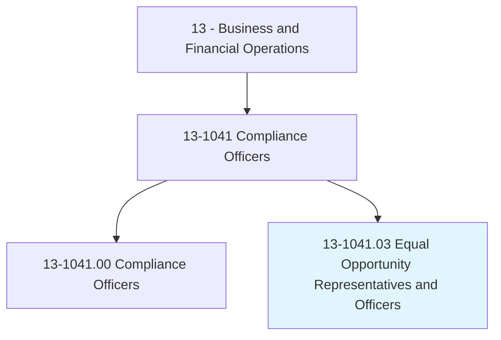
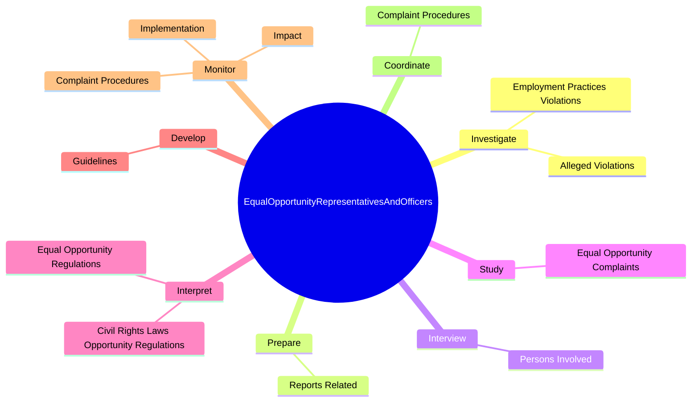

# Equal Opportunity Representatives and Officers

> Monitor and evaluate compliance with equal opportunity laws, guidelines, and policies to ensure that employment practices and contracting arrangements give equal opportunity without regard to race, religion, color, national origin, sex, age, or disability.

## Overview

Equal Opportunity Representatives and Officers is classified under Business and Financial Operations (SOC 13). Monitor and evaluate compliance with equal opportunity laws, guidelines, and policies to ensure that employment practices and contracting arrangements give equal opportunity without regard to race, religion, color, national origin, sex, age, or disability.

## Classification Hierarchy

## Key Statistics

| Metric | Value |
|--------|-------|
| SOC Code | 13-1041.03 |
| Category | [Business and Financial Operations](/occupations/Business) |
| Task Count | 57 |
| Source | O*NET |

## Core Tasks

### investigate.EmploymentPracticesViolations

Equal Opportunity Representatives and Officers investigate employment practices violations as part of their core responsibilities.

**Actions:**
- `investigate.EmploymentPracticesViolations.of.Laws.to.Document`
- `investigate.EmploymentPracticesViolations.of.CorrectDiscriminatoryFactors`
- `investigate.AllegedViolations.of.Laws.to.Document`
- `investigate.AllegedViolations.of.CorrectDiscriminatoryFactors`

### prepare.ReportsRelated

Equal Opportunity Representatives and Officers prepare reports related as part of their core responsibilities.

**Actions:**
- `prepare.ReportsRelated.to.InvestigationsOfEqualOpportunityComplaints`

### interview.PersonsInvolved

Equal Opportunity Representatives and Officers interview persons involved as part of their core responsibilities.

**Actions:**
- `interview.PersonsInvolved.in.EqualOpportunityComplaints.to.verify.CaseInformation`

## Skills & Competencies

### Technical Skills
- **Financial Analysis** - Advanced
- **Data Analysis** - Advanced
- **Regulatory Compliance** - Advanced

### Soft Skills
- **Communication** - Essential
- **Problem Solving** - Essential
- **Critical Thinking** - Important
- **Teamwork** - Important
- **Adaptability** - Important

## Related Occupations

## Industries

This occupation is found across multiple industries. See [Industries](/industries) for sector-specific employment data.

## Career Progression

---

*Source: O*NET 13-1041.03 - ONETOccupation*
