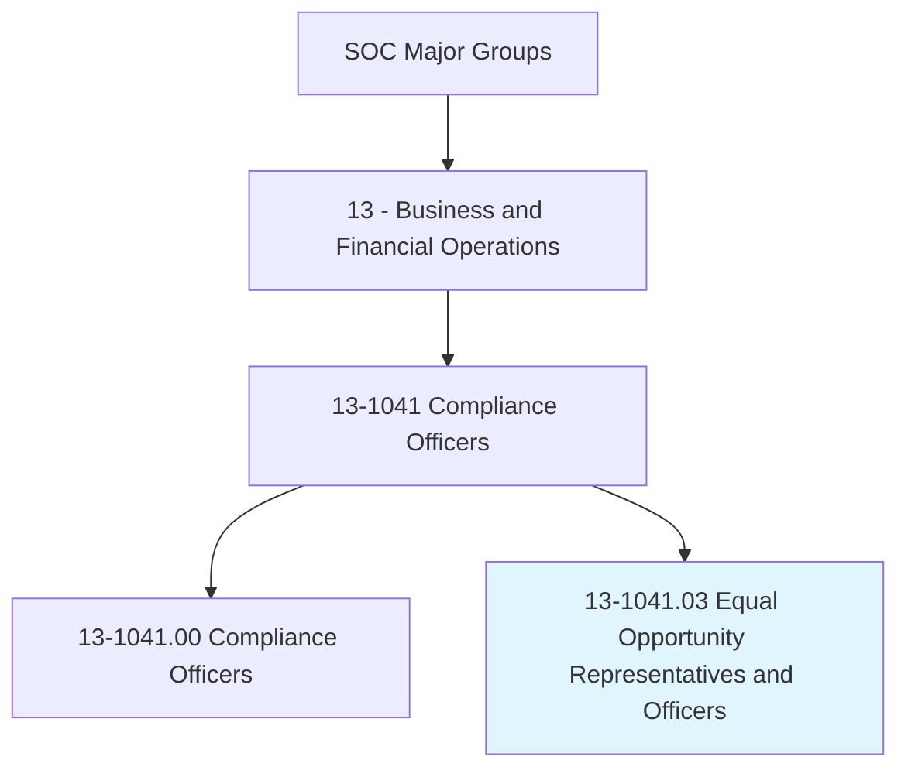
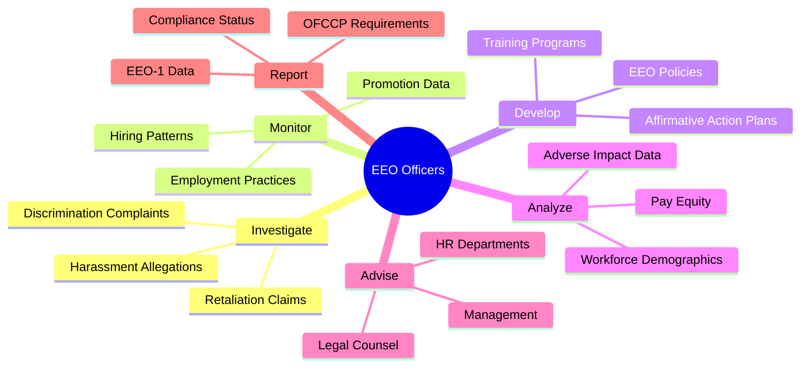
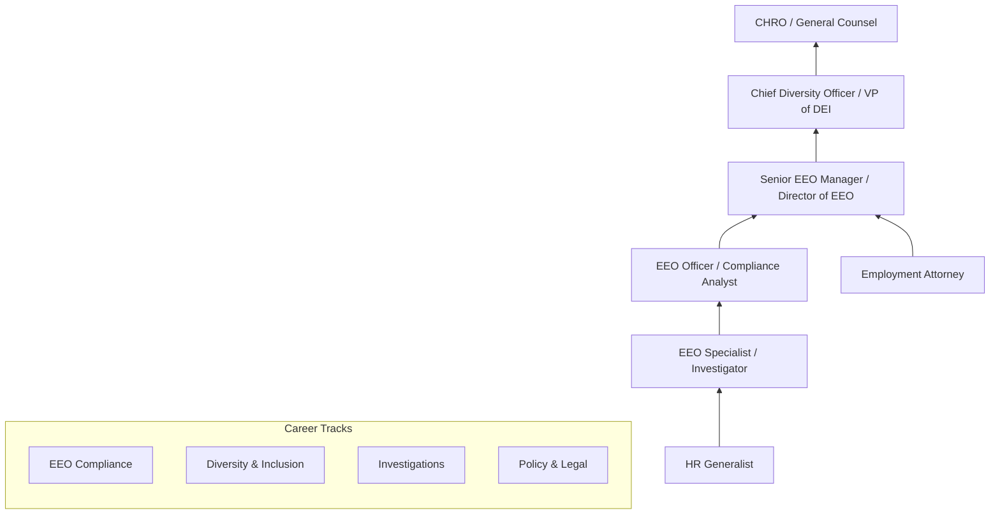
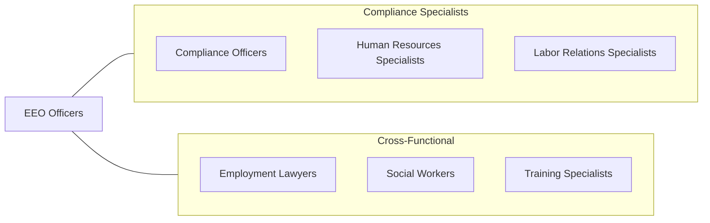

# Equal Opportunity Representatives and Officers

> Monitor and evaluate compliance with equal opportunity laws, guidelines, and policies to ensure that employment practices and contracting arrangements give equal opportunity without regard to race, religion, color, national origin, sex, age, or disability.

## Overview

Equal Opportunity Representatives and Officers ensure that organizations comply with federal, state, and local anti-discrimination laws and affirmative action requirements. They monitor employment practices, investigate discrimination complaints, conduct compliance reviews, and develop policies that promote diversity, equity, and inclusion in the workplace. These professionals work in government agencies, corporations, educational institutions, and military organizations to uphold civil rights protections.

Their work encompasses the full spectrum of employment law compliance, from reviewing hiring and promotion practices to investigating complaints of harassment, discrimination, and retaliation. They analyze workforce demographics, prepare affirmative action plans, conduct adverse impact analyses, and ensure that organizations meet their obligations under Title VII, the ADA, ADEA, Section 503, and Executive Order 11246. The role requires both legal knowledge and interpersonal skills, as officers must balance organizational interests with individual rights while maintaining objectivity.

The profession has evolved to encompass broader diversity, equity, and inclusion (DEI) initiatives, unconscious bias training, pay equity audits, and supplier diversity programs. Modern EEO professionals must address emerging issues including gender identity protections, religious accommodation complexities, AI-driven hiring bias, and remote work accessibility requirements.

## Classification Hierarchy

## Key Statistics

| Metric | Value |
|--------|-------|
| SOC Code | 13-1041.03 |
| Job Zone | 4 (Considerable Preparation) |
| Category | [Business and Financial Operations](/occupations/Business/index) |
| Median Salary | $73,860 |
| Employment | ~18,000 |
| Projected Growth | 5% (As fast as average) |
| Task Count | 46 |
| Source | O*NET |

## Core Tasks

### investigate.Complaints

Investigate complaints of discrimination, harassment, and retaliation.

**Actions:**
- `investigate.DiscriminationComplaints.to.determine.Merit` - Assess complaint validity
- `investigate.HarassmentAllegations.to.gather.Evidence` - Collect testimony and documentation
- `investigate.RetaliationClaims.to.evaluate.CausalConnection` - Assess adverse actions
- `prepare.InvestigationReports.with.FindingsAndRecommendations` - Document conclusions

### monitor.EmploymentPractices

Monitor hiring, promotion, and compensation practices for compliance with EEO laws.

**Actions:**
- `monitor.HiringPatterns.to.detect.AdverseImpact` - Analyze selection data
- `monitor.PromotionData.to.ensure.EquitableAdvancement` - Review advancement patterns
- `analyze.WorkforceDemographics.to.assess.Representation` - Track diversity metrics
- `review.CompensationData.to.identify.PayDisparities` - Audit pay equity

### develop.CompliancePrograms

Develop and implement EEO policies, affirmative action plans, and training programs.

**Actions:**
- `develop.AffirmativeActionPlans.for.FederalCompliance` - Meet OFCCP requirements
- `develop.EEOPolicies.for.OrganizationalGuidance` - Create policy frameworks
- `develop.TrainingPrograms.on.AntiDiscrimination` - Educate workforce
- `advise.Management.on.EEOCompliance` - Provide legal guidance

## Skills & Competencies

### Technical Skills
- **Employment Discrimination Law (Title VII, ADA, ADEA)** - Expert
- **Affirmative Action Planning** - Expert
- **Investigation & Fact-Finding** - Advanced
- **Statistical Analysis & Adverse Impact** - Advanced
- **EEO Regulatory Compliance (EEOC, OFCCP)** - Expert
- **Report Writing** - Advanced
- **HR Information Systems** - Proficient

### Soft Skills
- **Objectivity & Impartiality** - Critical
- **Communication (Written/Verbal)** - Critical
- **Empathy & Active Listening** - Essential
- **Conflict Resolution** - Essential
- **Discretion & Confidentiality** - Essential
- **Cultural Competency** - Important

## Education & Certifications

| Requirement | Details |
|-------------|---------|
| Typical Education | Bachelor's degree in HR, Business, Public Administration, or Law |
| Advanced Degree | JD or Master's in HR, Public Policy, or related field preferred |
| Key Certifications | PHR/SPHR (HRCI), SHRM-CP/SHRM-SCP |
| EEO-Specific | CDP (Certified Diversity Professional), CAAP (Certified Affirmative Action Professional) |
| Federal Training | EEOC-approved investigator training |
| Work Experience | 3-5 years in EEO, HR compliance, or employment law |

## Career Progression

## Industry Variations

| Industry | Focus | Typical Tasks |
|----------|-------|---------------|
| **Federal Government** | Executive Order compliance | OFCCP audits, Section 503, VEVRAA |
| **Military** | Service member EO | Military EO program, MEO complaints, climate surveys |
| **Higher Education** | Title IX and affirmative action | Faculty search compliance, Title IX investigations |
| **Corporate** | Workforce diversity | Affirmative action plans, pay equity, supplier diversity |
| **State/Local Government** | Public sector EEO | Civil service compliance, public accommodations |
| **Healthcare** | Patient and employee equity | ADA compliance, language access, cultural competency |

## Technology & Tools

| Category | Tools |
|----------|-------|
| **Case Management** | EthicsPoint, NAVEX Global, i-Sight |
| **HRIS & Analytics** | Workday, PeopleSoft, ADP, custom dashboards |
| **AAP Software** | Affirmity, OutSolve, DCI Consulting |
| **EEO Reporting** | EEO-1 Component 1 & 2, VETS-4212 |
| **Survey Tools** | Qualtrics, SurveyMonkey, Culture Amp |
| **Training** | Traliant, EVERFI, Kantola |
| **Document Management** | SharePoint, secure case repositories |

## Related Occupations

## Departments

This occupation typically works in:
- Equal Employment Opportunity
- Diversity, Equity & Inclusion
- Human Resources
- Legal & Compliance
- Office of Civil Rights

---

*Source: O*NET 13-1041.03 - ONETOccupation*
