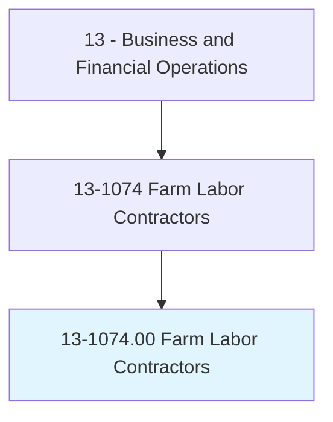
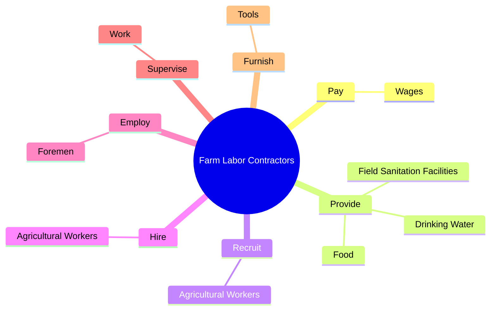
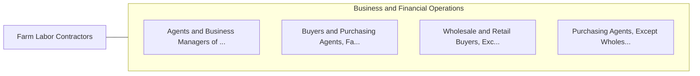

# Farm Labor Contractors

> Recruit and hire seasonal or temporary agricultural laborers. May transport, house, and provide meals for workers.

## Overview

Farm Labor Contractors is an occupation within the Business and Financial Operations category. Recruit and hire seasonal or temporary agricultural laborers. 

## Classification Hierarchy

## Key Statistics

| Metric | Value |
|--------|-------|
| SOC Code | 13-1074.00 |
| Category | [Business and Financial Operations](/occupations/Business/index) |
| Task Count | 15 |
| Source | O*NET |

## Core Tasks

### pay.Wages

Farm Labor Contractors pay wages as part of their core responsibilities.

**Actions:**
- `pay.Wages.of.ContractedFarmLaborers`

### provide.Food

Farm Labor Contractors provide food as part of their core responsibilities.

**Actions:**
- `provide.Food.to.contracted.Workers`
- `provide.DrinkingWater.to.contracted.Workers`
- `provide.FieldSanitationFacilities.to.contracted.Workers`

### recruit.AgriculturalWorkers

Farm Labor Contractors recruit agricultural workers as part of their core responsibilities.

**Actions:**
- `recruit.AgriculturalWorkers`

## Skills & Competencies

### Technical Skills
- **Financial Analysis** - Advanced
- **Data Analysis** - Advanced
- **Regulatory Compliance** - Advanced

### Soft Skills
- **Communication** - Essential
- **Problem Solving** - Essential
- **Critical Thinking** - Important
- **Teamwork** - Important
- **Adaptability** - Important

## Related Occupations

## Industries

This occupation is found across multiple industries. See [Industries](/industries) for sector-specific employment data.

## Career Progression

---

*Source: O*NET 13-1074.00 - ONETOccupation*
