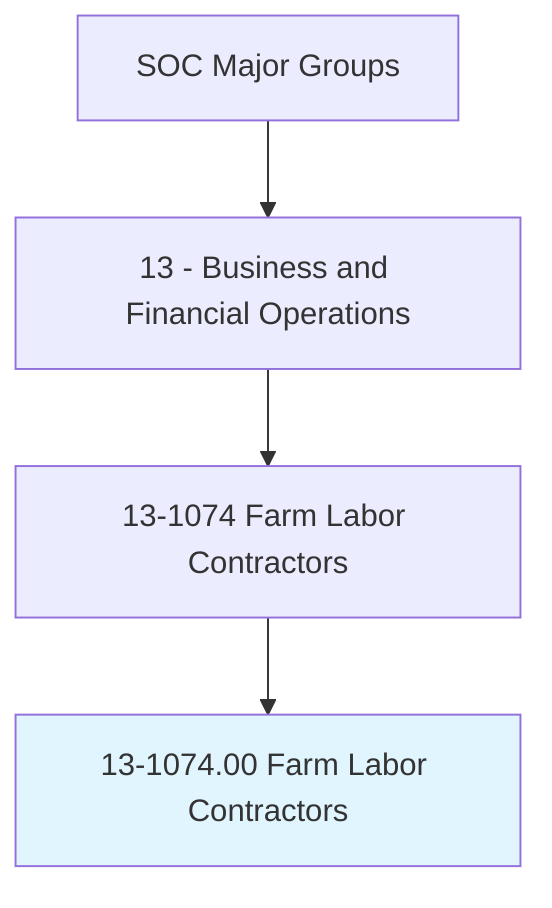
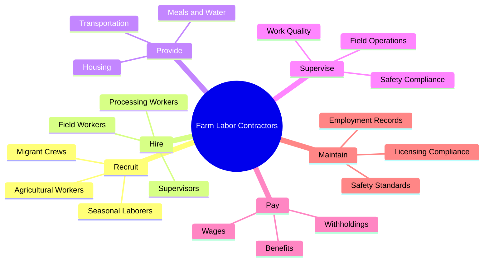
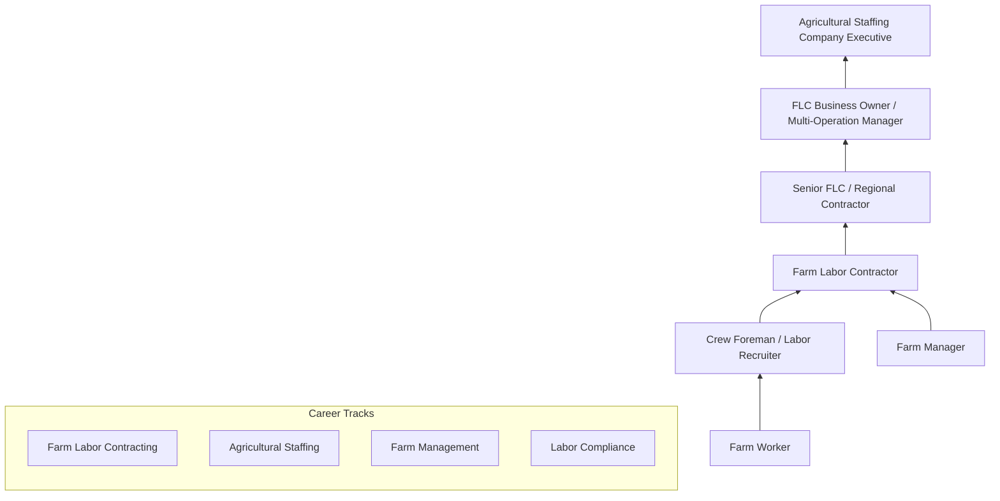
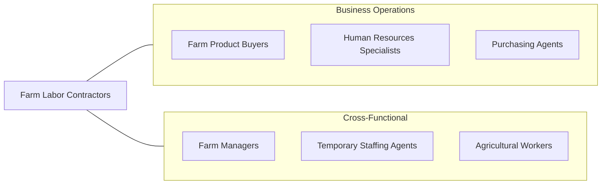

# Farm Labor Contractors

> Recruit and hire seasonal or temporary agricultural laborers. May transport, house, and provide meals for workers.

## Overview

Farm Labor Contractors (FLCs) recruit, hire, transport, and supervise seasonal and temporary agricultural workers for farms, ranches, and processing operations. They serve as intermediaries between agricultural employers who need labor and workers seeking employment, often coordinating the movement of migrant labor crews across regions as harvest seasons shift. FLCs must navigate complex federal and state labor regulations, including the Migrant and Seasonal Agricultural Worker Protection Act (MSPA), H-2A visa program requirements, and OSHA field sanitation standards.

These professionals manage all aspects of agricultural labor operations, from recruiting workers and negotiating wages to arranging housing, transportation, and field amenities. They maintain payroll records, ensure workers' compensation coverage, and comply with agricultural labor laws that govern working conditions, housing standards, and disclosure requirements. The role demands strong organizational skills, bilingual communication abilities, and thorough knowledge of both agricultural operations and employment law.

The profession operates within one of the most heavily regulated segments of the labor market, reflecting the historically vulnerable position of agricultural workers. Modern farm labor contractors must contend with labor shortages, immigration policy changes, increasing mechanization, heat illness prevention requirements, and growing scrutiny of working conditions from regulators and advocacy organizations.

## Classification Hierarchy

## Key Statistics

| Metric | Value |
|--------|-------|
| SOC Code | 13-1074.00 |
| Job Zone | 2 (Some Preparation) |
| Category | [Business and Financial Operations](/occupations/Business/index) |
| Median Salary | $38,960 |
| Employment | ~5,500 |
| Projected Growth | -2% (Declining) |
| Task Count | 15 |
| Source | O*NET |

## Core Tasks

### recruit.AgriculturalWorkers

Recruit and hire seasonal or temporary agricultural laborers for farming operations.

**Actions:**
- `recruit.AgriculturalWorkers.for.SeasonalHarvest` - Source labor supply
- `recruit.MigrantCrews.for.RegionalDeployment` - Coordinate mobile labor
- `hire.FieldWorkers.with.AppropriateDocumentation` - Verify employment eligibility
- `employ.Foremen.to.supervise.FieldOperations` - Staff crew leadership

### provide.WorkerServices

Provide transportation, housing, meals, and field sanitation for agricultural workers.

**Actions:**
- `provide.Transportation.to.WorkSites` - Arrange worker transport
- `provide.Housing.that.meets.FederalStandards` - Maintain worker housing
- `provide.Food.to.contracted.Workers` - Supply meals and provisions
- `provide.FieldSanitationFacilities.to.contracted.Workers` - Ensure OSHA compliance

### manage.LaborOperations

Manage payroll, compliance, and daily operations of agricultural labor crews.

**Actions:**
- `pay.Wages.of.ContractedFarmLaborers` - Process payroll
- `maintain.EmploymentRecords.for.RegulatoryCompliance` - Document labor activities
- `supervise.Work.to.ensure.QualityAndSafety` - Oversee field operations
- `furnish.Tools.for.AgriculturalWork` - Supply equipment

## Skills & Competencies

### Technical Skills
- **Agricultural Labor Regulations (MSPA, H-2A)** - Expert
- **Workforce Recruitment & Management** - Advanced
- **Payroll & Employment Records** - Advanced
- **OSHA Field Sanitation Standards** - Advanced
- **Agricultural Operations Knowledge** - Advanced
- **Transportation & Logistics** - Proficient
- **Workers' Compensation Administration** - Proficient

### Soft Skills
- **Leadership & Supervision** - Critical
- **Bilingual Communication (English/Spanish)** - Critical
- **Organizational Skills** - Essential
- **Relationship Building** - Essential
- **Problem Solving** - Important
- **Cultural Sensitivity** - Important

## Education & Certifications

| Requirement | Details |
|-------------|---------|
| Typical Education | High school diploma or equivalent; some college preferred |
| Federal Registration | Farm Labor Contractor Registration with DOL (required) |
| Vehicle Licensing | CDL may be required for worker transportation |
| Insurance | Workers' compensation and vehicle liability insurance required |
| H-2A Compliance | DOL certification for temporary agricultural workers |
| Continuing Requirements | Annual registration renewal, insurance maintenance |

## Career Progression

## Industry Variations

| Industry | Focus | Typical Tasks |
|----------|-------|---------------|
| **Row Crops** | Seasonal harvest | Planting and harvesting crews, field preparation |
| **Orchards & Vineyards** | Specialized labor | Pruning, thinning, picking, packing |
| **Nurseries & Greenhouses** | Year-round labor | Propagation, transplanting, maintenance |
| **Dairy & Livestock** | Animal husbandry | Milking, feeding, facility maintenance |
| **Food Processing** | Post-harvest | Sorting, packing, processing line staffing |
| **Forestry** | Tree services | Planting, thinning, fire prevention |

## Technology & Tools

| Category | Tools |
|----------|-------|
| **Payroll** | QuickBooks, ADP, Paylocity agricultural modules |
| **Compliance** | DOL electronic registration, E-Verify |
| **Communication** | Mobile phones, WhatsApp, group messaging |
| **Transportation** | Fleet management, GPS tracking |
| **Timekeeping** | Time clocks, mobile time tracking apps |
| **Housing Management** | Inspection checklists, maintenance logs |
| **Record Keeping** | Spreadsheets, agricultural management software |

## Related Occupations

## Departments

This occupation typically works in:
- Agricultural Labor Operations
- Human Resources
- Farm Operations
- Compliance
- Transportation & Logistics

---

*Source: O*NET 13-1074.00 - ONETOccupation*
