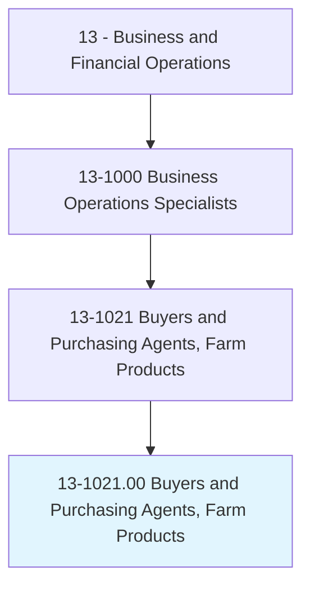
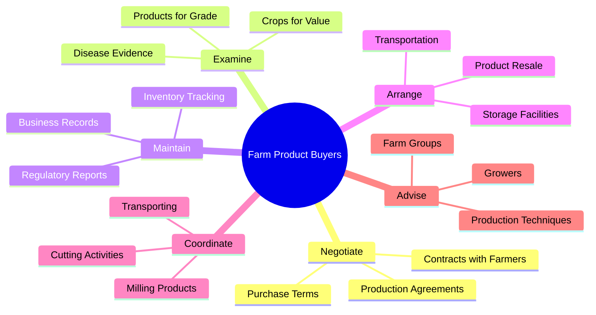
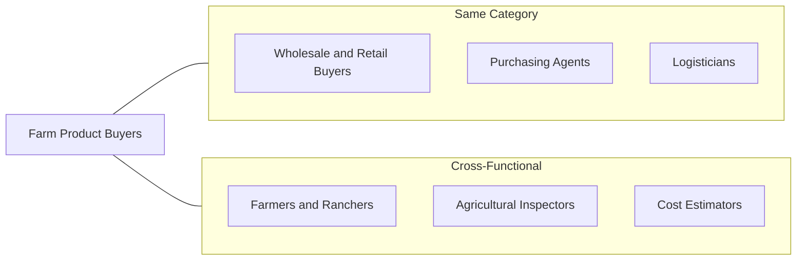
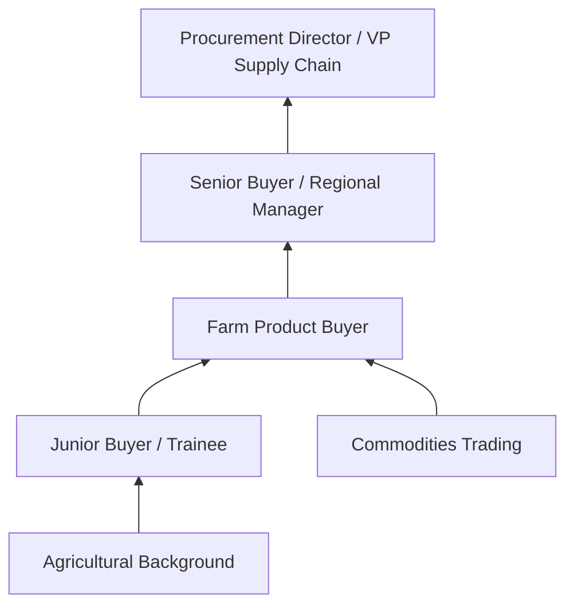

# Buyers and Purchasing Agents, Farm Products

> Purchase farm products either for further processing or resale. Includes tree farm contractors, grain brokers and market operators, grain buyers, and tobacco buyers. May negotiate contracts.

## Overview

Farm Product Buyers serve as essential intermediaries in the agricultural supply chain, connecting farmers and growers with processors, distributors, and end markets. They evaluate product quality, negotiate fair prices, arrange logistics, and maintain critical records of agricultural transactions. This role requires deep knowledge of agricultural commodities, market dynamics, and quality standards to ensure both supply chain efficiency and fair dealing with producers.

## Classification Hierarchy

## Key Statistics

| Metric | Value |
|--------|-------|
| SOC Code | 13-1021.00 |
| Job Zone | 3 (Medium Preparation) |
| Category | [Business and Financial Operations](/occupations/Business/index) |
| Core Tasks | 10+ |
| Source | O*NET |

## Core Tasks

### negotiate.Contracts

Farm Product Buyers establish agreements with farmers for the production and purchase of agricultural products.

**Actions:**
- `negotiate.Contracts.with.Farmers.for.Production` - Establish production agreements
- `negotiate.Contracts.with.Purchase.of.FarmProducts` - Set purchase terms and pricing
- `arrange.Resale.of.PurchasedProducts` - Coordinate downstream sales

### examine.Crops

Farm Product Buyers assess the quality and value of agricultural products.

**Actions:**
- `examine.Crops.to.estimate.Value` - Determine fair market value
- `examine.Crops.to.determine.Grade` - Assess quality classification
- `examine.Crops.to.locate.EvidenceOfDiseaseDamage` - Identify quality issues
- `examine.Products.to.estimate.Value` - Evaluate processed products

### maintain.Records

Farm Product Buyers manage comprehensive documentation of all transactions and inventory.

**Actions:**
- `maintain.Records.of.BusinessTransactionsInventories` - Track all business dealings
- `maintain.Records.of.ProductInventories` - Monitor stock levels
- `maintain.Records.of.ReportingData.to.Companies` - Prepare corporate reports
- `maintain.Records.of.GovernmentAgenciesAsNecessary` - Ensure regulatory compliance

### coordinate.Activities

Farm Product Buyers oversee various operational activities in the agricultural supply chain.

**Actions:**
- `coordinate.Activities.of.Workers.engaged.in.Cutting` - Manage harvest operations
- `coordinate.Activities.of.Transporting` - Oversee logistics
- `coordinate.Activities.of.Storing` - Manage storage facilities
- `coordinate.Activities.of.MillingProducts` - Coordinate processing

### advise.FarmGroups

Farm Product Buyers provide guidance to producers on maximizing product quality and yield.

**Actions:**
- `advise.FarmGroups.on.LandPreparationCareTechniquesWillMaximizeQuantityQuality.of.Production` - Guide cultivation practices
- `advise.Growers.on.LivestockCareTechniquesWillMaximizeQuantityQuality.of.Production` - Advise on animal husbandry
- `estimate.LandProductionPossibilities` - Assess land potential

## Skills & Competencies

### Technical Skills
- **Agricultural Science** - Advanced
- **Quality Assessment** - Advanced
- **Contract Negotiation** - Proficient
- **Supply Chain Management** - Proficient
- **Market Analysis** - Proficient

### Soft Skills
- **Negotiation** - Critical
- **Analytical Thinking** - Essential
- **Communication** - Essential
- **Relationship Building** - Important
- **Decision Making** - Important

## Related Occupations

## Industries

- [Agriculture, Forestry, Fishing, and Hunting](/industries/Manufacturing/MachineryManufacturing/Agriculture/index) - High Employment
- [Food Manufacturing](/industries/Manufacturing/FoodManufacturing/index) - High Employment
- [Wholesale Trade](/industries/Wholesale/index) - Moderate Employment
- [Merchant Wholesalers](/industries/MerchantWholesalers) - Moderate Employment

## Career Progression

## Education & Training

| Requirement | Details |
|-------------|---------|
| Typical Education | High school diploma; Associate's or Bachelor's degree preferred |
| Work Experience | 1-3 years in agriculture or purchasing |
| On-the-Job Training | Moderate - learning commodity markets and quality standards |
| Common Certifications | Certified Purchasing Professional (CPP) |

## Departments

This occupation typically works in:
- [Procurement](/departments/Procurement)
- [Agricultural Operations](/departments/AgriculturalOps)
- [Supply Chain Management](/departments/SupplyChain/index)

---

*Source: O*NET 13-1021.00 - ONETOccupation*
