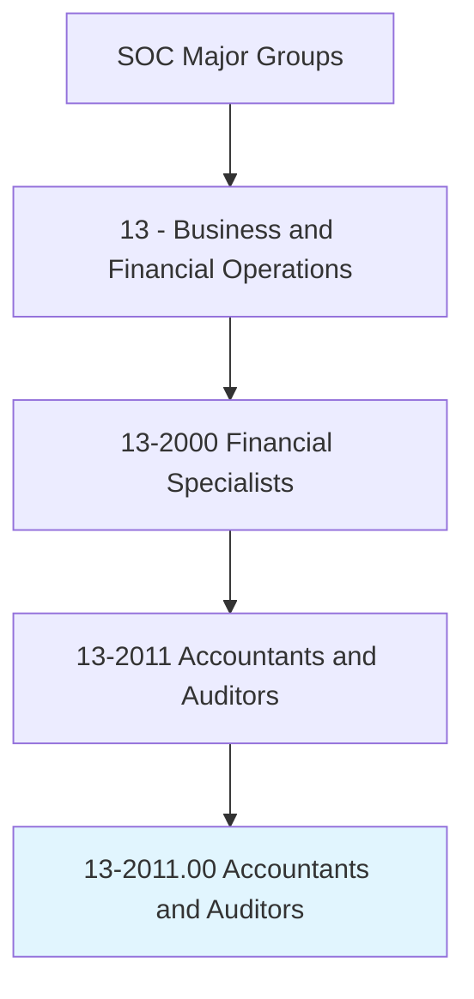
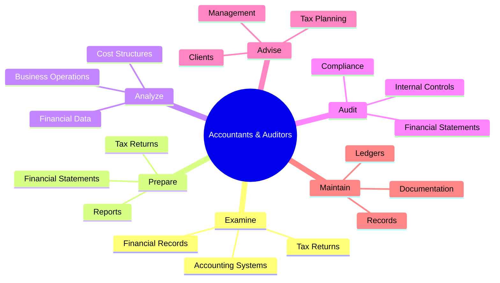
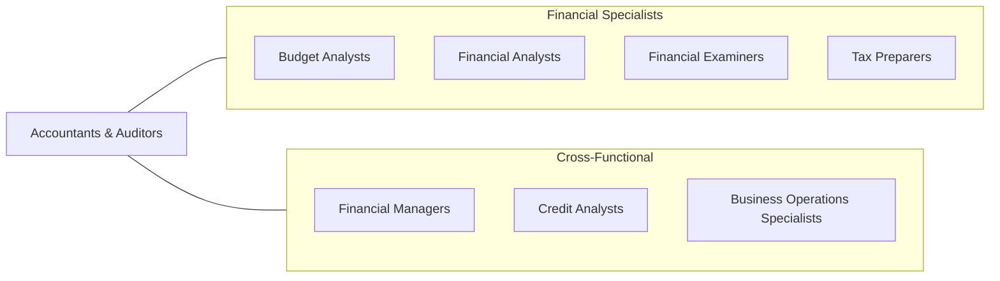
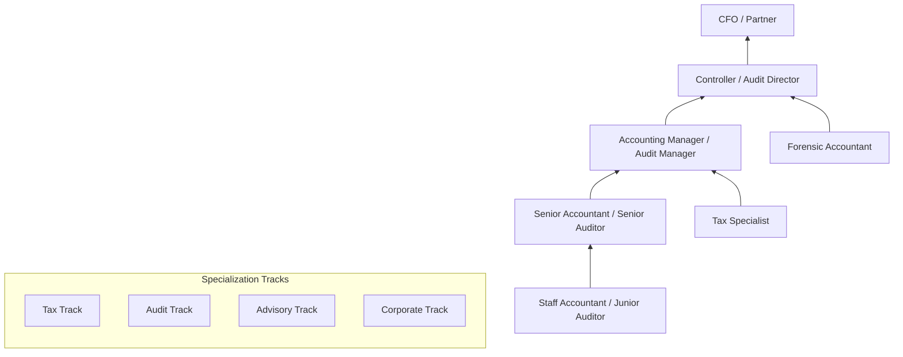

# Accountants and Auditors

> Examine, analyze, and interpret accounting records to prepare financial statements, give advice, or audit and evaluate statements prepared by others. Install or advise on systems of recording costs or other financial and budgetary data.

## Overview

Accountants and Auditors are the backbone of financial integrity in organizations. They ensure accuracy in financial reporting, compliance with regulations, and provide strategic advice on financial matters. This occupation spans public accounting (serving external clients), private/corporate accounting (internal to organizations), and government accounting. The role has evolved significantly with technology, now incorporating data analytics, automation, and advisory services alongside traditional bookkeeping and audit functions.

## Classification Hierarchy

## Key Statistics

| Metric | Value |
|--------|-------|
| SOC Code | 13-2011.00 |
| Job Zone | 4 (Considerable Preparation) |
| Category | [Business and Financial Operations](/occupations/Business) |
| Subcategory | Financial Specialists |
| Core Tasks | 15+ |
| Source | O*NET |

## Core Tasks

### examine.FinancialRecords

Accountants examine, analyze, and interpret accounting records to ensure accuracy and compliance.

**Actions:**
- `examine.AccountingRecords.to.prepare.FinancialStatements` - Review records for statement preparation
- `examine.AccountingRecords.to.give.Advice` - Analyze data for advisory purposes
- `examine.AccountingRecords.to.audit.StatementsPreparedByOthers` - Verify third-party statements
- `analyze.FinancialData.to.interpret.AccountingRecords` - Derive insights from financial information

### prepare.FinancialStatements

Prepare financial statements, reports, and tax returns following established standards.

**Actions:**
- `prepare.FinancialStatements.following.GAAP` - Create statements per accounting standards
- `prepare.TaxReturns.for.Individuals` - Complete individual tax filings
- `prepare.TaxReturns.for.Businesses` - Complete business tax filings
- `prepare.Reports.for.Management` - Generate internal financial reports

### audit.FinancialStatements

Conduct audits to verify accuracy of financial statements and compliance with regulations.

**Actions:**
- `audit.FinancialStatements.to.verify.Accuracy` - Test statement accuracy
- `audit.InternalControls.to.assess.Effectiveness` - Evaluate control systems
- `audit.Compliance.with.Regulations` - Check regulatory adherence
- `evaluate.StatementsPreparedByOthers.for.Compliance` - Review external statements

### advise.Management

Provide strategic financial advice to management and clients.

**Actions:**
- `advise.Management.on.FinancialMatters` - Counsel on financial decisions
- `advise.Clients.on.TaxPlanning` - Guide tax strategy
- `install.Systems.for.RecordingCosts` - Implement cost accounting systems
- `recommend.Improvements.to.FinancialProcesses` - Suggest operational enhancements

## Professional Certifications

| Certification | Full Name | Focus Area | Requirements |
|--------------|-----------|------------|--------------|
| **CPA** | Certified Public Accountant | Public accounting, audit | 150 credit hours, exam, experience |
| **CMA** | Certified Management Accountant | Management accounting | Bachelor's + exam + experience |
| **CIA** | Certified Internal Auditor | Internal audit | Bachelor's + exam + experience |
| **CGMA** | Chartered Global Management Accountant | Global management accounting | CPA or CMA + experience |
| **EA** | Enrolled Agent | Tax | IRS exam or IRS experience |
| **CFE** | Certified Fraud Examiner | Fraud detection | Experience + exam |

## Skills & Competencies

### Technical Skills
- **Financial Reporting (GAAP/IFRS)** - Expert
- **Tax Preparation and Planning** - Expert
- **Audit Methodologies** - Advanced
- **Accounting Software (QuickBooks, SAP, Oracle)** - Advanced
- **Data Analytics** - Proficient
- **Excel/Spreadsheet Modeling** - Expert
- **ERP Systems** - Advanced

### Soft Skills
- **Attention to Detail** - Critical
- **Analytical Thinking** - Critical
- **Ethical Judgment** - Essential
- **Communication** - Essential
- **Time Management** - Important
- **Client Relations** - Important

## Related Occupations

## Industries

- [Accounting Services](/industries/AccountingServices) - High Employment
- [Finance and Insurance](/industries/FinanceInsurance) - High Employment
- [Government](/industries/Government) - Moderate Employment
- [Manufacturing](/industries/Manufacturing) - Moderate Employment
- [Healthcare](/industries/Healthcare) - Moderate Employment
- [Professional Services](/industries/ProfessionalServices) - High Employment

## Industry Variations

| Industry | Focus | Specializations |
|----------|-------|-----------------|
| **Public Accounting** | External clients, audit | Tax, audit, advisory |
| **Corporate** | Internal finance | Cost accounting, FP&A |
| **Government** | Public funds | Fund accounting, compliance |
| **Healthcare** | Medical billing | Revenue cycle, compliance |
| **Manufacturing** | Cost control | Cost accounting, inventory |
| **Nonprofit** | Fund management | Grant accounting, compliance |

## Career Progression

## Education & Training

| Requirement | Details |
|-------------|---------|
| Typical Education | Bachelor's degree in Accounting (150 credits for CPA) |
| Work Experience | 1-2 years for CPA certification |
| On-the-Job Training | Moderate - firm-specific procedures |
| Continuing Education | 40 CPE hours annually (varies by state) |

## Departments

This occupation typically works in:
- [Finance](/departments/Finance)
- [Accounting](/departments/Accounting)
- [Internal Audit](/departments/InternalAudit)
- [Tax](/departments/Tax)
- [Compliance](/departments/Compliance)

## Technology & Tools

| Category | Tools |
|----------|-------|
| **Accounting Software** | QuickBooks, Sage, Xero |
| **ERP Systems** | SAP, Oracle, NetSuite, Microsoft Dynamics |
| **Audit Software** | ACL, IDEA, TeamMate |
| **Tax Software** | TurboTax, H&R Block, Lacerte, ProSeries |
| **Data Analytics** | Alteryx, Tableau, Power BI |
| **Spreadsheets** | Microsoft Excel, Google Sheets |

---

*Source: O*NET 13-2011.00 - ONETOccupation*
