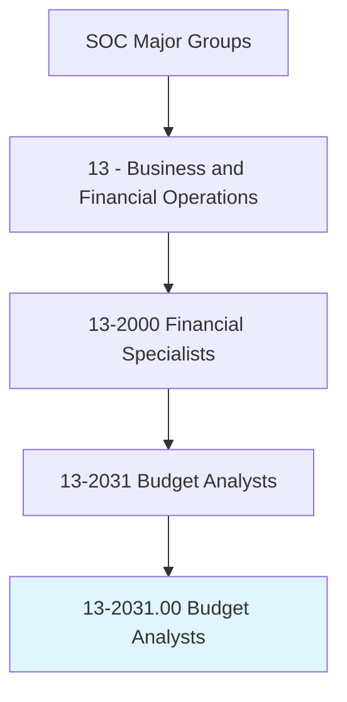
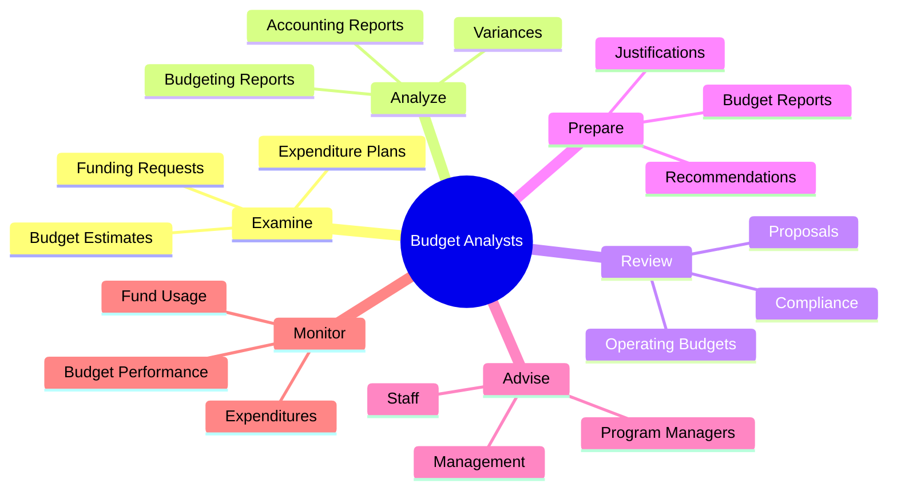
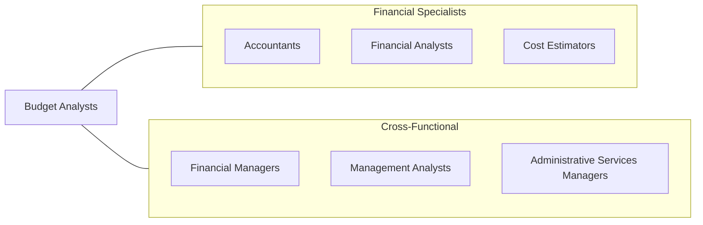
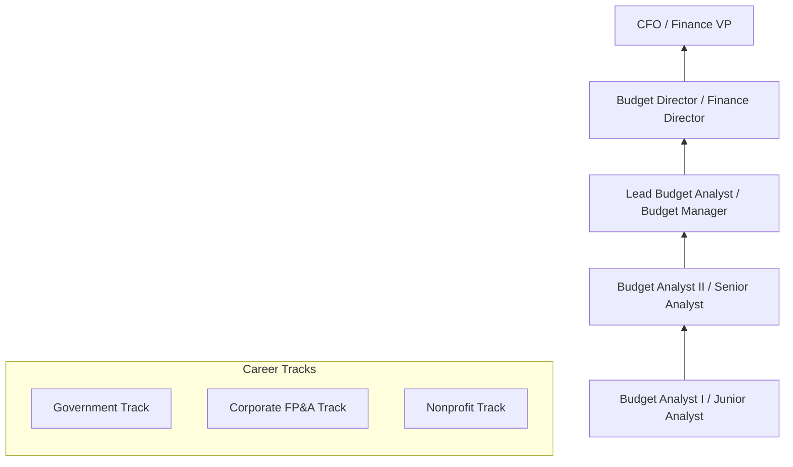

# Budget Analysts

> Examine budget estimates for completeness, accuracy, and conformance with procedures and regulations. Analyze budgeting and accounting reports.

## Overview

Budget Analysts are the financial stewards who help organizations plan, allocate, and control their financial resources. They develop, analyze, and execute budgets while ensuring compliance with organizational policies and government regulations. This role is critical in both public and private sectors, with government budget analysts focusing on appropriations and program funding, while corporate analysts concentrate on departmental budgets and financial planning. The profession requires strong analytical skills, attention to detail, and the ability to communicate complex financial information to non-financial stakeholders.

## Classification Hierarchy

## Key Statistics

| Metric | Value |
|--------|-------|
| SOC Code | 13-2031.00 |
| Job Zone | 4 (Considerable Preparation) |
| Category | [Business and Financial Operations](/occupations/Business/index) |
| Subcategory | Financial Specialists |
| Core Tasks | 12+ |
| Source | O*NET |

## Core Tasks

### examine.BudgetEstimates

Examine budget estimates for completeness, accuracy, and conformance with procedures and regulations.

**Actions:**
- `examine.BudgetEstimates.for.Completeness` - Verify all components included
- `examine.BudgetEstimates.for.Accuracy` - Check calculations and assumptions
- `examine.BudgetEstimates.for.ConformanceWithProcedures` - Ensure policy compliance
- `examine.BudgetEstimates.for.ConformanceWithRegulations` - Verify regulatory adherence

### analyze.Reports

Analyze budgeting and accounting reports to support financial decision-making.

**Actions:**
- `analyze.BudgetingReports.to.identify.Variances` - Spot budget discrepancies
- `analyze.AccountingReports.to.track.Expenditures` - Monitor spending patterns
- `compare.ActualCosts.with.BudgetedAmounts` - Perform variance analysis
- `prepare.FinancialAnalysis.for.Management` - Create analytical reports

### review.OperatingBudgets

Review operating budgets to analyze trends affecting budget needs.

**Actions:**
- `review.OperatingBudgets.to.analyze.Trends` - Identify spending patterns
- `review.Proposals.for.FundingRequests` - Evaluate funding submissions
- `review.BudgetRequests.for.Completeness` - Screen budget packages
- `assess.Programs.for.BudgetImplications` - Evaluate program costs

### advise.Management

Provide advice and technical assistance with cost analysis, fiscal allocation, and budget preparation.

**Actions:**
- `advise.Management.on.CostAnalysis` - Guide cost decisions
- `advise.ProgramManagers.on.FiscalAllocation` - Support resource distribution
- `provide.TechnicalAssistance.with.BudgetPreparation` - Help prepare budgets
- `consult.Managers.concerning.BudgetConstraints` - Communicate limitations

## Professional Certifications

| Certification | Full Name | Focus Area | Requirements |
|--------------|-----------|------------|--------------|
| **CGFM** | Certified Government Financial Manager | Government finance | 2 years experience + 3 exams |
| **CPA** | Certified Public Accountant | Accounting/finance | 150 credits + exam + experience |
| **CFM** | Certified Financial Manager | Corporate finance | Experience + exam |
| **CTP** | Certified Treasury Professional | Treasury management | Experience + exam |
| **CPFO** | Certified Public Finance Officer | Public finance | Experience + exam |

## Skills & Competencies

### Technical Skills
- **Financial Analysis** - Expert
- **Budget Development** - Expert
- **Excel/Spreadsheet Modeling** - Expert
- **Financial Reporting** - Advanced
- **ERP/Financial Systems** - Advanced
- **Data Visualization** - Proficient
- **Statistical Analysis** - Proficient

### Soft Skills
- **Attention to Detail** - Critical
- **Analytical Thinking** - Critical
- **Communication** - Essential
- **Integrity** - Essential
- **Time Management** - Important
- **Collaboration** - Important

## Related Occupations

## Industries

- Government (Federal) - High Employment
- Government (State/Local) - High Employment
- [Healthcare](/industries/Healthcare/index) - Moderate Employment
- Higher Education - Moderate Employment
- Nonprofit - Moderate Employment
- [Corporate](/industries/Corporate) - Moderate Employment

## Industry Variations

| Industry | Focus | Specializations |
|----------|-------|-----------------|
| **Federal Government** | Appropriations | Program budgets, OMB submissions |
| **State/Local Government** | Fund accounting | Revenue forecasting, capital budgets |
| **Healthcare** | Cost center budgets | Departmental budgets, grant management |
| **Higher Education** | Academic budgets | Research grants, tuition forecasting |
| **Nonprofit** | Donor restrictions | Grant budgets, fund tracking |
| **Corporate** | Operating budgets | P&L budgets, capital planning |

## Career Progression

## Education & Training

| Requirement | Details |
|-------------|---------|
| Typical Education | Bachelor's degree in Accounting, Finance, Public Administration, or Economics |
| Work Experience | 1-3 years for senior positions |
| On-the-Job Training | Moderate - agency/company-specific processes |
| Continuing Education | Varies by certification |

## Departments

This occupation typically works in:
- Budget Office
- [Finance](/departments/Finance/index)
- Financial Planning & Analysis
- Office of Management and Budget
- Treasury

## Technology & Tools

| Category | Tools |
|----------|-------|
| **Budgeting Software** | Hyperion, Anaplan, Adaptive Insights |
| **ERP Systems** | SAP, Oracle, PeopleSoft, Workday |
| **Spreadsheets** | Excel, Google Sheets |
| **Government Systems** | MAX, GFIS, state-specific systems |
| **Visualization** | Power BI, Tableau |
| **Collaboration** | SharePoint, Teams |

---

*Source: O*NET 13-2031.00 - ONETOccupation*
