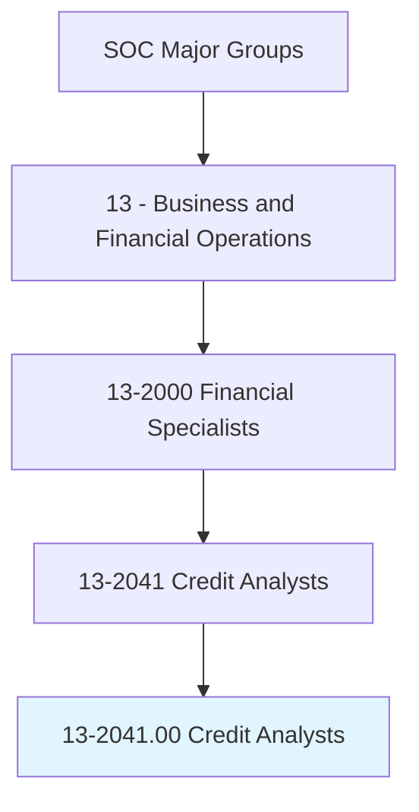
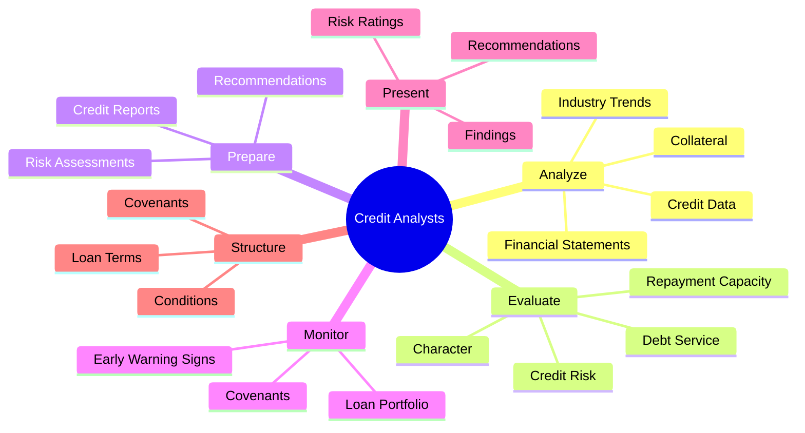
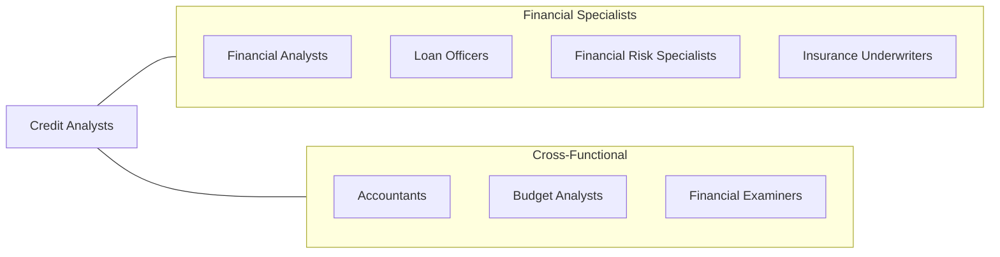
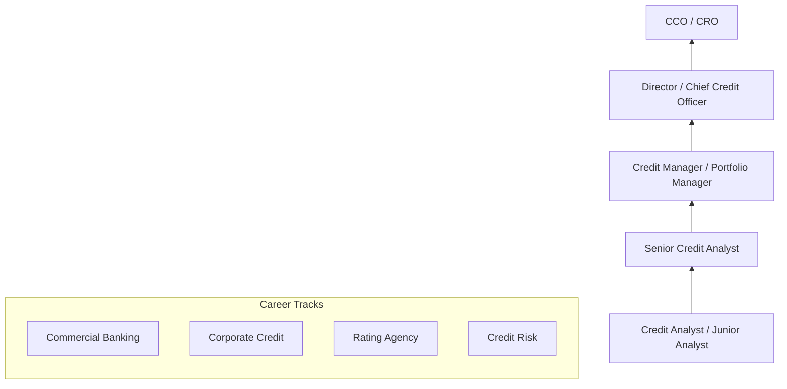

# Credit Analysts

> Analyze credit data and financial statements of individuals or firms to determine the degree of risk involved in extending credit or lending money. Prepare reports with credit information for use in decisionmaking.

## Overview

Credit Analysts are the risk assessors who evaluate the creditworthiness of individuals, companies, and securities. They analyze financial statements, assess repayment capacity, evaluate collateral, and determine the level of risk involved in lending decisions. The role spans commercial banking (corporate loans), consumer lending (mortgages, personal loans), and investment analysis (bond ratings). Credit Analysts must combine quantitative financial analysis with qualitative judgment about management quality, industry conditions, and economic factors.

## Classification Hierarchy

## Key Statistics

| Metric | Value |
|--------|-------|
| SOC Code | 13-2041.00 |
| Job Zone | 4 (Considerable Preparation) |
| Category | [Business and Financial Operations](/occupations/Business) |
| Subcategory | Financial Specialists |
| Core Tasks | 12+ |
| Source | O*NET |

## Core Tasks

### analyze.CreditData

Analyze credit data and financial statements to determine risk.

**Actions:**
- `analyze.CreditData.to.assess.Risk` - Review credit history
- `analyze.FinancialStatements.of.Individuals` - Assess personal finances
- `analyze.FinancialStatements.of.Firms` - Evaluate corporate financials
- `determine.DegreeOfRisk.in.ExtendingCredit` - Quantify credit risk

### evaluate.Creditworthiness

Evaluate the creditworthiness and repayment capacity of borrowers.

**Actions:**
- `evaluate.CreditRisk.based.on.Analysis` - Assess overall risk
- `evaluate.RepaymentCapacity.from.CashFlow` - Analyze payment ability
- `evaluate.Collateral.for.Adequacy` - Assess security value
- `assess.CharacterOfBorrower.through.References` - Evaluate integrity

### prepare.CreditReports

Prepare reports with credit information for decision-making.

**Actions:**
- `prepare.CreditReports.with.Information` - Document findings
- `prepare.RiskAssessments.for.Committee` - Summarize risk analysis
- `prepare.Recommendations.for.LoanApproval` - Advise on decisions
- `document.Analysis.for.CreditFile` - Maintain records

### monitor.Portfolio

Monitor existing loans for compliance and early warning signs.

**Actions:**
- `monitor.LoanPortfolio.for.Risk` - Track portfolio health
- `monitor.Covenants.for.Compliance` - Check borrower requirements
- `identify.EarlyWarningSigns.of.Deterioration` - Spot problem credits
- `review.PeriodicFinancials.of.Borrowers` - Update analysis

## Professional Certifications

| Certification | Full Name | Focus Area | Requirements |
|--------------|-----------|------------|--------------|
| **CPSA** | Certified Credit Professional | Commercial credit | Experience + exam |
| **CFA** | Chartered Financial Analyst | Investment analysis | 3 exams + experience |
| **FRM** | Financial Risk Manager | Risk management | 2 exams + experience |
| **CRC** | Credit Risk Certification | Credit risk | Experience + exam |
| **RMA Credit Essentials** | Risk Management Association | Commercial lending | Training program |

## Skills & Competencies

### Technical Skills
- **Financial Statement Analysis** - Expert
- **Credit Analysis** - Expert
- **Financial Modeling** - Advanced
- **Risk Assessment** - Advanced
- **Industry Analysis** - Advanced
- **Accounting Knowledge** - Advanced
- **Spreadsheet/Excel** - Expert

### Soft Skills
- **Analytical Thinking** - Critical
- **Attention to Detail** - Critical
- **Written Communication** - Essential
- **Judgment** - Essential
- **Skepticism** - Important
- **Time Management** - Important

## Related Occupations

## Industries

- [Commercial Banking](/industries/CommercialBanking) - High Employment
- [Investment Banking](/industries/InvestmentBanking) - Moderate Employment
- [Credit Rating Agencies](/industries/CreditRating) - High Employment
- [Corporate Finance](/industries/CorporateFinance) - Moderate Employment
- [Insurance](/industries/Insurance) - Moderate Employment
- [Private Credit](/industries/PrivateCredit) - High Employment

## Industry Variations

| Industry | Focus | Key Metrics |
|----------|-------|-------------|
| **Commercial Banking** | Corporate loans | DSCR, leverage, liquidity |
| **Investment Banking** | Bond analysis | Ratings, spreads, covenants |
| **Rating Agencies** | Public ratings | Long-term solvency, industry |
| **Consumer Lending** | Retail credit | FICO, DTI, LTV |
| **Private Credit** | Middle market | Cash flow, sponsor quality |
| **Trade Credit** | Supplier credit | Aging, payment history |

## Career Progression

## Education & Training

| Requirement | Details |
|-------------|---------|
| Typical Education | Bachelor's degree in Finance, Accounting, or Economics |
| Work Experience | 1-3 years for senior analyst roles |
| On-the-Job Training | Extensive - bank-specific processes and criteria |
| Continuing Education | RMA, ABA, or firm-specific training |

## Departments

This occupation typically works in:
- [Credit/Underwriting](/departments/Credit)
- [Commercial Lending](/departments/CommercialLending)
- [Corporate Banking](/departments/CorporateBanking)
- [Risk Management](/departments/RiskManagement)
- [Portfolio Management](/departments/PortfolioManagement)

## Technology & Tools

| Category | Tools |
|----------|-------|
| **Credit Analysis** | Moody's Analytics, S&P Capital IQ |
| **Financial Data** | Bloomberg, FactSet, PitchBook |
| **Loan Systems** | nCino, Finastra, Temenos |
| **Spreadsheets** | Excel (heavy use), Google Sheets |
| **Risk Models** | Moody's RiskCalc, CreditEdge |
| **Research** | SEC EDGAR, D&B, Equifax |

---

*Source: O*NET 13-2041.00 - ONETOccupation*
