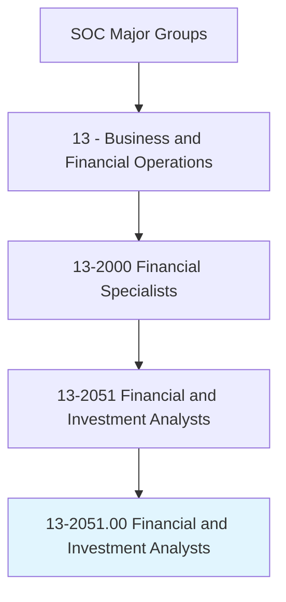
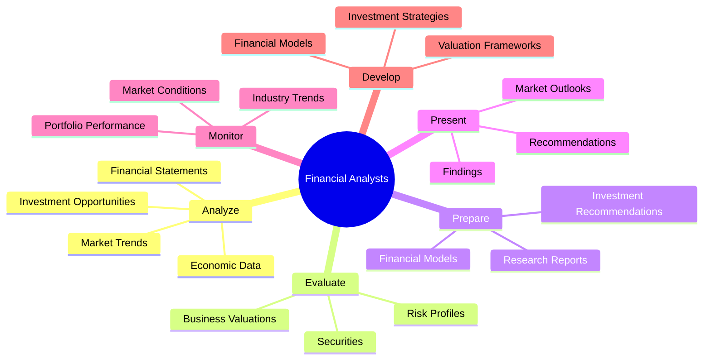
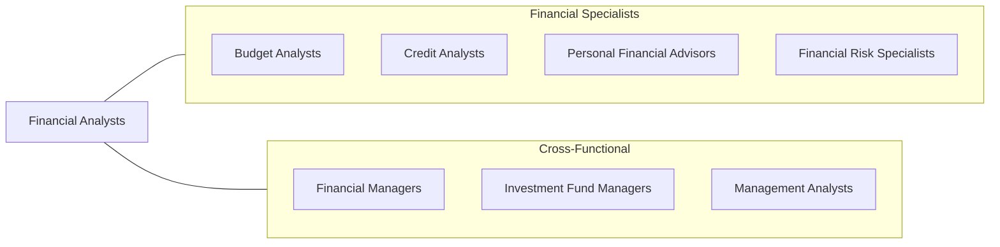
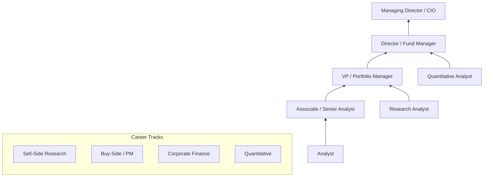

# Financial and Investment Analysts

> Conduct quantitative analyses of information involving investment programs or financial data of public or private institutions, including valuation of businesses.

## Overview

Financial and Investment Analysts are the quantitative minds behind investment decisions and corporate financial strategy. They evaluate financial data, create models, and provide recommendations on securities, mergers, acquisitions, and corporate finance decisions. This role spans sell-side research (investment banks advising clients), buy-side analysis (managing investments for institutions), and corporate finance (internal strategic analysis). The profession demands strong analytical skills, financial modeling expertise, and deep market knowledge.

## Classification Hierarchy

## Key Statistics

| Metric | Value |
|--------|-------|
| SOC Code | 13-2051.00 |
| Job Zone | 4 (Considerable Preparation) |
| Category | [Business and Financial Operations](/occupations/Business/index) |
| Subcategory | Financial Specialists |
| Core Tasks | 12+ |
| Source | O*NET |

## Core Tasks

### analyze.FinancialData

Conduct quantitative analyses of financial data and investment programs.

**Actions:**
- `analyze.FinancialStatements.to.evaluate.CompanyPerformance` - Assess financial health
- `analyze.MarketTrends.to.identify.InvestmentOpportunities` - Spot market opportunities
- `analyze.EconomicData.to.forecast.MarketConditions` - Predict economic trends
- `conduct.QuantitativeAnalyses.of.InvestmentPrograms` - Model investment scenarios

### evaluate.Securities

Evaluate securities and provide investment recommendations.

**Actions:**
- `evaluate.Securities.to.determine.Value` - Assess intrinsic value
- `evaluate.BusinessValuations.for.MergersAndAcquisitions` - Value M&A targets
- `evaluate.RiskProfiles.of.Investments` - Assess investment risk
- `determine.IntrinsicValue.of.PublicSecurities` - Calculate fair value

### prepare.Reports

Prepare research reports and investment recommendations.

**Actions:**
- `prepare.ResearchReports.for.Clients` - Write client research
- `prepare.FinancialModels.to.project.Performance` - Build projection models
- `prepare.InvestmentRecommendations.based.on.Analysis` - Formulate buy/sell recommendations
- `document.Findings.in.Reports` - Record analytical conclusions

### present.Recommendations

Present findings and recommendations to clients and management.

**Actions:**
- `present.Findings.to.Clients` - Communicate research results
- `present.Recommendations.to.InvestmentCommittees` - Advise on portfolio decisions
- `communicate.MarketOutlooks.to.Stakeholders` - Share market views
- `advise.Management.on.InvestmentStrategies` - Guide corporate finance

## Professional Certifications

| Certification | Full Name | Focus Area | Requirements |
|--------------|-----------|------------|--------------|
| **CFA** | Chartered Financial Analyst | Investment analysis | 3 exams + 4 years experience |
| **FRM** | Financial Risk Manager | Risk management | 2 exams + 2 years experience |
| **CAIA** | Chartered Alternative Investment Analyst | Alternative investments | 2 exams + experience |
| **CMT** | Chartered Market Technician | Technical analysis | 3 exams + experience |
| **CFP** | Certified Financial Planner | Financial planning | Education + exam + experience |
| **CPA** | Certified Public Accountant | Accounting/audit | 150 credits + exam + experience |

## Skills & Competencies

### Technical Skills
- **Financial Modeling** - Expert
- **Valuation Methodologies (DCF, Comps, Precedent)** - Expert
- **Excel/VBA** - Expert
- **Bloomberg Terminal** - Advanced
- **Python/R for Analysis** - Advanced
- **SQL/Database Queries** - Proficient
- **Statistical Analysis** - Advanced

### Soft Skills
- **Analytical Thinking** - Critical
- **Attention to Detail** - Critical
- **Communication (Written/Verbal)** - Essential
- **Presentation Skills** - Essential
- **Time Management** - Important
- **Teamwork** - Important

## Related Occupations

## Industries

- [Investment Banking](/industries/InvestmentBanking) - High Employment
- Asset Management - High Employment
- Private Equity - High Employment
- Hedge Funds - High Employment
- Corporate Finance - Moderate Employment
- [Insurance](/industries/Insurance/index) - Moderate Employment

## Industry Variations

| Industry | Focus | Typical Tasks |
|----------|-------|---------------|
| **Investment Banking (Sell-Side)** | M&A, equity research | Valuation, pitch books, research reports |
| **Asset Management (Buy-Side)** | Portfolio management | Security selection, portfolio construction |
| **Private Equity** | Deal analysis | LBO modeling, due diligence |
| **Hedge Funds** | Trading strategies | Quantitative analysis, alpha generation |
| **Corporate Finance** | Internal strategy | FP&A, capital allocation, M&A |
| **Credit Analysis** | Debt evaluation | Credit ratings, bond analysis |

## Career Progression

## Education & Training

| Requirement | Details |
|-------------|---------|
| Typical Education | Bachelor's degree in Finance, Economics, or related field |
| Advanced Degree | MBA or Master's in Finance preferred for advancement |
| Work Experience | 2-4 years for CFA charterholder |
| On-the-Job Training | Extensive - firm-specific models and processes |

## Departments

This occupation typically works in:
- Investment Research
- Portfolio Management
- Corporate Development
- Financial Planning & Analysis
- Treasury

## Technology & Tools

| Category | Tools |
|----------|-------|
| **Data Terminals** | Bloomberg, FactSet, Refinitiv, Capital IQ |
| **Modeling** | Excel, VBA, Python, R |
| **Databases** | SQL, Access, Alteryx |
| **Visualization** | Tableau, Power BI |
| **Research** | Morningstar, Preqin, PitchBook |
| **Portfolio Systems** | Aladdin, Charles River, SimCorp |

---

*Source: O*NET 13-2051.00 - ONETOccupation*
