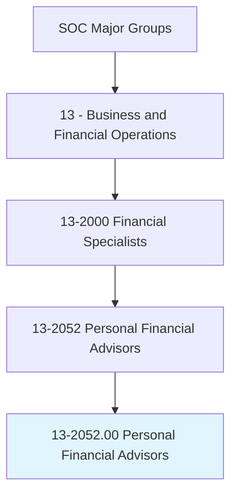
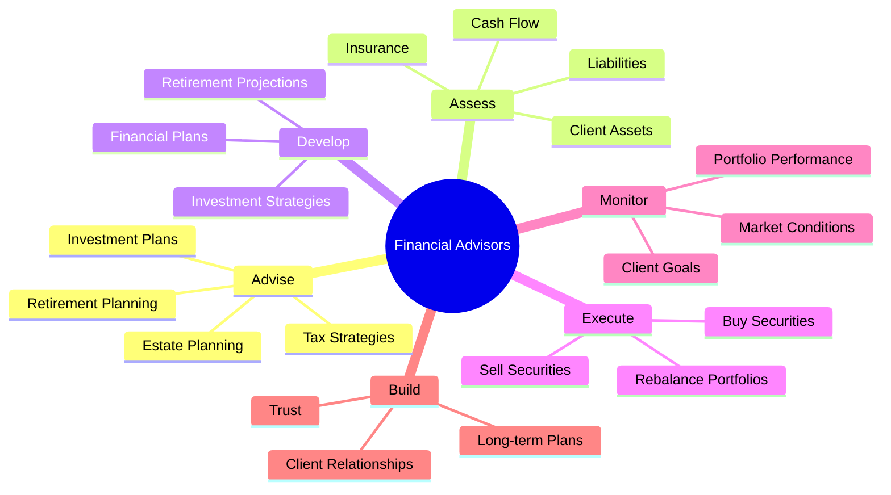
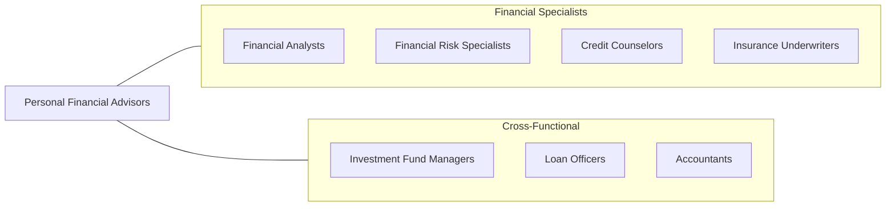
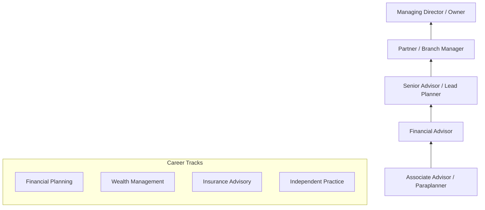

# Personal Financial Advisors

> Advise clients on financial plans using knowledge of tax and investment strategies, securities, insurance, pension plans, and real estate. Duties include assessing clients' assets, liabilities, cash flow, insurance coverage, tax status, and financial objectives. May also buy and sell financial assets for clients.

## Overview

Personal Financial Advisors are trusted guides who help individuals and families achieve their financial goals through comprehensive financial planning. They assess clients' complete financial situations and develop strategies for investments, retirement, estate planning, tax optimization, insurance, and education funding. The role requires building long-term client relationships, understanding complex financial products, and staying current with tax laws and market conditions. This profession has evolved with the rise of robo-advisors and fee-only planning models, emphasizing holistic advice over product sales.

## Classification Hierarchy

## Key Statistics

| Metric | Value |
|--------|-------|
| SOC Code | 13-2052.00 |
| Job Zone | 4 (Considerable Preparation) |
| Category | [Business and Financial Operations](/occupations/Business) |
| Subcategory | Financial Specialists |
| Core Tasks | 15+ |
| Source | O*NET |

## Core Tasks

### advise.Clients

Advise clients on financial plans using knowledge of tax and investment strategies.

**Actions:**
- `advise.Clients.on.TaxStrategies` - Optimize tax efficiency
- `advise.Clients.on.InvestmentStrategies` - Guide investment decisions
- `advise.Clients.on.Securities` - Recommend security selections
- `advise.Clients.on.InsurancePlans` - Suggest risk management
- `advise.Clients.on.PensionPlans` - Plan retirement income
- `advise.Clients.on.RealEstate` - Guide property decisions

### assess.ClientFinances

Assess clients' assets, liabilities, cash flow, insurance coverage, tax status, and financial objectives.

**Actions:**
- `assess.ClientsAssets.to.determine.NetWorth` - Value total assets
- `assess.ClientsLiabilities.to.understand.DebtPosition` - Analyze obligations
- `assess.CashFlow.to.plan.Savings` - Map income and expenses
- `assess.InsuranceCoverage.to.identify.Gaps` - Review risk protection
- `assess.TaxStatus.to.optimize.Planning` - Understand tax situation
- `assess.FinancialObjectives.to.set.Goals` - Define client priorities

### develop.FinancialPlans

Develop comprehensive financial plans addressing all aspects of clients' financial lives.

**Actions:**
- `develop.FinancialPlans.for.Retirement` - Create retirement roadmaps
- `develop.FinancialPlans.for.Education` - Plan education funding
- `develop.FinancialPlans.for.EstatePlanning` - Structure wealth transfer
- `develop.InvestmentStrategies.aligned.with.Goals` - Design portfolios

### execute.Transactions

Buy and sell financial assets for clients based on approved strategies.

**Actions:**
- `buy.FinancialAssets.for.Clients` - Execute purchase orders
- `sell.FinancialAssets.for.Clients` - Execute sell orders
- `rebalance.Portfolios.to.maintain.Allocation` - Adjust holdings
- `implement.Recommendations.following.Approval` - Execute agreed plans

## Professional Certifications

| Certification | Full Name | Focus Area | Requirements |
|--------------|-----------|------------|--------------|
| **CFP** | Certified Financial Planner | Comprehensive planning | Education + exam + experience + ethics |
| **CFA** | Chartered Financial Analyst | Investment analysis | 3 exams + 4 years experience |
| **ChFC** | Chartered Financial Consultant | Advanced planning | 8 courses + experience |
| **CLU** | Chartered Life Underwriter | Insurance planning | 8 courses + experience |
| **CPA/PFS** | CPA Personal Financial Specialist | Tax-focused planning | CPA + experience + exam |
| **CIMA** | Certified Investment Management Analyst | Investment consulting | Education + exam + experience |

## Skills & Competencies

### Technical Skills
- **Financial Planning** - Expert
- **Investment Analysis** - Expert
- **Tax Planning** - Advanced
- **Insurance Analysis** - Advanced
- **Estate Planning** - Proficient
- **Financial Modeling** - Proficient
- **Planning Software** - Advanced

### Soft Skills
- **Relationship Building** - Critical
- **Active Listening** - Critical
- **Trustworthiness** - Essential
- **Communication** - Essential
- **Emotional Intelligence** - Important
- **Sales/Persuasion** - Important

## Related Occupations

## Industries

- [Wealth Management](/industries/WealthManagement) - High Employment
- [Financial Planning Firms](/industries/FinancialPlanning) - High Employment
- [Banks/Credit Unions](/industries/Banking) - Moderate Employment
- [Insurance Companies](/industries/Insurance) - Moderate Employment
- [Brokerage Firms](/industries/Brokerage) - Moderate Employment
- [Independent RIA](/industries/RIA) - High Employment

## Industry Variations

| Industry | Focus | Compensation Model |
|----------|-------|-------------------|
| **Wirehouse** | Full-service brokerage | Commission + fees |
| **Independent RIA** | Fee-only advice | AUM fees or flat fees |
| **Insurance-based** | Insurance products | Commission-based |
| **Bank/Credit Union** | Retail customers | Salary + bonus |
| **Robo-advisor** | Digital planning | Subscription/AUM |
| **Family Office** | Ultra-high-net-worth | Salary + AUM |

## Career Progression

## Education & Training

| Requirement | Details |
|-------------|---------|
| Typical Education | Bachelor's degree in Finance, Economics, or Business |
| CFP Requirement | Bachelor's degree + CFP coursework |
| Work Experience | 3 years for CFP certification |
| Licensing | Series 7, Series 66 (or 63/65), Life/Health Insurance |

## Departments

This occupation typically works in:
- [Wealth Management](/departments/WealthManagement)
- [Financial Planning](/departments/FinancialPlanning)
- [Private Banking](/departments/PrivateBanking)
- [Investment Advisory](/departments/InvestmentAdvisory)
- [Retirement Services](/departments/RetirementServices)

## Technology & Tools

| Category | Tools |
|----------|-------|
| **Planning Software** | eMoney, MoneyGuidePro, RightCapital, NaviPlan |
| **CRM** | Salesforce, Redtail, Wealthbox |
| **Portfolio Management** | Orion, Black Diamond, Tamarac |
| **Trading Platforms** | Schwab, Fidelity, TD Ameritrade |
| **Research** | Morningstar, Fi360, Riskalyze |
| **Client Portal** | Orion Portal, eMoney Client Portal |

---

*Source: O*NET 13-2052.00 - ONETOccupation*
