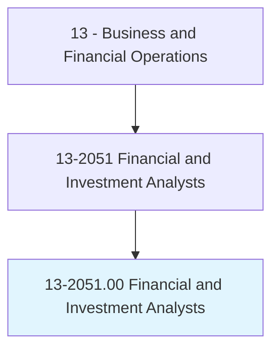
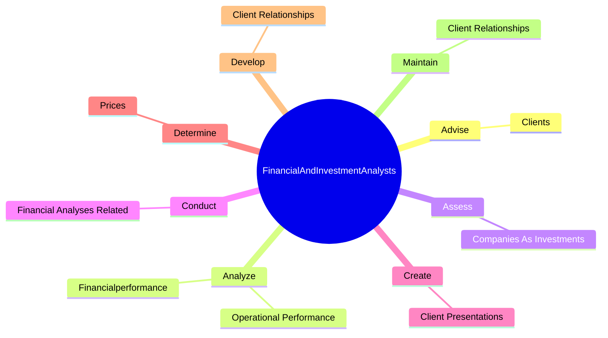

# Financial and Investment Analysts

> Conduct quantitative analyses of information involving investment programs or financial data of public or private institutions, including valuation of businesses.

## Overview

Financial and Investment Analysts is classified under Business and Financial Operations (SOC 13). Conduct quantitative analyses of information involving investment programs or financial data of public or private institutions, including valuation of businesses.

## Classification Hierarchy

## Key Statistics

| Metric | Value |
|--------|-------|
| SOC Code | 13-2051.00 |
| Category | [Business and Financial Operations](/occupations/Business/index) |
| Task Count | 82 |
| Source | O*NET |

## Core Tasks

### advise.Clients

Financial and Investment Analysts advise clients as part of their core responsibilities.

**Actions:**
- `advise.Clients.on.Aspects.of.Capitalization`
- `advise.Clients.on.Amounts`
- `advise.Clients.on.Sources`
- `advise.Clients.on.Timing`

### analyze.Financialperformance

Financial and Investment Analysts analyze financialperformance as part of their core responsibilities.

**Actions:**
- `analyze.Financialperformance.of.CompaniesFacingFinancialDifficulties.to.Identify`
- `analyze.Financialperformance.of.RecommendRemedies`
- `analyze.OperationalPerformance.of.CompaniesFacingFinancialDifficulties.to.Identify`
- `analyze.OperationalPerformance.of.RecommendRemedies`

### assess.CompaniesAsInvestments

Financial and Investment Analysts assess companies as investments as part of their core responsibilities.

**Actions:**
- `assess.CompaniesAsInvestments.for.Clients.by.ExaminingCompanyFacilities`

## Skills & Competencies

### Technical Skills
- **Financial Analysis** - Advanced
- **Data Analysis** - Advanced
- **Regulatory Compliance** - Advanced

### Soft Skills
- **Communication** - Essential
- **Problem Solving** - Essential
- **Critical Thinking** - Important
- **Teamwork** - Important
- **Adaptability** - Important

## Related Occupations

## Industries

This occupation is found across multiple industries. See [Industries](/industries) for sector-specific employment data.

## Career Progression

---

*Source: O*NET 13-2051.00 - ONETOccupation*
