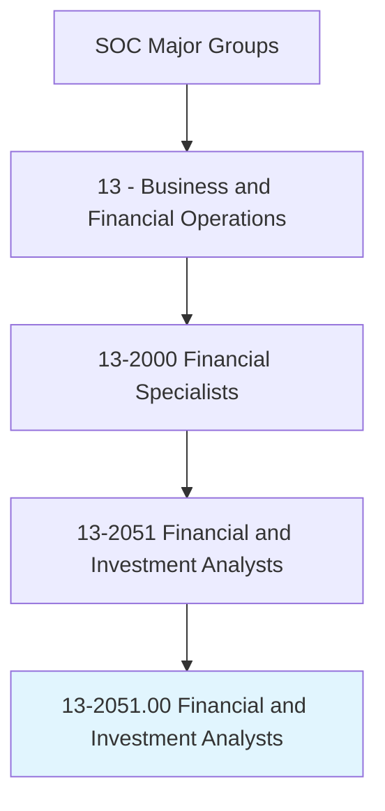
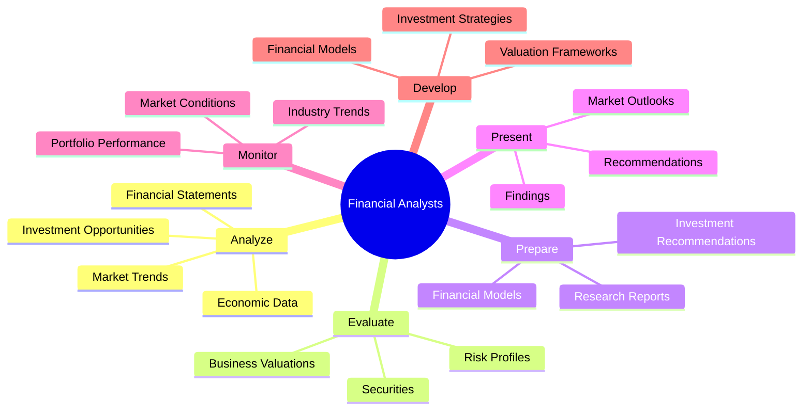
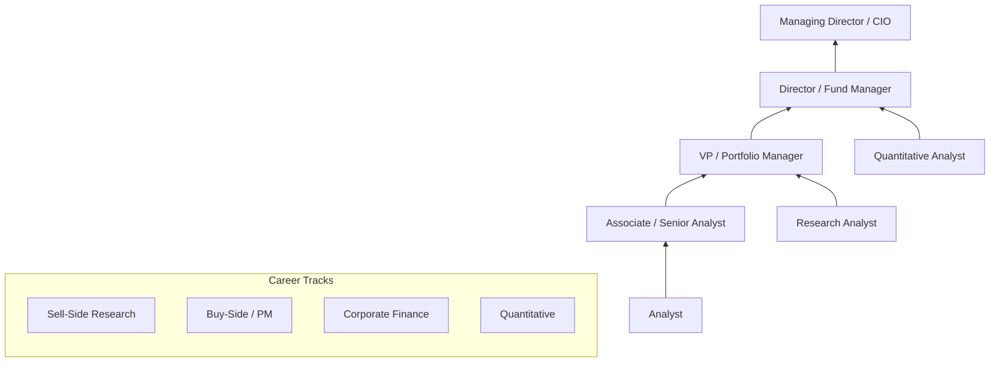
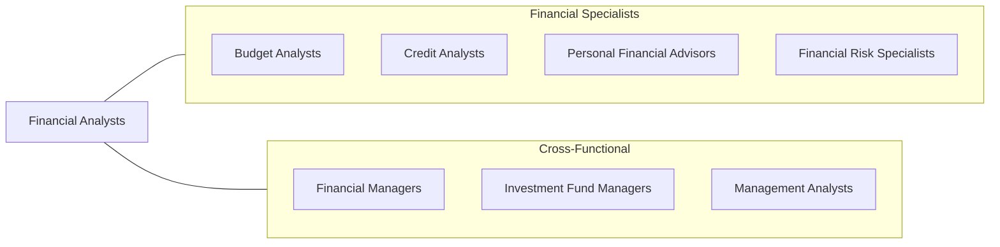

# Financial and Investment Analysts

> Conduct quantitative analyses of information involving investment programs or financial data of public or private institutions, including valuation of businesses.

## Overview

Financial and Investment Analysts are the quantitative minds behind investment decisions and corporate financial strategy. They evaluate financial data, create models, and provide recommendations on securities, mergers, acquisitions, and corporate finance decisions. This role spans sell-side research (investment banks advising clients), buy-side analysis (managing investments for institutions), and corporate finance (internal strategic analysis).

The profession demands strong analytical skills, financial modeling expertise, and deep market knowledge. Analysts must synthesize vast amounts of financial data, economic indicators, and industry intelligence to produce actionable investment recommendations. Whether building discounted cash flow models, analyzing comparable company valuations, or forecasting earnings, these professionals provide the analytical foundation upon which billions of dollars in investment decisions are made.

The field continues to evolve with algorithmic trading, alternative data sources, ESG integration, and machine learning approaches to investment analysis. Despite technological advances, the judgment and communication skills of experienced analysts remain essential for interpreting complex situations and advising clients and portfolio managers.

## Classification Hierarchy

## Key Statistics

| Metric | Value |
|--------|-------|
| SOC Code | 13-2051.00 |
| Job Zone | 4 (Considerable Preparation) |
| Category | [Business and Financial Operations](/occupations/Business/index) |
| Subcategory | Financial Specialists |
| Median Salary | $95,080 |
| Employment | ~295,000 |
| Projected Growth | 9% (Faster than average) |
| Core Tasks | 12+ |
| Source | O*NET |

## Core Tasks

### analyze.FinancialData

Conduct quantitative analyses of financial data and investment programs.

**Actions:**
- `analyze.FinancialStatements.to.evaluate.CompanyPerformance` - Assess financial health
- `analyze.MarketTrends.to.identify.InvestmentOpportunities` - Spot market opportunities
- `analyze.EconomicData.to.forecast.MarketConditions` - Predict economic trends
- `conduct.QuantitativeAnalyses.of.InvestmentPrograms` - Model investment scenarios

### evaluate.Securities

Evaluate securities and provide investment recommendations.

**Actions:**
- `evaluate.Securities.to.determine.Value` - Assess intrinsic value
- `evaluate.BusinessValuations.for.MergersAndAcquisitions` - Value M&A targets
- `evaluate.RiskProfiles.of.Investments` - Assess investment risk
- `determine.IntrinsicValue.of.PublicSecurities` - Calculate fair value

### prepare.Reports

Prepare research reports and investment recommendations.

**Actions:**
- `prepare.ResearchReports.for.Clients` - Write client research
- `prepare.FinancialModels.to.project.Performance` - Build projection models
- `prepare.InvestmentRecommendations.based.on.Analysis` - Formulate recommendations
- `present.Findings.to.Clients` - Communicate results

## Skills & Competencies

### Technical Skills
- **Financial Modeling** - Expert
- **Valuation Methodologies (DCF, Comps, Precedent)** - Expert
- **Excel/VBA** - Expert
- **Bloomberg Terminal** - Advanced
- **Python/R for Analysis** - Advanced
- **SQL/Database Queries** - Proficient
- **Statistical Analysis** - Advanced

### Soft Skills
- **Analytical Thinking** - Critical
- **Attention to Detail** - Critical
- **Communication (Written/Verbal)** - Essential
- **Presentation Skills** - Essential
- **Time Management** - Important
- **Teamwork** - Important

## Education & Certifications

| Requirement | Details |
|-------------|---------|
| Typical Education | Bachelor's degree in Finance, Economics, or related field |
| Advanced Degree | MBA or Master's in Finance preferred for advancement |
| Key Certifications | CFA (Chartered Financial Analyst) - 3 exams + 4 years experience |
| Additional Certs | FRM (Financial Risk Manager), CAIA, CMT |
| Work Experience | 2-4 years for CFA charterholder |
| On-the-Job Training | Extensive - firm-specific models and processes |

## Career Progression

## Industry Variations

| Industry | Focus | Typical Tasks |
|----------|-------|---------------|
| **Investment Banking (Sell-Side)** | M&A, equity research | Valuation, pitch books, research reports |
| **Asset Management (Buy-Side)** | Portfolio management | Security selection, portfolio construction |
| **Private Equity** | Deal analysis | LBO modeling, due diligence |
| **Hedge Funds** | Trading strategies | Quantitative analysis, alpha generation |
| **Corporate Finance** | Internal strategy | FP&A, capital allocation, M&A |
| **Credit Analysis** | Debt evaluation | Credit ratings, bond analysis |

## Technology & Tools

| Category | Tools |
|----------|-------|
| **Data Terminals** | Bloomberg, FactSet, Refinitiv, Capital IQ |
| **Modeling** | Excel, VBA, Python, R |
| **Databases** | SQL, Access, Alteryx |
| **Visualization** | Tableau, Power BI |
| **Research** | Morningstar, Preqin, PitchBook |
| **Portfolio Systems** | Aladdin, Charles River, SimCorp |

## Related Occupations

## Departments

This occupation typically works in:
- [Investment Research](/departments/InvestmentResearch)
- [Portfolio Management](/departments/PortfolioManagement)
- [Corporate Development](/departments/CorporateDevelopment)
- [Financial Planning & Analysis](/departments/FPA)
- [Treasury](/departments/Treasury)

---

*Source: O*NET 13-2051.00 - ONETOccupation*
