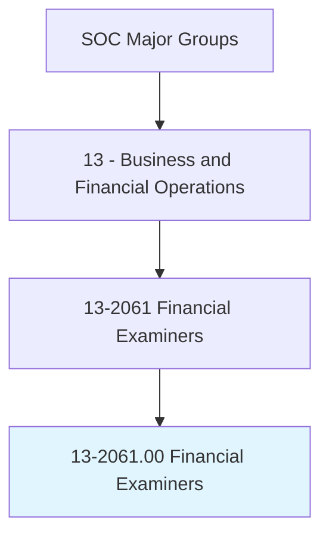
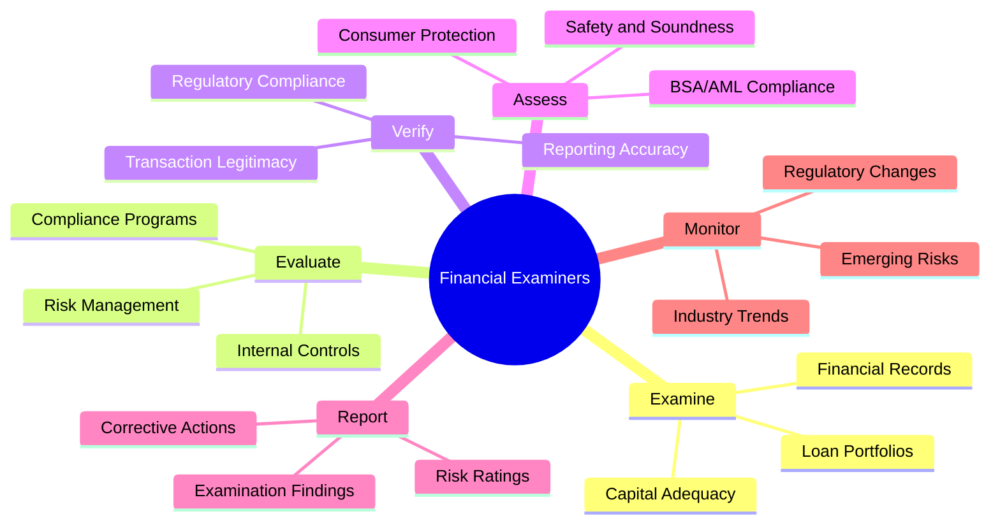
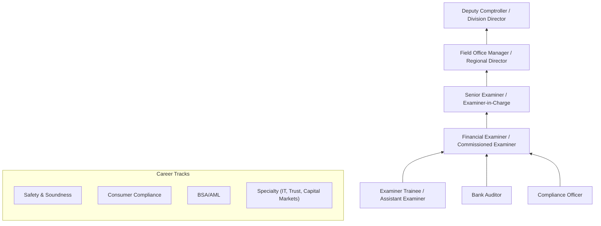
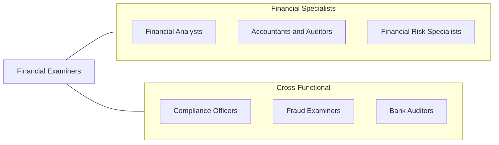

# Financial Examiners

> Enforce or ensure compliance with laws and regulations governing financial and securities institutions and financial and real estate transactions. May examine, verify, or authenticate records.

## Overview

Financial Examiners are regulatory professionals who ensure that financial institutions -- including banks, credit unions, insurance companies, and securities firms -- comply with applicable laws and regulations. They conduct on-site examinations, review financial records, assess risk management practices, and evaluate the safety and soundness of regulated entities. Their work protects depositors, policyholders, investors, and the broader financial system from fraud, mismanagement, and systemic risk.

These professionals work primarily for federal and state regulatory agencies including the OCC, FDIC, Federal Reserve, SEC, state banking departments, and state insurance departments. They analyze balance sheets, loan portfolios, capital adequacy, liquidity positions, and compliance programs to identify weaknesses that could threaten institutional stability or consumer protection. The role demands deep expertise in banking law, accounting standards, risk assessment, and the specific regulatory frameworks governing different types of financial institutions.

The profession has expanded significantly since the 2008 financial crisis, with heightened regulatory scrutiny, new compliance requirements (Dodd-Frank, Basel III, BSA/AML), and growing attention to emerging risks including cybersecurity, fintech disruption, climate-related financial risk, and cryptocurrency activities.

## Classification Hierarchy

## Key Statistics

| Metric | Value |
|--------|-------|
| SOC Code | 13-2061.00 |
| Job Zone | 4 (Considerable Preparation) |
| Category | [Business and Financial Operations](/occupations/Business/index) |
| Median Salary | $84,300 |
| Employment | ~67,000 |
| Projected Growth | 21% (Much faster than average) |
| Task Count | 28 |
| Source | O*NET |

## Core Tasks

### examine.FinancialRecords

Conduct detailed examinations of financial institution records and operations.

**Actions:**
- `examine.FinancialRecords.to.assess.InstitutionalHealth` - Evaluate financial condition
- `examine.LoanPortfolios.to.evaluate.CreditQuality` - Assess lending risk
- `examine.CapitalAdequacy.to.verify.RegulatoryCompliance` - Test capital ratios
- `verify.TransactionRecords.to.detect.Irregularities` - Identify suspicious activity

### evaluate.RiskManagement

Evaluate the effectiveness of risk management practices and internal controls.

**Actions:**
- `evaluate.RiskManagement.to.assess.InstitutionalResilience` - Rate risk practices
- `evaluate.CompliancePrograms.for.RegulatoryAdherence` - Review compliance systems
- `evaluate.InternalControls.to.identify.Weaknesses` - Test control effectiveness
- `assess.BSAAMLCompliance.to.prevent.MoneyLaundering` - Examine AML programs

### report.ExaminationFindings

Prepare examination reports with findings, recommendations, and corrective actions.

**Actions:**
- `report.ExaminationFindings.to.RegulatoryAuthorities` - Document results
- `recommend.CorrectiveActions.for.IdentifiedDeficiencies` - Prescribe remediation
- `assign.RiskRatings.to.ExaminedInstitutions` - Rate institutional health
- `monitor.CorrectiveActionProgress.for.SubsequentExaminations` - Track remediation

## Skills & Competencies

### Technical Skills
- **Banking Law & Regulations** - Expert
- **Financial Statement Analysis** - Expert
- **Risk Assessment & Management** - Expert
- **BSA/AML Compliance** - Advanced
- **Accounting Standards (GAAP)** - Advanced
- **Credit Analysis** - Advanced
- **Capital Adequacy (Basel III)** - Advanced
- **Cybersecurity Risk Assessment** - Proficient

### Soft Skills
- **Analytical Thinking** - Critical
- **Attention to Detail** - Critical
- **Written Communication** - Essential
- **Professional Skepticism** - Essential
- **Interpersonal Skills** - Important
- **Time Management** - Important

## Education & Certifications

| Requirement | Details |
|-------------|---------|
| Typical Education | Bachelor's degree in Finance, Accounting, Economics, or related field |
| Advanced Degree | Master's or MBA preferred for advancement |
| Key Certifications | CPA, CFE (Certified Fraud Examiner), CRCM (Certified Regulatory Compliance Manager) |
| Additional Certs | CAMS (Certified Anti-Money Laundering Specialist) |
| Federal Training | Extensive agency-specific examination training |
| Work Experience | 2-5 years in banking, accounting, or financial regulation |

## Career Progression

## Industry Variations

| Industry | Focus | Typical Tasks |
|----------|-------|---------------|
| **Federal Banking (OCC, FDIC, Fed)** | National banks, state banks | Safety & soundness, capital adequacy, CAMELS ratings |
| **State Banking** | State-chartered institutions | State law compliance, chartering, branching |
| **Securities (SEC, FINRA)** | Broker-dealers, advisors | Net capital, customer protection, fiduciary duties |
| **Insurance** | Insurance companies | Solvency, reserves, market conduct |
| **Credit Unions (NCUA)** | Credit union safety | CAMEL ratings, share insurance, field of membership |
| **Consumer Financial Protection (CFPB)** | Consumer protection | Fair lending, UDAAP, disclosure compliance |

## Technology & Tools

| Category | Tools |
|----------|-------|
| **Examination** | FFIEC tools, AIRES, MIDAS |
| **Data Analysis** | Excel (advanced), SAS, Python, ACL/IDEA |
| **Regulatory Systems** | NED, FOIA portals, FinCEN systems |
| **Financial Data** | Bloomberg, S&P Global, SNL Financial |
| **Document Management** | SharePoint, secure examination portals |
| **Communication** | Microsoft 365, encrypted email |
| **Risk Modeling** | Moody's Analytics, FIS, custom models |

## Related Occupations

## Departments

This occupation typically works in:
- [Bank Supervision](/departments/BankSupervision)
- [Examination Division](/departments/Examination)
- [Consumer Compliance](/departments/ConsumerCompliance)
- [BSA/AML Enforcement](/departments/BSA)
- [Risk Analysis](/departments/RiskAnalysis)

---

*Source: O*NET 13-2061.00 - ONETOccupation*
