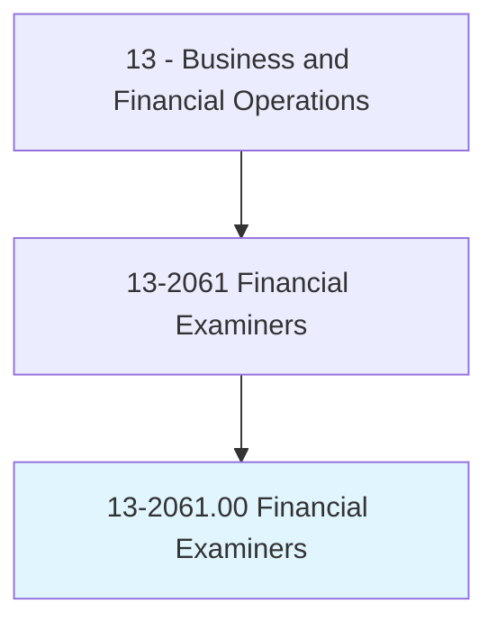
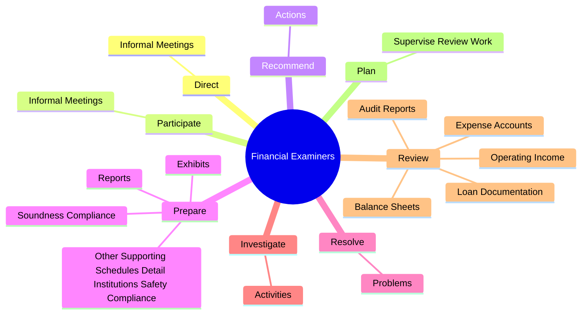
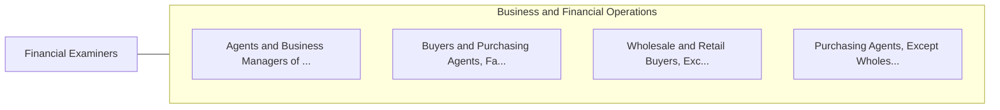

# Financial Examiners

> Enforce or ensure compliance with laws and regulations governing financial and securities institutions and financial and real estate transactions. May examine, verify, or authenticate records.

## Overview

Financial Examiners is an occupation within the Business and Financial Operations category. Enforce or ensure compliance with laws and regulations governing financial and securities institutions and financial and real estate transactions. 

## Classification Hierarchy

## Key Statistics

| Metric | Value |
|--------|-------|
| SOC Code | 13-2061.00 |
| Category | [Business and Financial Operations](/occupations/Business/index) |
| Task Count | 95 |
| Source | O*NET |

## Core Tasks

### direct.InformalMeetings

Financial Examiners direct informal meetings as part of their core responsibilities.

**Actions:**
- `direct.InformalMeetings.with.BankDirectors`
- `direct.InformalMeetings.with.Trustees`
- `direct.InformalMeetings.with.Seni`
- `direct.InformalMeetings.with.Management`

### participate.InformalMeetings

Financial Examiners participate informal meetings as part of their core responsibilities.

**Actions:**
- `participate.InformalMeetings.with.BankDirectors`
- `participate.InformalMeetings.with.Trustees`
- `participate.InformalMeetings.with.Seni`
- `participate.InformalMeetings.with.Management`

### recommend.Actions

Financial Examiners recommend actions as part of their core responsibilities.

**Actions:**
- `recommend.Actions.to.ensure.ComplianceWithLaws`
- `recommend.Actions.to.Regulations`
- `recommend.Actions.to.ToProtectSolvencyOfInstitutions`

## Skills & Competencies

### Technical Skills
- **Financial Analysis** - Advanced
- **Data Analysis** - Advanced
- **Regulatory Compliance** - Advanced

### Soft Skills
- **Communication** - Essential
- **Problem Solving** - Essential
- **Critical Thinking** - Important
- **Teamwork** - Important
- **Adaptability** - Important

## Related Occupations

## Industries

This occupation is found across multiple industries. See [Industries](/industries) for sector-specific employment data.

## Career Progression

---

*Source: O*NET 13-2061.00 - ONETOccupation*
