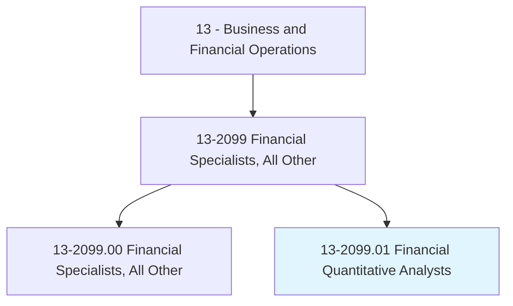
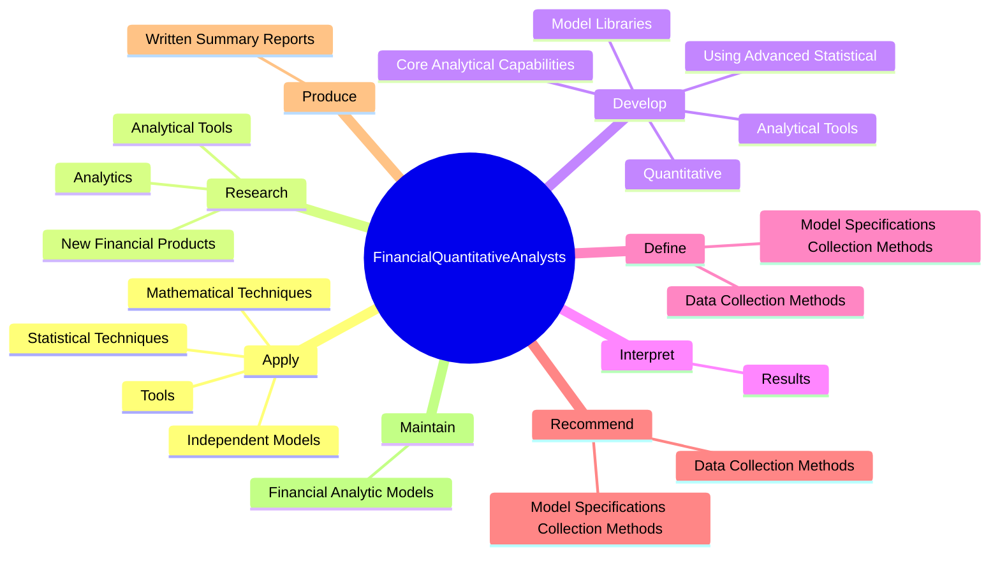

# Financial Quantitative Analysts

> Develop quantitative techniques to inform securities investing, equities investing, pricing, or valuation of financial instruments. Develop mathematical or statistical models for risk management, asset optimization, pricing, or relative value analysis.

## Overview

Financial Quantitative Analysts is a specialized variant within the Business and Financial Operations category. Develop quantitative techniques to inform securities investing, equities investing, pricing, or valuation of financial instruments. 

## Classification Hierarchy

## Key Statistics

| Metric | Value |
|--------|-------|
| SOC Code | 13-2099.01 |
| Category | [Business and Financial Operations](/occupations/Business) |
| Task Count | 83 |
| Source | O*NET |

## Core Tasks

### apply.MathematicalTechniques

Financial Quantitative Analysts apply mathematical techniques as part of their core responsibilities.

**Actions:**
- `apply.MathematicalTechniques.to.address.PracticalIssuesInFinance`
- `apply.MathematicalTechniques.to.DerivativeValuation`
- `apply.MathematicalTechniques.to.SecuritiesTrading`
- `apply.MathematicalTechniques.to.Riskmanagement`

### research.AnalyticalTools

Financial Quantitative Analysts research analytical tools as part of their core responsibilities.

**Actions:**
- `research.AnalyticalTools.to.address.Issues`
- `research.AnalyticalTools.to.PortfolioConstruction`
- `research.AnalyticalTools.to.Optimization`
- `research.AnalyticalTools.to.PerformanceMeasurement`

### develop.AnalyticalTools

Financial Quantitative Analysts develop analytical tools as part of their core responsibilities.

**Actions:**
- `develop.AnalyticalTools.to.address.Issues`
- `develop.AnalyticalTools.to.PortfolioConstruction`
- `develop.AnalyticalTools.to.Optimization`
- `develop.AnalyticalTools.to.PerformanceMeasurement`

## Skills & Competencies

### Technical Skills
- **Financial Analysis** - Advanced
- **Data Analysis** - Advanced
- **Regulatory Compliance** - Advanced

### Soft Skills
- **Communication** - Essential
- **Problem Solving** - Essential
- **Critical Thinking** - Important
- **Teamwork** - Important
- **Adaptability** - Important

## Related Occupations

## Industries

This occupation is found across multiple industries. See [Industries](/industries) for sector-specific employment data.

## Career Progression

---

*Source: O*NET 13-2099.01 - ONETOccupation*
