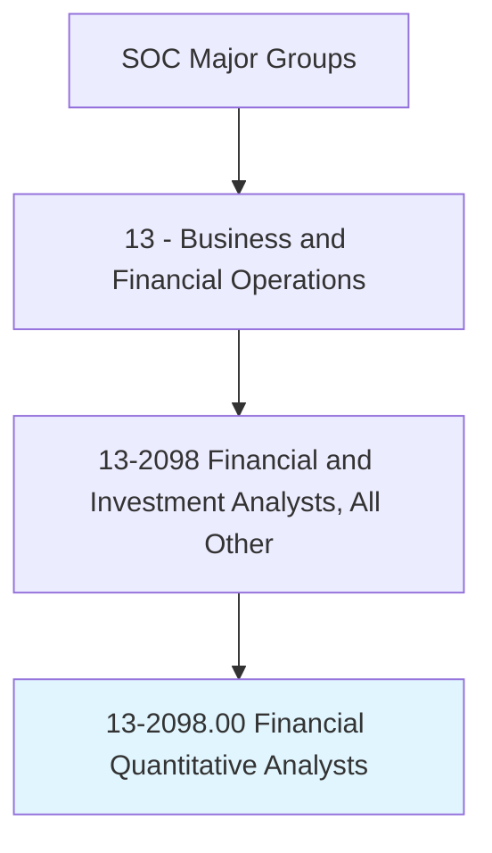
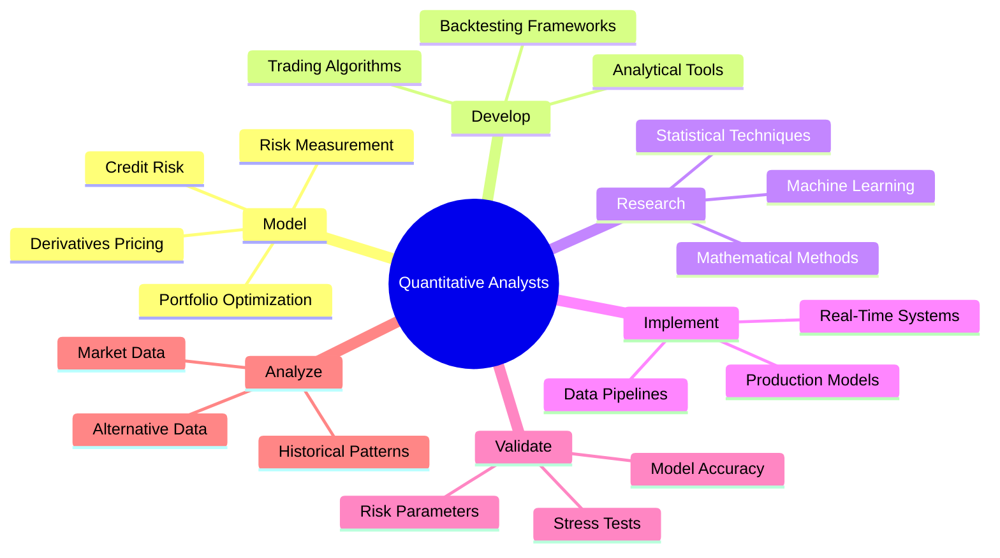
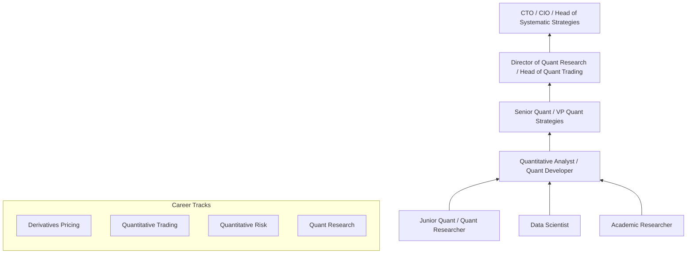
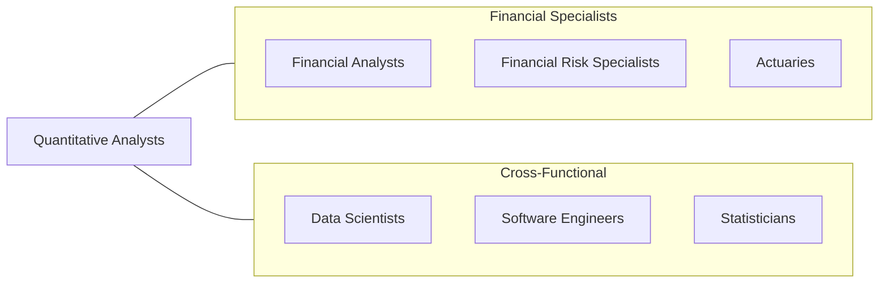

# Financial Quantitative Analysts

> Develop quantitative financial products used to inform individuals or financial institutions engaged in saving, lending, investing, borrowing, or managing risk. Investigate methods for financial analysis to create mathematical models used to develop improved analytical tools or advanced financial investment instruments.

## Overview

Financial Quantitative Analysts, commonly known as "quants," develop the mathematical models and computational tools that drive modern financial markets. They create pricing models for derivatives, design algorithmic trading strategies, build risk measurement frameworks, and develop portfolio optimization techniques. Their work sits at the intersection of mathematics, statistics, computer science, and finance, requiring both deep theoretical knowledge and practical implementation skills.

These professionals are employed by investment banks, hedge funds, asset managers, insurance companies, and financial technology firms. Their models underpin trillions of dollars in daily financial transactions, from options pricing and credit risk assessment to high-frequency trading and portfolio construction. The role demands proficiency in stochastic calculus, probability theory, numerical methods, and programming, combined with an understanding of financial markets and instruments.

The field continues to evolve rapidly with advances in machine learning, alternative data analytics, natural language processing, and distributed computing. Quants are increasingly applying deep learning to market prediction, reinforcement learning to portfolio management, and graph neural networks to systemic risk analysis. The growing importance of ESG quantification, climate risk modeling, and cryptocurrency derivatives has opened new frontiers for quantitative finance.

## Classification Hierarchy

## Key Statistics

| Metric | Value |
|--------|-------|
| SOC Code | 13-2098.00 |
| Job Zone | 5 (Extensive Preparation) |
| Category | [Business and Financial Operations](/occupations/Business/index) |
| Median Salary | $108,790 |
| Employment | ~42,000 |
| Projected Growth | 9% (Faster than average) |
| Task Count | 45 |
| Source | O*NET |

## Core Tasks

### model.FinancialInstruments

Develop mathematical models for pricing, hedging, and risk management of financial instruments.

**Actions:**
- `model.DerivativesPricing.using.StochasticCalculus` - Price options and structured products
- `model.RiskMeasurement.using.VaRAndCVaR` - Quantify portfolio risk
- `model.CreditRisk.using.DefaultProbabilities` - Assess credit exposure
- `model.PortfolioOptimization.using.MeanVarianceFrameworks` - Construct optimal portfolios

### develop.TradingAlgorithms

Design and implement algorithmic trading strategies and execution systems.

**Actions:**
- `develop.TradingAlgorithms.for.MarketMaking` - Build automated trading
- `develop.BacktestingFrameworks.to.validate.Strategies` - Test historical performance
- `develop.ExecutionAlgorithms.to.minimize.MarketImpact` - Optimize trade execution
- `develop.SignalGeneration.from.AlternativeData` - Extract alpha signals

### research.QuantitativeMethods

Investigate and implement new mathematical and computational methods for financial analysis.

**Actions:**
- `research.MachineLearningMethods.for.FinancialPrediction` - Apply ML to markets
- `research.StatisticalTechniques.for.TimeSeriesAnalysis` - Model temporal patterns
- `research.NumericalMethods.for.ModelCalibration` - Improve model accuracy
- `validate.ModelAccuracy.through.StressTesting` - Verify model robustness

## Skills & Competencies

### Technical Skills
- **Stochastic Calculus & Probability Theory** - Expert
- **Python / C++ / R Programming** - Expert
- **Machine Learning & Deep Learning** - Advanced
- **Financial Mathematics** - Expert
- **Statistical Modeling** - Expert
- **Derivatives Pricing Theory** - Expert
- **High-Performance Computing** - Advanced
- **SQL & Data Engineering** - Advanced

### Soft Skills
- **Analytical Thinking** - Critical
- **Problem Solving** - Critical
- **Attention to Detail** - Essential
- **Communication (Technical/Non-Technical)** - Essential
- **Intellectual Curiosity** - Important
- **Collaboration** - Important

## Education & Certifications

| Requirement | Details |
|-------------|---------|
| Typical Education | Master's or PhD in Mathematics, Physics, Computer Science, Financial Engineering, or Statistics |
| Key Certifications | CQF (Certificate in Quantitative Finance), FRM (Financial Risk Manager) |
| Additional Certs | CFA, PRM (Professional Risk Manager) |
| Programming | Python, C++, R, MATLAB, Julia required |
| Academic Research | Published research preferred for top-tier positions |
| Work Experience | 2-5 years; PhD often substitutes for experience |

## Career Progression

## Industry Variations

| Industry | Focus | Typical Tasks |
|----------|-------|---------------|
| **Investment Banks** | Derivatives pricing | Exotic options, structured products, XVA |
| **Hedge Funds** | Alpha generation | Signal research, portfolio construction, execution |
| **Asset Management** | Portfolio optimization | Factor models, smart beta, ESG quantification |
| **Insurance** | Actuarial/risk models | Catastrophe modeling, reserve estimation |
| **Fintech** | Product innovation | Robo-advisory, credit scoring, crypto derivatives |
| **Risk Management** | Regulatory compliance | VaR, stress testing, FRTB, model validation |

## Technology & Tools

| Category | Tools |
|----------|-------|
| **Programming** | Python, C++, R, Julia, MATLAB |
| **ML Frameworks** | TensorFlow, PyTorch, scikit-learn, XGBoost |
| **Data** | Bloomberg, Refinitiv, Quandl, Alternative data APIs |
| **Computing** | AWS, GCP, GPU clusters, Spark |
| **Databases** | SQL, kdb+/q, MongoDB, Arctic |
| **Version Control** | Git, GitHub, CI/CD pipelines |
| **Visualization** | Matplotlib, Plotly, Dash, Jupyter |

## Related Occupations

## Departments

This occupation typically works in:
- [Quantitative Research](/departments/QuantResearch)
- [Quantitative Trading](/departments/QuantTrading)
- [Model Risk Management](/departments/ModelRisk)
- [Derivatives](/departments/Derivatives)
- [Technology](/departments/Technology)

---

*Source: O*NET 13-2098.00 - ONETOccupation*
