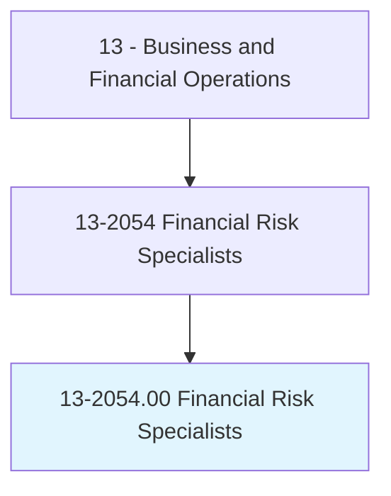
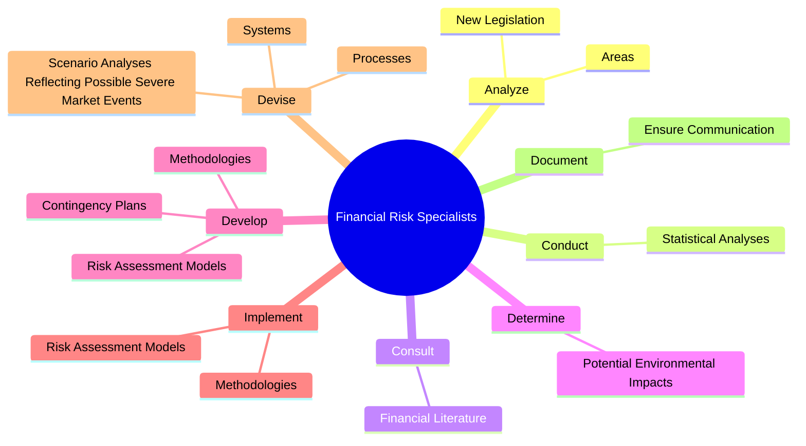

# Financial Risk Specialists

> Analyze and measure exposure to credit and market risk threatening the assets, earning capacity, or economic state of an organization. May make recommendations to limit risk.

## Overview

Financial Risk Specialists is an occupation within the Business and Financial Operations category. Analyze and measure exposure to credit and market risk threatening the assets, earning capacity, or economic state of an organization. 

## Classification Hierarchy

## Key Statistics

| Metric | Value |
|--------|-------|
| SOC Code | 13-2054.00 |
| Category | [Business and Financial Operations](/occupations/Business) |
| Task Count | 57 |
| Source | O*NET |

## Core Tasks

### analyze.Areas

Financial Risk Specialists analyze areas as part of their core responsibilities.

**Actions:**
- `analyze.Areas.of.PotentialRisk.to.Assets`
- `analyze.Areas.of.EarningCapacity`
- `analyze.Areas.of.Success.of.Organizations`
- `analyze.NewLegislation.to.determine.ImpactOnRiskExposure`

### conduct.StatisticalAnalyses

Financial Risk Specialists conduct statistical analyses as part of their core responsibilities.

**Actions:**
- `conduct.StatisticalAnalyses.to.quantify.Risk`
- `conduct.StatisticalAnalyses.to.UsingStatisticalAnalysisSoftware`
- `conduct.StatisticalAnalyses.to.EconometricModels`

### consult.FinancialLiterature

Financial Risk Specialists consult financial literature as part of their core responsibilities.

**Actions:**
- `consult.FinancialLiterature.to.ensure.UseOfLatestModelsTechniques`
- `consult.FinancialLiterature.to.StatisticalTechniques`

## Skills & Competencies

### Technical Skills
- **Financial Analysis** - Advanced
- **Data Analysis** - Advanced
- **Regulatory Compliance** - Advanced

### Soft Skills
- **Communication** - Essential
- **Problem Solving** - Essential
- **Critical Thinking** - Important
- **Teamwork** - Important
- **Adaptability** - Important

## Related Occupations

## Industries

This occupation is found across multiple industries. See [Industries](/industries) for sector-specific employment data.

## Career Progression

---

*Source: O*NET 13-2054.00 - ONETOccupation*
