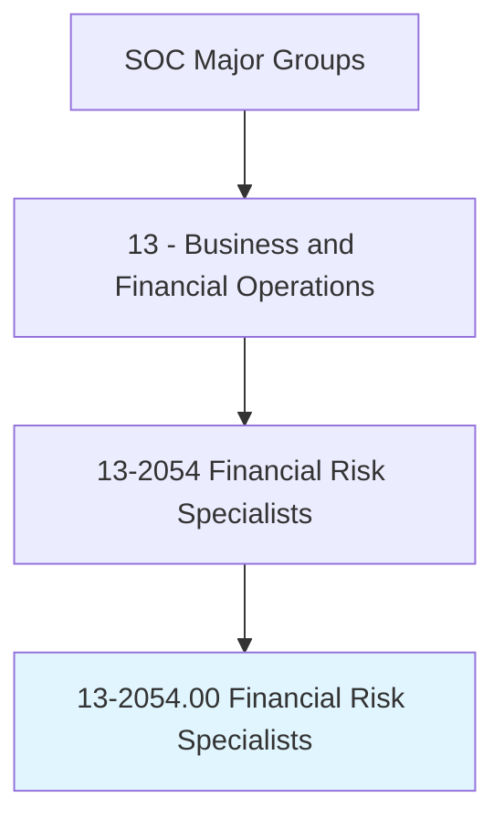
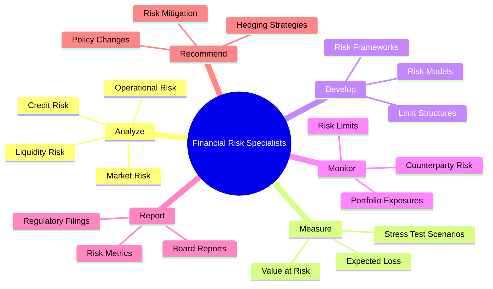
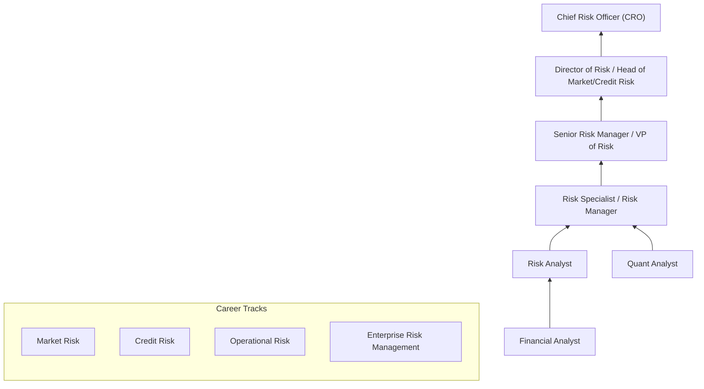
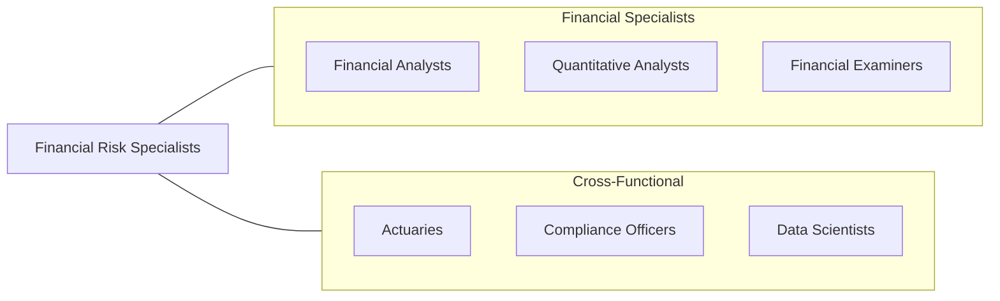

# Financial Risk Specialists

> Analyze and measure exposure to credit and market risk threatening the assets, earning capacity, or economic state of an organization. May make recommendations to limit risk.

## Overview

Financial Risk Specialists identify, measure, and manage the risks that threaten financial institutions and corporations. They develop risk models, set risk limits, monitor portfolio exposures, and recommend strategies to mitigate credit risk, market risk, operational risk, and liquidity risk. Their work is essential to institutional stability and regulatory compliance, particularly in the wake of financial crises that highlighted the consequences of inadequate risk management.

These professionals work across the "three lines of defense" model: as risk-takers in front-office roles, as independent risk managers in the second line, and as internal auditors in the third line. They apply quantitative methods to measure Value at Risk (VaR), Expected Shortfall, credit default probabilities, and stress test scenarios. The role requires both deep technical expertise and the business judgment to translate risk metrics into actionable management decisions.

The profession has expanded rapidly due to evolving regulatory requirements (Basel III/IV, FRTB, CECL, IFRS 9), emerging risk categories (climate risk, cyber risk, model risk), and the growing complexity of financial instruments and interconnected markets. Risk specialists must balance quantitative rigor with practical communication, translating complex risk concepts for senior management and board-level audiences.

## Classification Hierarchy

## Key Statistics

| Metric | Value |
|--------|-------|
| SOC Code | 13-2054.00 |
| Job Zone | 4 (Considerable Preparation) |
| Category | [Business and Financial Operations](/occupations/Business/index) |
| Median Salary | $102,120 |
| Employment | ~58,000 |
| Projected Growth | 9% (Faster than average) |
| Task Count | 36 |
| Source | O*NET |

## Core Tasks

### analyze.RiskExposures

Analyze and measure exposure to credit, market, operational, and liquidity risk.

**Actions:**
- `analyze.CreditRisk.to.assess.DefaultProbability` - Evaluate borrower risk
- `analyze.MarketRisk.to.measure.PortfolioSensitivity` - Quantify market exposure
- `analyze.OperationalRisk.to.identify.ProcessVulnerabilities` - Assess operational threats
- `analyze.LiquidityRisk.to.ensure.FundingAdequacy` - Monitor cash flows

### develop.RiskModels

Build and maintain quantitative risk models and frameworks.

**Actions:**
- `develop.VaRModels.to.quantify.PotentialLosses` - Measure tail risk
- `develop.StressTestScenarios.for.RegulatoryCompliance` - Design adverse scenarios
- `develop.CreditScoringModels.to.assess.BorrowerQuality` - Rate credit quality
- `develop.RiskLimitFrameworks.to.constrain.Exposures` - Set risk boundaries

### report.RiskMetrics

Prepare risk reports for management, board, and regulatory audiences.

**Actions:**
- `report.RiskMetrics.to.SeniorManagement` - Communicate risk posture
- `report.StressTestResults.to.Regulators` - Submit regulatory filings
- `recommend.RiskMitigation.to.reduce.Exposures` - Advise on risk reduction
- `recommend.HedgingStrategies.to.offset.MarketRisk` - Propose hedges

## Skills & Competencies

### Technical Skills
- **Risk Modeling (VaR, ES, PD/LGD)** - Expert
- **Statistical & Quantitative Analysis** - Expert
- **Regulatory Frameworks (Basel III/IV, FRTB)** - Expert
- **Financial Mathematics** - Advanced
- **Python/R/SAS Programming** - Advanced
- **Stress Testing & Scenario Analysis** - Advanced
- **Credit Risk Assessment** - Advanced
- **SQL & Data Management** - Proficient

### Soft Skills
- **Analytical Thinking** - Critical
- **Communication (Technical/Executive)** - Critical
- **Attention to Detail** - Essential
- **Professional Skepticism** - Essential
- **Strategic Thinking** - Important
- **Collaboration** - Important

## Education & Certifications

| Requirement | Details |
|-------------|---------|
| Typical Education | Bachelor's or Master's in Finance, Mathematics, Statistics, or Economics |
| Key Certifications | FRM (Financial Risk Manager - GARP), PRM (Professional Risk Manager) |
| Additional Certs | CFA, CERA (Chartered Enterprise Risk Analyst), ERM certification |
| Regulatory Knowledge | Basel III/IV, FRTB, CECL, IFRS 9, Dodd-Frank |
| Work Experience | 3-5 years in risk management, quantitative analysis, or related field |
| Programming | Python, R, SAS, SQL, MATLAB |

## Career Progression

## Industry Variations

| Industry | Focus | Typical Tasks |
|----------|-------|---------------|
| **Banking** | Credit & market risk | Loan loss provisioning, trading book risk, capital adequacy |
| **Insurance** | Underwriting & investment risk | Reserve risk, catastrophe modeling, ALM |
| **Asset Management** | Portfolio risk | Factor exposure, tracking error, liquidity risk |
| **Hedge Funds** | Trading risk | Real-time P&L, Greeks management, counterparty risk |
| **Corporate Treasury** | Financial risk | FX hedging, interest rate risk, commodity exposure |
| **Fintech / Crypto** | Emerging risks | Digital asset risk, smart contract risk, DeFi exposure |

## Technology & Tools

| Category | Tools |
|----------|-------|
| **Risk Systems** | SAS Risk Management, Moody's Analytics, MSCI RiskMetrics |
| **Programming** | Python, R, SAS, MATLAB, C++ |
| **Data & Analytics** | SQL, Bloomberg, Refinitiv, kdb+/q |
| **Stress Testing** | FRB models, internal scenario engines |
| **Visualization** | Tableau, Power BI, custom dashboards |
| **Cloud** | AWS, Azure, GCP for risk computation |
| **Regulatory Reporting** | AxiomSL, Wolters Kluwer, Moody's |

## Related Occupations

## Departments

This occupation typically works in:
- [Risk Management](/departments/RiskManagement)
- [Market Risk](/departments/MarketRisk)
- [Credit Risk](/departments/CreditRisk)
- [Enterprise Risk](/departments/EnterpriseRisk)
- [Treasury](/departments/Treasury)

---

*Source: O*NET 13-2054.00 - ONETOccupation*
