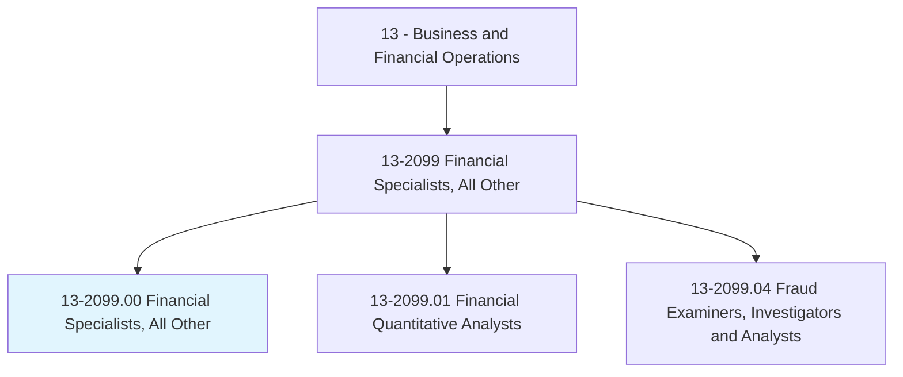
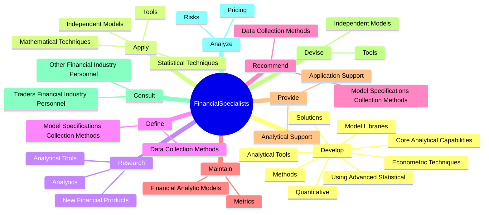

# Financial Specialists, All Other

> All financial specialists not listed separately.

## Overview

Financial Specialists, All Other is classified under Business and Financial Operations (SOC 13). All financial specialists not listed separately.

## Classification Hierarchy

## Key Statistics

| Metric | Value |
|--------|-------|
| SOC Code | 13-2099.00 |
| Category | [Business and Financial Operations](/occupations/Business/index) |
| Task Count | 83 |
| Source | O*NET |

## Core Tasks

### develop.AnalyticalTools

Financial Specialists, All Other develop analytical tools as part of their core responsibilities.

**Actions:**
- `develop.AnalyticalTools.to.Issues`
- `develop.AnalyticalTools.to.PortfolioConstruction`
- `develop.AnalyticalTools.to.Optimization`
- `develop.AnalyticalTools.to.PerformanceMeasurement`

### apply.MathematicalTechniques

Financial Specialists, All Other apply mathematical techniques as part of their core responsibilities.

**Actions:**
- `apply.MathematicalTechniques.to.PracticalIssues`
- `apply.MathematicalTechniques.to.DerivativeValuation`
- `apply.MathematicalTechniques.to.SecuritiesTrading`
- `apply.MathematicalTechniques.to.Riskmanagement`

### research.AnalyticalTools

Financial Specialists, All Other research analytical tools as part of their core responsibilities.

**Actions:**
- `research.AnalyticalTools.to.Issues`
- `research.AnalyticalTools.to.PortfolioConstruction`
- `research.AnalyticalTools.to.Optimization`
- `research.AnalyticalTools.to.PerformanceMeasurement`

## Skills & Competencies

### Technical Skills
- **Financial Analysis** - Advanced
- **Data Analysis** - Advanced
- **Regulatory Compliance** - Advanced

### Soft Skills
- **Communication** - Essential
- **Problem Solving** - Essential
- **Critical Thinking** - Important
- **Teamwork** - Important
- **Adaptability** - Important

## Related Occupations

## Industries

This occupation is found across multiple industries. See [Industries](/industries) for sector-specific employment data.

## Career Progression

---

*Source: O*NET 13-2099.00 - ONETOccupation*
