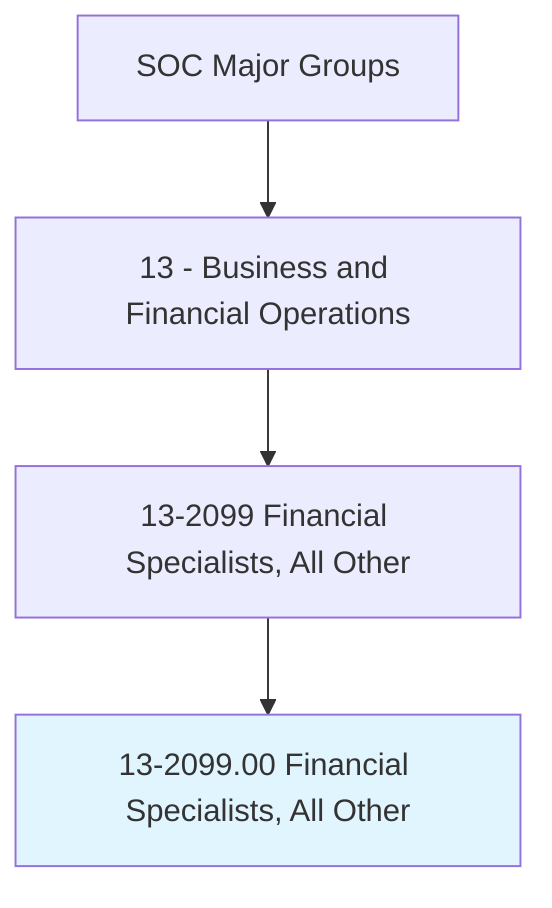
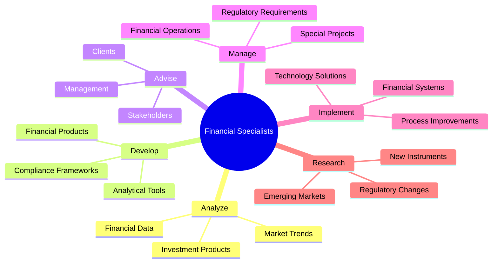
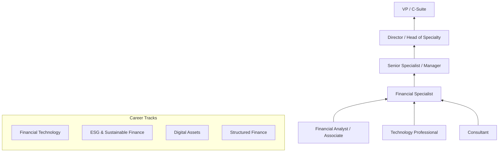
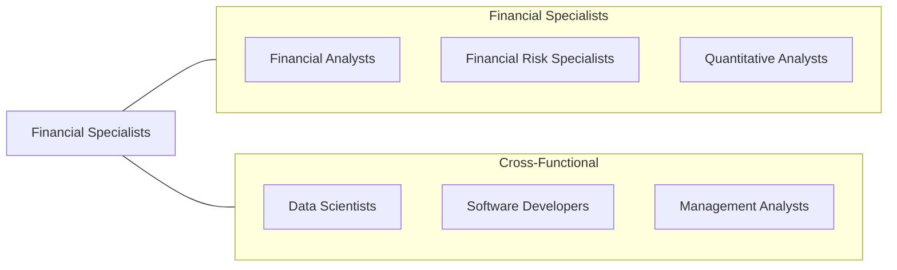

# Financial Specialists, All Other

> All financial specialists not listed separately.

## Overview

Financial Specialists, All Other is a residual classification that encompasses financial professionals whose roles do not fit neatly into other specific SOC categories. This includes emerging and hybrid financial roles such as financial wellness coaches, cryptocurrency compliance specialists, ESG analysts, fintech product managers, financial data engineers, and treasury analysts. The category reflects the rapidly evolving nature of the financial services industry, where new specializations emerge faster than occupational classification systems can accommodate.

These professionals share a common foundation in financial analysis, regulatory knowledge, and quantitative methods, but apply these skills in novel or cross-cutting ways. They may work in niche areas such as structured finance, securitization, wealth management operations, financial technology development, or specialized advisory services that combine elements of multiple traditional financial occupations.

The growth of fintech, digital assets, sustainable finance, and data-driven financial services has expanded this category significantly. Many professionals in this classification work at the intersection of finance and technology, developing new financial products, building compliance frameworks for digital assets, or applying advanced analytics to traditional financial problems in innovative ways.

## Classification Hierarchy

## Key Statistics

| Metric | Value |
|--------|-------|
| SOC Code | 13-2099.00 |
| Job Zone | 4 (Considerable Preparation) |
| Category | [Business and Financial Operations](/occupations/Business/index) |
| Median Salary | $78,770 |
| Employment | ~68,000 |
| Projected Growth | 6% (As fast as average) |
| Task Count | Variable |
| Source | O*NET |

## Core Tasks

### analyze.FinancialData

Analyze financial data using specialized methods and domain-specific expertise.

**Actions:**
- `analyze.FinancialData.to.support.SpecializedDecisions` - Provide analytical insights
- `analyze.MarketTrends.to.identify.EmergingOpportunities` - Spot new markets
- `analyze.InvestmentProducts.to.evaluate.Performance` - Assess product effectiveness
- `analyze.RegulatoryChanges.to.assess.BusinessImpact` - Evaluate compliance implications

### develop.FinancialProducts

Develop new financial products, tools, and frameworks for specialized applications.

**Actions:**
- `develop.FinancialProducts.for.ClientNeeds` - Create customized solutions
- `develop.ComplianceFrameworks.for.EmergingRegulations` - Build regulatory responses
- `develop.AnalyticalTools.for.SpecializedAnalysis` - Build purpose-built analytics
- `implement.FinancialSystems.for.OperationalEfficiency` - Deploy technology solutions

### advise.Stakeholders

Provide specialized financial advice to clients, management, and stakeholders.

**Actions:**
- `advise.Clients.on.SpecializedFinancialMatters` - Deliver expert counsel
- `advise.Management.on.StrategicFinancialDecisions` - Support leadership
- `manage.FinancialOperations.for.SpecializedFunctions` - Oversee niche operations
- `research.EmergingInstruments.to.expand.ProductOfferings` - Identify innovations

## Skills & Competencies

### Technical Skills
- **Financial Analysis** - Expert
- **Specialized Domain Expertise** - Expert
- **Quantitative Methods** - Advanced
- **Regulatory Compliance** - Advanced
- **Financial Technology** - Advanced
- **Data Analysis & Programming** - Proficient
- **Product Development** - Proficient

### Soft Skills
- **Analytical Thinking** - Critical
- **Adaptability** - Critical
- **Communication** - Essential
- **Problem Solving** - Essential
- **Continuous Learning** - Essential
- **Collaboration** - Important

## Education & Certifications

| Requirement | Details |
|-------------|---------|
| Typical Education | Bachelor's degree in Finance, Economics, Mathematics, or related field |
| Advanced Degree | Master's or MBA often required for specialized roles |
| Key Certifications | CFA, CPA, CFP, FRM (varies by specialization) |
| Specialized Certs | CAIA, CIPM, CAMS, blockchain certifications |
| Work Experience | 3-7 years depending on specialization |
| Continuing Education | Required for most professional certifications |

## Career Progression

## Industry Variations

| Industry | Focus | Typical Tasks |
|----------|-------|---------------|
| **Fintech** | Product development | Digital product design, API integration, user analytics |
| **Sustainable Finance** | ESG analysis | Carbon accounting, impact measurement, green bond verification |
| **Cryptocurrency** | Digital assets | Token analysis, DeFi risk, regulatory compliance |
| **Structured Finance** | Securitization | Tranche analysis, waterfall modeling, servicer oversight |
| **Wealth Management** | Client operations | Portfolio administration, performance reporting |
| **Corporate Treasury** | Cash management | Liquidity forecasting, FX management, bank relations |

## Technology & Tools

| Category | Tools |
|----------|-------|
| **Analytics** | Python, R, Excel, Tableau |
| **Financial Systems** | Bloomberg, Refinitiv, FactSet |
| **Fintech Platforms** | Plaid, Stripe, blockchain explorers |
| **ERP & Treasury** | SAP, Oracle, Kyriba, GTreasury |
| **Data** | SQL, Snowflake, AWS, Databricks |
| **Communication** | Microsoft 365, Slack |
| **Specialized** | Domain-specific platforms and tools |

## Related Occupations

## Departments

This occupation typically works in:
- [Finance](/departments/Finance)
- Financial Products
- Treasury
- Innovation & Technology
- Compliance

---

*Source: O*NET 13-2099.00 - ONETOccupation*
