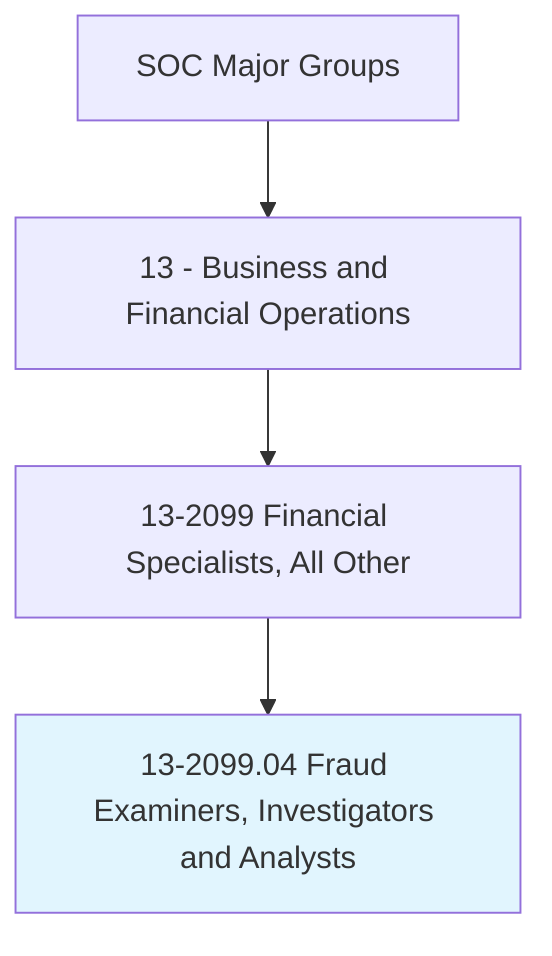
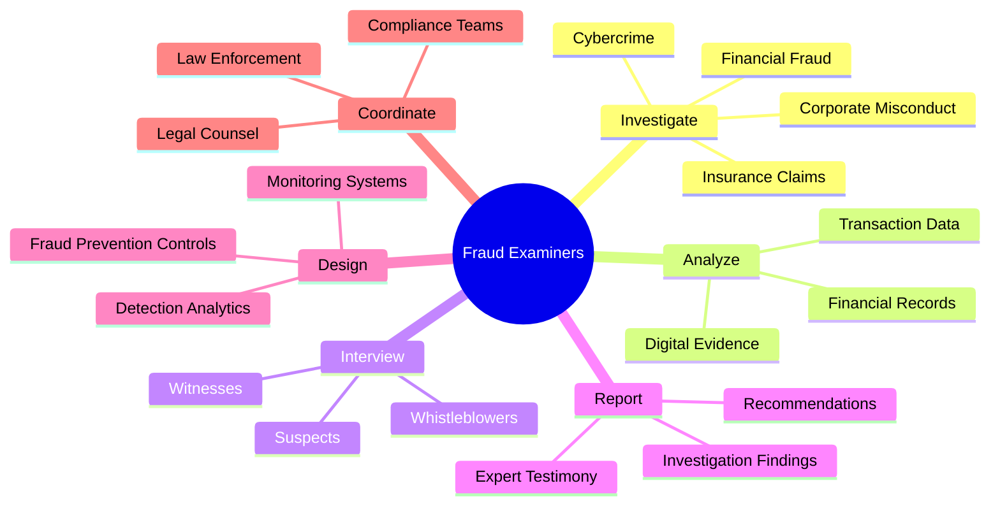
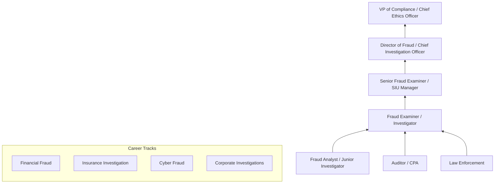
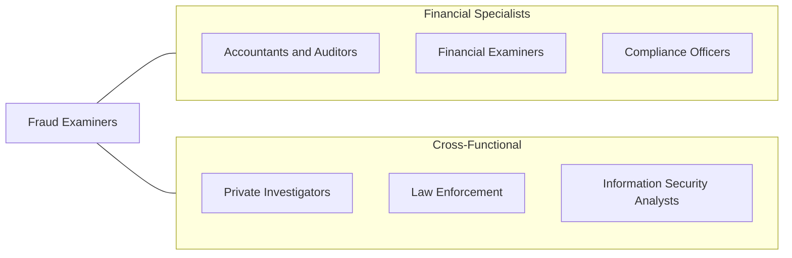

# Fraud Examiners, Investigators and Analysts

> Obtain evidence, take statements, produce reports, and testify to findings regarding resolution of fraud allegations. May coordinate fraud detection and prevention activities.

## Overview

Fraud Examiners, Investigators and Analysts are specialized professionals who detect, investigate, and help prevent fraudulent activities across financial, corporate, insurance, healthcare, and government sectors. They combine accounting expertise, investigative skills, legal knowledge, and data analytics to uncover schemes ranging from embezzlement and financial statement fraud to insurance fraud, identity theft, and cybercrime. The Association of Certified Fraud Examiners (ACFE) estimates that organizations lose 5% of revenue to fraud annually, underscoring the critical importance of this profession.

These professionals conduct detailed examinations of financial records, interview witnesses and suspects, trace illicit funds, and prepare evidence for civil and criminal proceedings. They may work reactively, investigating known or suspected fraud, or proactively, designing controls, analytics, and monitoring systems to detect fraud early. The role requires a unique blend of accounting knowledge, investigative methodology, legal understanding, and interpersonal skills.

The profession has evolved significantly with advances in data analytics, artificial intelligence, and digital forensics. Modern fraud examiners use predictive modeling, anomaly detection algorithms, network analysis, and blockchain tracing tools alongside traditional investigative methods. The rise of cyber-enabled fraud, synthetic identity theft, cryptocurrency laundering, and sophisticated social engineering attacks has made the field more technically demanding than ever.

## Classification Hierarchy

## Key Statistics

| Metric | Value |
|--------|-------|
| SOC Code | 13-2099.04 |
| Job Zone | 4 (Considerable Preparation) |
| Category | [Business and Financial Operations](/occupations/Business/index) |
| Median Salary | $78,770 |
| Employment | ~38,000 |
| Projected Growth | 8% (Faster than average) |
| Task Count | 42 |
| Source | O*NET |

## Core Tasks

### investigate.FraudAllegations

Investigate allegations of fraud through document examination, data analysis, and interviews.

**Actions:**
- `investigate.FinancialFraud.to.identify.MisappropriatedFunds` - Trace stolen assets
- `investigate.InsuranceClaims.to.detect.FraudulentSubmissions` - Verify claim legitimacy
- `investigate.CorporateMisconduct.to.uncover.SchemeDetails` - Expose internal fraud
- `analyze.TransactionData.to.identify.AnomalousPatterns` - Detect suspicious activity

### analyze.Evidence

Analyze financial records, digital evidence, and transaction data to build fraud cases.

**Actions:**
- `analyze.FinancialRecords.to.trace.FundsFlow` - Follow the money
- `analyze.DigitalEvidence.to.establish.CyberFraud` - Examine digital artifacts
- `interview.Witnesses.to.corroborate.Evidence` - Gather testimony
- `prepare.InvestigationReports.for.LegalProceedings` - Document findings

### design.FraudPrevention

Design fraud prevention controls, detection analytics, and monitoring systems.

**Actions:**
- `design.FraudPreventionControls.for.OrganizationalProtection` - Build defenses
- `design.DetectionAnalytics.to.identify.EmergingSchemes` - Create detection models
- `develop.MonitoringSystems.for.ContinuousSurveillance` - Implement real-time monitoring
- `coordinate.with.LawEnforcement.for.CriminalProsecution` - Support legal action

## Skills & Competencies

### Technical Skills
- **Forensic Accounting** - Expert
- **Investigation Methodology** - Expert
- **Data Analytics & Fraud Detection** - Advanced
- **Digital Forensics** - Advanced
- **Interview & Interrogation Techniques** - Advanced
- **Legal/Regulatory Knowledge** - Advanced
- **Anti-Money Laundering (AML)** - Proficient
- **Expert Witness Testimony** - Proficient

### Soft Skills
- **Analytical Thinking** - Critical
- **Attention to Detail** - Critical
- **Professional Skepticism** - Essential
- **Communication (Written/Verbal)** - Essential
- **Ethical Judgment** - Essential
- **Persistence** - Important

## Education & Certifications

| Requirement | Details |
|-------------|---------|
| Typical Education | Bachelor's degree in Accounting, Criminal Justice, Finance, or related field |
| Key Certifications | CFE (Certified Fraud Examiner - ACFE) |
| Additional Certs | CAMS (Anti-Money Laundering), CIRA (Certified Insolvency & Restructuring Advisor) |
| Accounting | CPA preferred for financial fraud investigations |
| Digital Forensics | EnCE (EnCase Certified Examiner), GCFE |
| Work Experience | 2-5 years in accounting, auditing, law enforcement, or investigations |

## Career Progression

## Industry Variations

| Industry | Focus | Typical Tasks |
|----------|-------|---------------|
| **Banking / Financial Services** | Account fraud, AML | Transaction monitoring, SAR filing, internal investigations |
| **Insurance** | Claims fraud | Surveillance, medical record review, SIU operations |
| **Healthcare** | Billing fraud | False claims analysis, upcoding detection, kickback investigation |
| **Government** | Tax/benefits fraud | Procurement fraud, public corruption, whistleblower investigations |
| **Corporate** | Internal fraud | Employee theft, expense fraud, conflicts of interest |
| **Technology / E-commerce** | Digital fraud | Account takeover, synthetic identity, payment fraud |

## Technology & Tools

| Category | Tools |
|----------|-------|
| **Forensic Accounting** | ACL/IDEA, CaseWare, TeamMate |
| **Data Analytics** | Python, R, SQL, SAS, Tableau |
| **Digital Forensics** | EnCase, FTK, Cellebrite |
| **AML/KYC** | Actimize, Norkom, Verafin |
| **Investigation** | i2 Analyst's Notebook, Palantir, LexisNexis |
| **Blockchain Tracing** | Chainalysis, Elliptic, CipherTrace |
| **Case Management** | CaseIQ, EthicsPoint, NAVEX Global |

## Related Occupations

## Departments

This occupation typically works in:
- Special Investigations Unit
- [Internal Audit](/departments/Finance)
- Compliance
- [Legal](/departments/Legal)
- Financial Crimes

---

*Source: O*NET 13-2099.04 - ONETOccupation*
